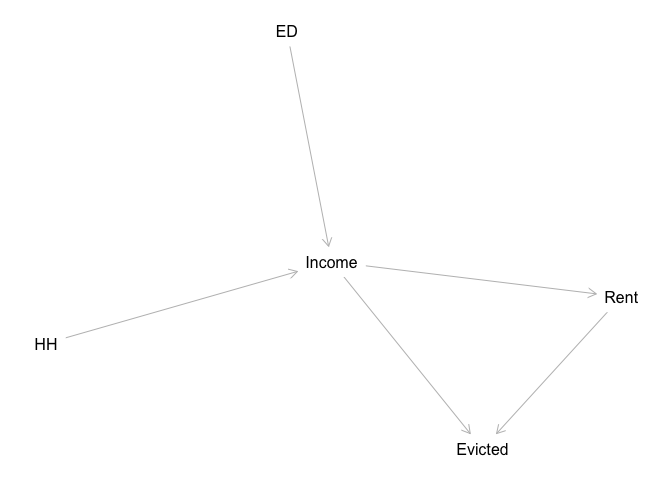
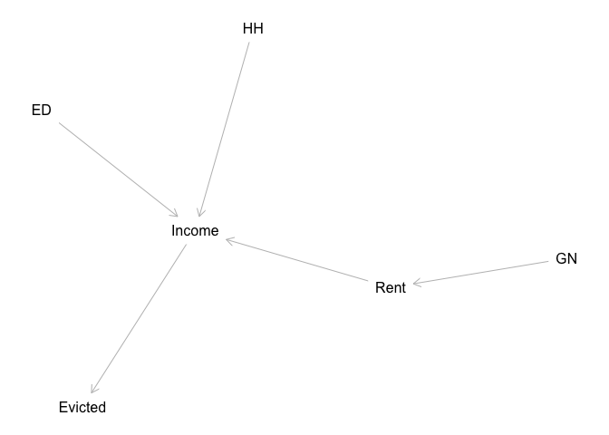
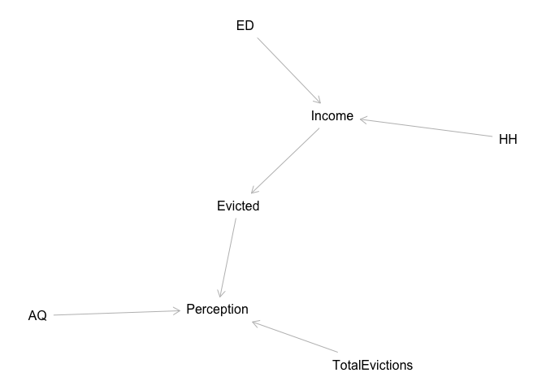

``` r
library(dagitty)
```

Income Model
------------

-   I will only consider Income constraints on Rent without taking into account neighborhood factors
-   My general thought process is that the main reason why people are evicted is they cannot afford to pay
-   I am not considering 'coerced' evictions or 'violating lease' agreements
-   This is the simplest model
-   Also in this case I would have to assume that those who are evicted stay in their neighborhood (Remember with NYCHVS I do not have access to neighborhood where they were evicted from)
-   In this case, my thought procresss is a moderated mediation type model (at least, I think). Your income will determine whether you can pay rent, if you cannot pay rent then you are evicted. Your income is moderated by educational attainment and household type.

``` r
mod1 <- dagitty::dagitty("dag{
                         ED -> Income <- HH
                         Income -> Evicted
                         Income -> Rent -> Evicted}")

plot(graphLayout(mod1))
```



-   ED - Educational Attainment
-   HH - Household Type

Income + Neighborhood Model
---------------------------

-   In this model, my logic is slightly different, I see gentrifying neighborhoods as driving up rent
-   Rent will affect one's ability to pay (affect one's disposable income)
-   Educational Attainment and the Household Type can affect one's income
-   If you do not have enough income, you will get evicted

``` r
mod2 <- dagitty::dagitty("dag{
                         GN -> Rent -> Income
                         ED -> Income <- HH
                         Income -> Evicted}")

plot(graphLayout(mod2))
```



-   ED - refer's to an individual's educational attainment
-   GN - Gentrifying Neighborhood (perhaps classified by Furman Center (NYU))
-   HH - houshold type (individual, family, roomates, single mother, single father)

Maybe eviction is not what I should be measuring?
-------------------------------------------------

### Should I Treat Eviction as a Treatment ?

-   Compared those who were Evicted (T=1) to those who moved for greater housing affordability (T = 0)
-   Do their neighborhood views change? i.e.: Do people who have a choice in moving tend to rate their neighborhoods higher, while those who were forced out (evicted) rate their neighborhoods lower? Or does any indication of financial difficulty (whether bc you chose to move or were evicted) cause you to poorly rate your neighborhood?
-   This is a more convoluted model - that I should think through more

``` r
mod3 <- dagitty::dagitty("dag{
                         Perception <- Evicted
                         HH->Income <- ED
                         Income -> Evicted
                         AQ -> Perception
                         TotalEvictions -> Perception}")

plot(graphLayout(mod3))
```


