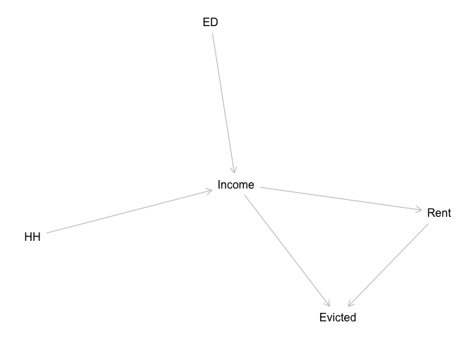
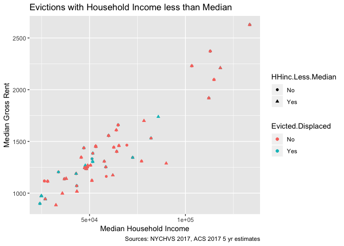
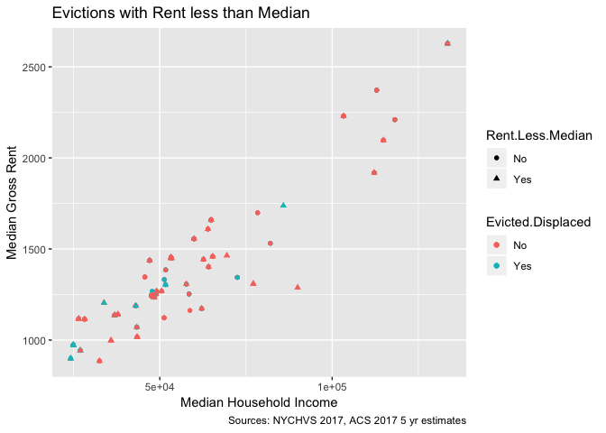
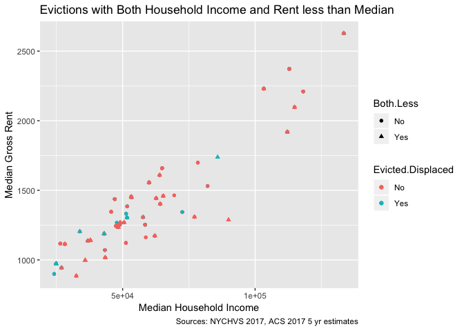
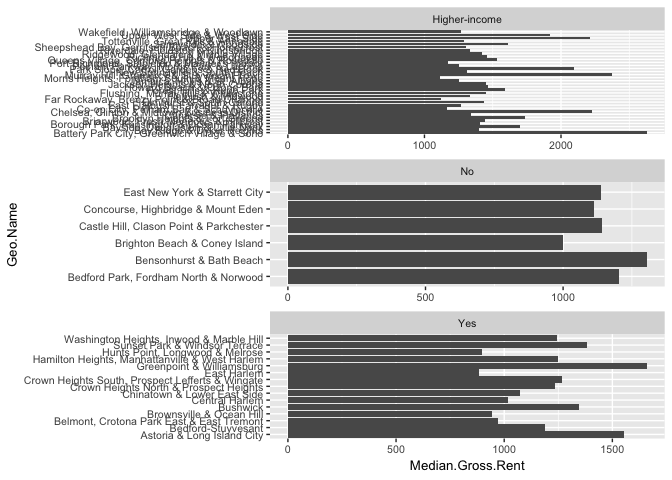
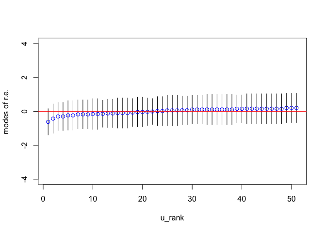

Introduction: Why a Causal Claim
--------------------------------

-   In short, prediction models do not answer a piovtal question. We can say that these features influence whether someone is evicted or not, but without causality we cannot definitively answer the question why do evictions happen ?

-   If we cannot answer this question then we cannot have targeted solutions. In short, thinking causally, will help us to better solve problems and create effective policies for change.

Judea Pearl's Causal Inference: The Book of Why
-----------------------------------------------

-   There are two camps in the causal inference world: Rubin's camp (think Andrew Gelman) and Judea Pearl's camp. The differences between the two camps lie in how they frame causality.

-   Rubin's camp follows a 'potential outcomes' framework, therefore when using methods from this camp, the idea of the counterfactual is important.

-   Pearl's beliefs are different and mainly rely on the path diagram + causal calculus (do calculus). A simplified version of this view is that if one can successfully draw a path (causal) diagram and account for confounders then you can estimate the causal effect.

-   Pearl states in Chapter 2 of *The Book of Why* that 'causal analysis requires the user to make a subjective commitment. She must draw a causal diagram that reflects her qualitative belief, or better yet, the consensus belief that reflects her qualitative belief.' As you can see, Pearl's view is not strictly quantitative, but one must make decisions that reflect actuality.

-   The main idea is that we are smarter than our data! We must think of the causal model and if the data supports our claims then we are in good shape.

-   Knowledge -&gt; Assumptions -&gt; Causal Model (causal diagrams, logic, structural equation) -&gt; Testable implications (model correctly specified)? -&gt; Queries we want answered -&gt; Estimand (what is to be estimated) -&gt; Data -&gt; Estimate (from model - approximate) -&gt; Causal answer (model correct + data are sufficient).

Method + Causal Diagram / Reasoning
-----------------------------------

-   Using the NYCHVS 2017, I have created a causal model based on logical reasoningg and by creating a causal diagram. I drew inspiration from methods laid out in Judea Pearl's *Book of Why*.

-   My causal model is income driven, meaning that those who cannot afford their living conditions and pay their rent are the ones who are evicted and/or displaced.

-   Below I present my causal diagram that will further explain my logical reasoning:

### Causal diagram

``` r
inc.mod <- dagitty::dagitty("dag{
                         ED -> Income <- HH
                         Income -> Evicted
                         Income -> Rent -> Evicted}")

plot(graphLayout(inc.mod))
```



-   ED = Education level

-   HH = Household composition: (ie: Single mom w. kids, Married couple, Married couple w. kids)

-   Income = Household income

-   Rent = Gross Rent

-   Evicted = Whether a household is evicted or not

### Reasoning

-   The logical reasoning in this model is that educational attainment and household composition are confounders of a household's income. If a household does not have considerable income, they may face difficulties that could lead to their eviction. Also if a household's income is not sufficient then they may not be able to pay their rent, which would also contribute to eviction. Likewise, a household's income constraint could lead to lower rent than what is typical in their neighborhood. Lower rents in a neighborhood where rents are typically higher + growing could make a household susceptible to a 'coerced' eviction.

### Methods

-   To come to a 'causal answer' I used data from the 2017 NYC HVS survey. I subsetted the dataset for renters, and also subsetted the data for those who moved. I identified those who listed their reason for moving as being: 'evicted, displaced, or harassed'. This is the group for who we are making causal inferences. I also subsetted the data for those who listed their reason for moving as 'seeking greater housing affordability.' This group is the counterfactual, the hypothetical group, this group of people is most likely similar to those who have been evicted in that they both have economic constraints. By using this group we can test whether income / rent constraints are a true cause of evictions.

-   My thoughts are that those seeking 'greater housing affordability' can be facing economic hardships, but not as severe as the evicted population.

-   Ultimately, to test this causal mode after subsetting the NYCHVS data, I ran a logistic regression on a binary indicator variable for evicted. I controlled for educational attainment + household composition variables. I then included variables indicating economic hardship (whether a household's income is lower than the median income of the neighborhood they reside in, whether a household's rent is lower than the median rent of the neighborhood they reside in). To create this indicators, I compared households responses from the NYCHVS 2017 to ACS 2017 5 year estimates.

-   Statiscal estimates from the **Rent.Less.Median** + **HHinc.Less.Median** variables will represent our causal estimates (approximate causal answers).

#### Income + Education

-   See FinanciallyBurdenedNeighborhoods.md

#### Income + Household Composition

-   See FinanciallyBurdenedNeighborhoods.md

#### Household Income, Rent, + Evictions

``` r
inc.rent.evic <- select(hvs.rent, Median.HH.Income.Year, Median.Gross.Rent, Evicted.Displaced,
                        Rent.Less.Median, HHinc.Less.Median)


ggplot(data = inc.rent.evic, aes(x = Median.HH.Income.Year, y = Median.Gross.Rent, shape = HHinc.Less.Median,
                                 color = Evicted.Displaced)) +
  geom_point() +
  geom_jitter(width = .75, height = .50) +  
  labs(title = 'Evictions with Household Income less than Median',
       x = 'Median Household Income',
       y = 'Median Gross Rent',
       caption = 'Sources: NYCHVS 2017, ACS 2017 5 yr estimates')
```



``` r
ggplot(data = inc.rent.evic, aes(x = Median.HH.Income.Year, y = Median.Gross.Rent, shape = Rent.Less.Median,
                                 color = Evicted.Displaced)) +
  geom_point() +
  geom_jitter(width = 0.75, height = .50) +  
  labs(title = 'Evictions with Rent less than Median',
       x = 'Median Household Income',
       y = 'Median Gross Rent',
       caption = 'Sources: NYCHVS 2017, ACS 2017 5 yr estimates')
```



``` r
inc.rent.evic$Both.Less <- ifelse(inc.rent.evic$Rent.Less.Median == 'Yes' & inc.rent.evic$HHinc.Less.Median == 'Yes', 'Yes', 'No')

ggplot(data = inc.rent.evic, aes(x = Median.HH.Income.Year, y = Median.Gross.Rent, shape = Both.Less,
                                 color = Evicted.Displaced)) +
  geom_point() +
  geom_jitter(width = 0.75, height = .50) +  
  labs(title = 'Evictions with Both Household Income and Rent less than Median',
       x = 'Median Household Income',
       y = 'Median Gross Rent',
       caption = 'Sources: NYCHVS 2017, ACS 2017 5 yr estimates')
```



-   From both plots, we can see that the majority of Evicted/Displaced households come from neighborhoods where the median household income is less than or just a bit above $50,000. In these cases, most times evicted/displaced people usually had either their rent less than median, their household income less than median, or both in comparison to those who were just seeking greater housing affordability.

Running the Causal Model
------------------------

### Some notes

-   The model uses data from the 2017 NYC Housing Vacancy Survey. As previously stated, data was subsetted for evicted individuals (group of interest) and those seeking greater housing affordability (counterfactual). As expected, we subsetted the dataset specifically for renters. We excluded from the dataset those whose household income and rent was not applicable ( equal to value 999999).

-   Since the NYCHVS is a survey, we used the household weights in our logistic regression made possible by the *survey* package.

#### Variables

-   Evicted.Displaced = Binary indicator variable that displays whether a household was evicted/displaced ('yes')

-   Rent.Less.Median = Binary indicator variable that displays whether a household's rent was less than the median gross rent typical for their neighborhood. We got estimates for the median gross rent from the 2017 ACS 5 year estimates. This variable is one of our causal estimates.

-   Income.Less.Median = Binary indicator variable that displays whether a household's income was less than the median household income for their neighborhood. We got estimates for the median household income from the 2017 ACS 5 year estimates. This variable is one of our causal estimates.

-   Household Composition = A categorical variable (confounder) for household income. This variable essentially indicates the family type (single father, married couple w. kids, etc.)

-   Householder's education level = A categorical variable (confounder) for household income. This variable indicates the education level of the household's reference person.

``` r
hvs.rent$Evicted.Displaced <- relevel(hvs.rent$Evicted.Displaced, ref = 'Yes')
hvs.rent$Gentrifying <- factor(hvs.rent$Gentrifying)
hvs.rent$Gentrifying <- relevel(hvs.rent$Gentrifying, ref = 'No')
```

``` r
hvs.rent$Rent.Less.Median <- factor(hvs.rent$Rent.Less.Median)
hvs.rent$HHinc.Less.Median <- factor(hvs.rent$HHinc.Less.Median)
```

``` r
hvs.design <- svydesign(id = hvs.rent$X, data = hvs.rent, weights = hvs.rent$hhweight)
```

### Model without confounders

``` r
burden.survey <- svyglm(Evicted.Displaced ~ Rent.Less.Median + HHinc.Less.Median, design = hvs.design, 
                        family = binomial)
```

    ## Warning in eval(family$initialize): non-integer #successes in a binomial
    ## glm!

``` r
summary(burden.survey)
```

    ## 
    ## Call:
    ## svyglm(formula = Evicted.Displaced ~ Rent.Less.Median + HHinc.Less.Median, 
    ##     design = hvs.design, family = binomial)
    ## 
    ## Survey design:
    ## svydesign(id = hvs.rent$X, data = hvs.rent, weights = hvs.rent$hhweight)
    ## 
    ## Coefficients:
    ##                      Estimate Std. Error t value Pr(>|t|)    
    ## (Intercept)            1.1445     0.2492   4.592 7.89e-06 ***
    ## Rent.Less.MedianYes    1.2328     0.4592   2.685  0.00789 ** 
    ## HHinc.Less.MedianYes  -0.8896     0.3745  -2.375  0.01852 *  
    ## ---
    ## Signif. codes:  0 '***' 0.001 '**' 0.01 '*' 0.05 '.' 0.1 ' ' 1
    ## 
    ## (Dispersion parameter for binomial family taken to be 1.051522)
    ## 
    ## Number of Fisher Scoring iterations: 4

#### Causal Estimates

-   If a household's gross rent is less than their neighborhood's median gross rent then they have a 3.42 increase in the log odds of being evicted

-   If a household's income is less than their neighborhood's median household income then they have a .41 increase in the log odds of being evicted.

##### Rent less Median

``` r
exp(1.2328) / (1 - control + (control * exp(1.2328)))
```

    ## [1] 1.206426

-   Households with rent less than the median rent are 21% more likely to become evicted than those whose rent is not less than the neighborhood's median rent.

##### Income less Median

``` r
exp(-0.8896) / (1 - control + (control * exp(-0.8896)))
```

    ## [1] 0.7427535

-   Households with income less than the median household income are .74 times as likely to become evicted as those whose income is not less than the neighborhood's median income.

### Model with Confounders (True Model)

``` r
burden.survey <- svyglm(Evicted.Displaced ~ Rent.Less.Median + HHinc.Less.Median + HH.Education +
                          Household.Composition, design = hvs.design, family = binomial)
```

    ## Warning in eval(family$initialize): non-integer #successes in a binomial
    ## glm!

``` r
summary(burden.survey)
```

    ## 
    ## Call:
    ## svyglm(formula = Evicted.Displaced ~ Rent.Less.Median + HHinc.Less.Median + 
    ##     HH.Education + Household.Composition, design = hvs.design, 
    ##     family = binomial)
    ## 
    ## Survey design:
    ## svydesign(id = hvs.rent$X, data = hvs.rent, weights = hvs.rent$hhweight)
    ## 
    ## Coefficients:
    ##                                          Estimate Std. Error t value
    ## (Intercept)                               1.98821    1.09163   1.821
    ## Rent.Less.MedianYes                       1.63333    0.53728   3.040
    ## HHinc.Less.MedianYes                     -0.88960    0.45807  -1.942
    ## HH.EducationCollege                      -0.13337    1.06447  -0.125
    ## HH.EducationGraduate                     -0.94280    1.06068  -0.889
    ## HH.EducationHS                           -1.11315    1.01299  -1.099
    ## HH.EducationHSnoDiploma                  -1.17979    1.14934  -1.026
    ## HH.EducationNone                         16.43911    1.56190  10.525
    ## HH.EducationSeventhEighth                -1.51613    1.27478  -1.189
    ## HH.EducationSixth                        -1.20513    1.32953  -0.906
    ## HH.EducationSomeCollege                   0.36958    1.10597   0.334
    ## HH.EducationSomeGrad                     15.91176    1.06198  14.983
    ## Household.CompositionFemalew.AdultsKids  -1.71064    1.12558  -1.520
    ## Household.CompositionFemalew.Kids        -1.83157    0.88832  -2.062
    ## Household.CompositionMalew.Adults        -0.90455    0.74002  -1.222
    ## Household.CompositionMalew.AdultsKids    -1.21365    1.25796  -0.965
    ## Household.CompositionMalew.Kids          16.08116    1.34941  11.917
    ## Household.CompositionMarriedw.AdultsKids -0.77558    0.88847  -0.873
    ## Household.CompositionMarriedw.AdultsOnly -0.74632    0.89065  -0.838
    ## Household.CompositionMarriedw.KidsOnly   -0.51295    0.80086  -0.640
    ## Household.CompositionSoleFemale           0.12446    0.78511   0.159
    ## Household.CompositionSolelyMarried        0.73018    0.85149   0.858
    ## Household.CompositionSoleMale             0.01006    0.92401   0.011
    ##                                          Pr(>|t|)    
    ## (Intercept)                               0.07029 .  
    ## Rent.Less.MedianYes                       0.00273 ** 
    ## HHinc.Less.MedianYes                      0.05376 .  
    ## HH.EducationCollege                       0.90043    
    ## HH.EducationGraduate                      0.37531    
    ## HH.EducationHS                            0.27335    
    ## HH.EducationHSnoDiploma                   0.30609    
    ## HH.EducationNone                          < 2e-16 ***
    ## HH.EducationSeventhEighth                 0.23594    
    ## HH.EducationSixth                         0.36597    
    ## HH.EducationSomeCollege                   0.73866    
    ## HH.EducationSomeGrad                      < 2e-16 ***
    ## Household.CompositionFemalew.AdultsKids   0.13039    
    ## Household.CompositionFemalew.Kids         0.04072 *  
    ## Household.CompositionMalew.Adults         0.22325    
    ## Household.CompositionMalew.AdultsKids     0.33600    
    ## Household.CompositionMalew.Kids           < 2e-16 ***
    ## Household.CompositionMarriedw.AdultsKids  0.38391    
    ## Household.CompositionMarriedw.AdultsOnly  0.40322    
    ## Household.CompositionMarriedw.KidsOnly    0.52270    
    ## Household.CompositionSoleFemale           0.87422    
    ## Household.CompositionSolelyMarried        0.39234    
    ## Household.CompositionSoleMale             0.99133    
    ## ---
    ## Signif. codes:  0 '***' 0.001 '**' 0.01 '*' 0.05 '.' 0.1 ' ' 1
    ## 
    ## (Dispersion parameter for binomial family taken to be 1.009839)
    ## 
    ## Number of Fisher Scoring iterations: 16

#### True Causal Estimates

-   After adding confounding variables, if a household's gross rent is less than their neighborhood's median gross rent then they have a 5.12 increase in the log odds of being evicted.

-   After adding confounding variables, if a household's income is less than their neighborhood's median household income then they have a .41 increase in the log odds of being evicted. (did not change)

##### Rent less Median

``` r
exp(1.63333) / (1 - control + (control * exp(1.63333)))
```

    ## [1] 1.107329

-   Households with rent less than the median rent are 11% more likely to become evicted than those whose rent is not less than the neighborhood's median rent.

##### Income less Median

``` r
exp(-0.88960) / (1 - control + (control * exp(-0.88960)))
```

    ## [1] 0.8527048

-   Households with income less than the median household income are .85 times as likely to become evicted as those whose income is not less than the neighborhood's median income.

Conclusions
-----------

-   Without grounding the model with a causal framework, it would simply be another 'predictive' model, adding logic makes it easier to guide policy and inform decisions for possible solutions to evictions across NYC.

-   Causal estimates did change after including confounders, those showing why it is necessary to include them. We should remember to never over-include confounders.

-   It does appear that income constraints + rent constraints are causes for eviction.One thing I did notice is that rent seems to have a greater causal estimate than income. Most likely this is the result from income constraints limiting the upper bounds on a household's rent. In other words, households with lower incomes cannot afford higher rents.

-   Ultimately, because rent constraints seem to have a greater causal estimate, this makes me wonder if there are gentrification influences in some neighborhoods. For example, in neighborhoods experiencing greater gentrification, perhaps households with lower rents are being driven out at greater rates to make room for households that could pay higher rents. This would be further analysis that I may be able to finish by the end of semester or that I may continue on in the summer with more free time :smile:

-   There are limitations to the study:

1.  Survey response bias

2.  Cross-sectional only focuses on 2017 NYCHVS

Future Analysis
---------------

1.  Neighborhood

2.  Longitudinal analysis from 1990s-2017

### Neighborhood

#### Gentrification Indicators

``` r
rel.cat <- c('Median household income ($2017)', 'Income diversity ratio', 'Racial diversity index', 'Serious housing code violations (per 1,000 privately owned rental units)', 'Total housing code violations (per 1,000 privately owned rental units)', 'Median rent, all ($2017)', 'Median rent, asking', 'Moderately rent-burdened households','Severely rent-burdened households', 'Total number of subsidized properties (properties)')

sba.fil <- filter(sba, Indicator %in% rel.cat)

sba.fil$Y2016 <- gsub("\\$", "", sba.fil$Y2016)
sba.fil$Y2016 <- gsub(",", "", sba.fil$Y2016)
sba.fil$Y2016 <- gsub ("%", "", sba.fil$Y2016)
sba.fil$Y2016 <- as.numeric(as.character(sba.fil$Y2016))
```

``` r
acs %>%
  select(Geo.Name,Median.Gross.Rent, Gentrifying)%>%
  ggplot(aes(x = Geo.Name, y = Median.Gross.Rent)) +
      geom_bar(stat = 'identity') +
      facet_wrap(vars(Gentrifying), scales = 'free', nrow = 3) +
      coord_flip() +
      theme(text = element_text(size=10))
```



``` r
burden.survey <- svyglm(Evicted.Displaced ~ Rent.Less.Median + HHinc.Less.Median + HH.Education +
                          Household.Composition + Gentrifying, design = hvs.design, family = binomial)
```

    ## Warning in eval(family$initialize): non-integer #successes in a binomial
    ## glm!

``` r
summary(burden.survey)
```

    ## 
    ## Call:
    ## svyglm(formula = Evicted.Displaced ~ Rent.Less.Median + HHinc.Less.Median + 
    ##     HH.Education + Household.Composition + Gentrifying, design = hvs.design, 
    ##     family = binomial)
    ## 
    ## Survey design:
    ## svydesign(id = hvs.rent$X, data = hvs.rent, weights = hvs.rent$hhweight)
    ## 
    ## Coefficients:
    ##                                          Estimate Std. Error t value
    ## (Intercept)                               1.04819    1.37372   0.763
    ## Rent.Less.MedianYes                       1.74366    0.54873   3.178
    ## HHinc.Less.MedianYes                     -1.00756    0.47272  -2.131
    ## HH.EducationCollege                      -0.15523    1.28173  -0.121
    ## HH.EducationGraduate                     -1.10366    1.29146  -0.855
    ## HH.EducationHS                           -1.20803    1.24147  -0.973
    ## HH.EducationHSnoDiploma                  -0.89619    1.39003  -0.645
    ## HH.EducationNone                         16.66299    1.74652   9.541
    ## HH.EducationSeventhEighth                -1.45159    1.43256  -1.013
    ## HH.EducationSixth                        -0.81374    1.38851  -0.586
    ## HH.EducationSomeCollege                   0.27163    1.31045   0.207
    ## HH.EducationSomeGrad                     15.79348    1.31015  12.055
    ## Household.CompositionFemalew.AdultsKids  -1.67117    1.11550  -1.498
    ## Household.CompositionFemalew.Kids        -1.92417    0.94945  -2.027
    ## Household.CompositionMalew.Adults        -0.82180    0.82330  -0.998
    ## Household.CompositionMalew.AdultsKids    -1.72313    1.34047  -1.285
    ## Household.CompositionMalew.Kids          15.38752    1.51082  10.185
    ## Household.CompositionMarriedw.AdultsKids -0.96623    0.97687  -0.989
    ## Household.CompositionMarriedw.AdultsOnly -0.67293    0.92437  -0.728
    ## Household.CompositionMarriedw.KidsOnly   -0.64106    0.83279  -0.770
    ## Household.CompositionSoleFemale           0.27345    0.85355   0.320
    ## Household.CompositionSolelyMarried        0.68987    0.89584   0.770
    ## Household.CompositionSoleMale             0.09364    0.96711   0.097
    ## GentrifyingHigher-income                  1.35770    0.70248   1.933
    ## GentrifyingYes                            0.83410    0.73096   1.141
    ##                                          Pr(>|t|)    
    ## (Intercept)                               0.44650    
    ## Rent.Less.MedianYes                       0.00176 ** 
    ## HHinc.Less.MedianYes                      0.03448 *  
    ## HH.EducationCollege                       0.90374    
    ## HH.EducationGraduate                      0.39398    
    ## HH.EducationHS                            0.33190    
    ## HH.EducationHSnoDiploma                   0.51997    
    ## HH.EducationNone                          < 2e-16 ***
    ## HH.EducationSeventhEighth                 0.31236    
    ## HH.EducationSixth                         0.55861    
    ## HH.EducationSomeCollege                   0.83604    
    ## HH.EducationSomeGrad                      < 2e-16 ***
    ## Household.CompositionFemalew.AdultsKids   0.13594    
    ## Household.CompositionFemalew.Kids         0.04426 *  
    ## Household.CompositionMalew.Adults         0.31960    
    ## Household.CompositionMalew.AdultsKids     0.20037    
    ## Household.CompositionMalew.Kids           < 2e-16 ***
    ## Household.CompositionMarriedw.AdultsKids  0.32401    
    ## Household.CompositionMarriedw.AdultsOnly  0.46762    
    ## Household.CompositionMarriedw.KidsOnly    0.44250    
    ## Household.CompositionSoleFemale           0.74908    
    ## Household.CompositionSolelyMarried        0.44232    
    ## Household.CompositionSoleMale             0.92298    
    ## GentrifyingHigher-income                  0.05492 .  
    ## GentrifyingYes                            0.25542    
    ## ---
    ## Signif. codes:  0 '***' 0.001 '**' 0.01 '*' 0.05 '.' 0.1 ' ' 1
    ## 
    ## (Dispersion parameter for binomial family taken to be 1.001837)
    ## 
    ## Number of Fisher Scoring iterations: 16

``` r
control <- exp(1.04819) / (1 + exp(1.04819))
```

``` r
exp(0.83410) / (1 - control + (control * exp(0.83410)))
```

    ## [1] 1.172126

-   Households that reside in neighborhoods identified as 'gentrifying' are 17% more likely to become evicted than those households that reside in neighborhoods that are not gentrifying.

``` r
exp(1.35770) / (1 - control + (control * exp(1.35770)))
```

    ## [1] 1.238846

-   Households that reside in neighborhoods identified as 'higher income' are 23% more likely to become evicted than those households that reside in neighborhoods that are not gentrifying.

#### Neighborhood Fixed Effects

``` r
library(lme4)
```

##### The null model

``` r
# fit without weights
fit <- glmer(Evicted.Displaced ~ (1 | Geo.Name), family = binomial("logit"), data = hvs.rent) 
```

``` r
summary(fit)
```

    ## Generalized linear mixed model fit by maximum likelihood (Laplace
    ##   Approximation) [glmerMod]
    ##  Family: binomial  ( logit )
    ## Formula: Evicted.Displaced ~ (1 | Geo.Name)
    ##    Data: hvs.rent
    ## 
    ##      AIC      BIC   logLik deviance df.resid 
    ##    236.0    242.5   -116.0    232.0      194 
    ## 
    ## Scaled residuals: 
    ##     Min      1Q  Median      3Q     Max 
    ## -1.7828 -1.2434  0.5609  0.6025  0.8242 
    ## 
    ## Random effects:
    ##  Groups   Name        Variance Std.Dev.
    ##  Geo.Name (Intercept) 0.2238   0.473   
    ## Number of obs: 196, groups:  Geo.Name, 51
    ## 
    ## Fixed effects:
    ##             Estimate Std. Error z value Pr(>|z|)    
    ## (Intercept)   1.0052     0.1971   5.099 3.41e-07 ***
    ## ---
    ## Signif. codes:  0 '***' 0.001 '**' 0.01 '*' 0.05 '.' 0.1 ' ' 1

-   From the model estimates (using Laplacian approximation), we can say that the log-odds of being evicted for an ‘average’ SBA is estimated as 1.0052

##### SBA effects from the null model

``` r
u0 <- ranef(fit, condVar = TRUE)
u0se <- sqrt(attr(u0[[1]], "postVar")[1, , ])
commid <- rownames(u0[[1]])
u0tab <- cbind("commid" = commid, "u0" = u0[[1]], "u0se" = u0se)
colnames(u0tab)[2] <- "u0"
u0tab <- u0tab[order(u0tab$u0), ]
u0tab <- cbind(u0tab, c(1:dim(u0tab)[1]))
u0tab <- u0tab[order(u0tab$commid), ]
colnames(u0tab)[4] <- "u0rank" 
```

``` r
plot(u0tab$u0rank, u0tab$u0, type = "n", xlab = "u_rank", ylab = "conditional
modes of r.e.", ylim = c(-4, 4))
segments(u0tab$u0rank, u0tab$u0 - 1.96*u0tab$u0se, u0tab$u0rank, u0tab$u0 +
1.96*u0tab$u0se)
points(u0tab$u0rank, u0tab$u0, col = "blue")
abline(h = 0, col = "red")
```


