Link ACS variables to HVS responses
-----------------------------------

Examining Neighborhoods Overall
-------------------------------

### Renter v. Owner

``` r
Owner.Renter.Est <- rep.wts.2grps.SE(hvs.all,sba.name, Owner.Renter)
#kable(dcast(melt(Owner.Renter.Est, id.vars=c("sba.name", "Owner.Renter")), sba.name~variable+Owner.Renter))
```

``` r
Owner.Renter.Est <- dcast(Owner.Renter.Est, sba.name ~ Owner.Renter, value.var="N0")
kable(Owner.Renter.Est, format = 'html', col.names = c('SBA',"Owner Estimate",'Renter Estimate'))
```

<table>
<thead>
<tr>
<th style="text-align:left;">
SBA
</th>
<th style="text-align:right;">
Owner Estimate
</th>
<th style="text-align:right;">
Renter Estimate
</th>
</tr>
</thead>
<tbody>
<tr>
<td style="text-align:left;">
Astoria
</td>
<td style="text-align:right;">
14083.176
</td>
<td style="text-align:right;">
60661.56
</td>
</tr>
<tr>
<td style="text-align:left;">
Bay Ridge
</td>
<td style="text-align:right;">
18533.182
</td>
<td style="text-align:right;">
33083.21
</td>
</tr>
<tr>
<td style="text-align:left;">
Bayside / Little Neck
</td>
<td style="text-align:right;">
29492.592
</td>
<td style="text-align:right;">
11749.15
</td>
</tr>
<tr>
<td style="text-align:left;">
Bedford Stuyvesant
</td>
<td style="text-align:right;">
10249.851
</td>
<td style="text-align:right;">
40897.19
</td>
</tr>
<tr>
<td style="text-align:left;">
Bellerose / Rosedale
</td>
<td style="text-align:right;">
43875.486
</td>
<td style="text-align:right;">
15982.99
</td>
</tr>
<tr>
<td style="text-align:left;">
Bensonhurst
</td>
<td style="text-align:right;">
23035.457
</td>
<td style="text-align:right;">
49590.58
</td>
</tr>
<tr>
<td style="text-align:left;">
Borough Park
</td>
<td style="text-align:right;">
14630.258
</td>
<td style="text-align:right;">
31658.72
</td>
</tr>
<tr>
<td style="text-align:left;">
Brooklyn Heights / Fort Greene
</td>
<td style="text-align:right;">
22740.497
</td>
<td style="text-align:right;">
33386.16
</td>
</tr>
<tr>
<td style="text-align:left;">
Brownsville / Ocean Hill
</td>
<td style="text-align:right;">
5715.281
</td>
<td style="text-align:right;">
36395.64
</td>
</tr>
<tr>
<td style="text-align:left;">
Bushwick
</td>
<td style="text-align:right;">
4886.382
</td>
<td style="text-align:right;">
36870.23
</td>
</tr>
<tr>
<td style="text-align:left;">
Central Harlem
</td>
<td style="text-align:right;">
8745.361
</td>
<td style="text-align:right;">
45749.50
</td>
</tr>
<tr>
<td style="text-align:left;">
Chelsea / Clinton / Midtown
</td>
<td style="text-align:right;">
20411.518
</td>
<td style="text-align:right;">
56232.45
</td>
</tr>
<tr>
<td style="text-align:left;">
Coney Island
</td>
<td style="text-align:right;">
17432.230
</td>
<td style="text-align:right;">
31928.03
</td>
</tr>
<tr>
<td style="text-align:left;">
East Flatbush
</td>
<td style="text-align:right;">
11608.192
</td>
<td style="text-align:right;">
32780.44
</td>
</tr>
<tr>
<td style="text-align:left;">
East Harlem
</td>
<td style="text-align:right;">
5928.899
</td>
<td style="text-align:right;">
43243.85
</td>
</tr>
<tr>
<td style="text-align:left;">
East New York / Starret City
</td>
<td style="text-align:right;">
15558.175
</td>
<td style="text-align:right;">
39740.84
</td>
</tr>
<tr>
<td style="text-align:left;">
Elmhurst / Corona
</td>
<td style="text-align:right;">
10332.844
</td>
<td style="text-align:right;">
40130.59
</td>
</tr>
<tr>
<td style="text-align:left;">
Flatbush
</td>
<td style="text-align:right;">
12990.770
</td>
<td style="text-align:right;">
43810.75
</td>
</tr>
<tr>
<td style="text-align:left;">
Flatlands / Canarsie
</td>
<td style="text-align:right;">
38614.518
</td>
<td style="text-align:right;">
32232.55
</td>
</tr>
<tr>
<td style="text-align:left;">
Flushing / Whitestone
</td>
<td style="text-align:right;">
41233.493
</td>
<td style="text-align:right;">
44733.66
</td>
</tr>
<tr>
<td style="text-align:left;">
Forest Hills / Rego Park
</td>
<td style="text-align:right;">
23399.624
</td>
<td style="text-align:right;">
25385.98
</td>
</tr>
<tr>
<td style="text-align:left;">
Greenwich Village / Financial District
</td>
<td style="text-align:right;">
24244.044
</td>
<td style="text-align:right;">
57025.23
</td>
</tr>
<tr>
<td style="text-align:left;">
Highbridge / S. Concourse
</td>
<td style="text-align:right;">
4456.140
</td>
<td style="text-align:right;">
42981.35
</td>
</tr>
<tr>
<td style="text-align:left;">
Hillcrest / Fresh Meadows
</td>
<td style="text-align:right;">
23085.404
</td>
<td style="text-align:right;">
30674.36
</td>
</tr>
<tr>
<td style="text-align:left;">
Howard Beach / S. Ozone Park
</td>
<td style="text-align:right;">
25440.090
</td>
<td style="text-align:right;">
12892.38
</td>
</tr>
<tr>
<td style="text-align:left;">
Jackson Heights
</td>
<td style="text-align:right;">
17362.032
</td>
<td style="text-align:right;">
35579.17
</td>
</tr>
<tr>
<td style="text-align:left;">
Jamaica
</td>
<td style="text-align:right;">
37015.883
</td>
<td style="text-align:right;">
33555.42
</td>
</tr>
<tr>
<td style="text-align:left;">
Kew Gardens / Woodhaven
</td>
<td style="text-align:right;">
20014.935
</td>
<td style="text-align:right;">
25612.53
</td>
</tr>
<tr>
<td style="text-align:left;">
Kingsbridge Heights / Mosholu
</td>
<td style="text-align:right;">
3859.194
</td>
<td style="text-align:right;">
45100.49
</td>
</tr>
<tr>
<td style="text-align:left;">
Lower East Side / Chinatown
</td>
<td style="text-align:right;">
9240.642
</td>
<td style="text-align:right;">
64885.04
</td>
</tr>
<tr>
<td style="text-align:left;">
Mid-Island
</td>
<td style="text-align:right;">
30534.975
</td>
<td style="text-align:right;">
16048.75
</td>
</tr>
<tr>
<td style="text-align:left;">
Middle Village / Ridgewood
</td>
<td style="text-align:right;">
27523.386
</td>
<td style="text-align:right;">
38096.17
</td>
</tr>
<tr>
<td style="text-align:left;">
Morningside Heights / Hamilton Heights
</td>
<td style="text-align:right;">
7627.796
</td>
<td style="text-align:right;">
37725.01
</td>
</tr>
<tr>
<td style="text-align:left;">
Morrisania / East Tremont
</td>
<td style="text-align:right;">
5806.314
</td>
<td style="text-align:right;">
48658.77
</td>
</tr>
<tr>
<td style="text-align:left;">
Mott Haven / Hunts Point
</td>
<td style="text-align:right;">
4098.804
</td>
<td style="text-align:right;">
44875.84
</td>
</tr>
<tr>
<td style="text-align:left;">
North Crown Heights / Prospect Heights
</td>
<td style="text-align:right;">
7169.937
</td>
<td style="text-align:right;">
39844.51
</td>
</tr>
<tr>
<td style="text-align:left;">
North Shore
</td>
<td style="text-align:right;">
29830.043
</td>
<td style="text-align:right;">
29956.99
</td>
</tr>
<tr>
<td style="text-align:left;">
Park Slope / Carroll Gardens
</td>
<td style="text-align:right;">
18503.497
</td>
<td style="text-align:right;">
28204.46
</td>
</tr>
<tr>
<td style="text-align:left;">
Pelham Parkway
</td>
<td style="text-align:right;">
12977.837
</td>
<td style="text-align:right;">
30981.55
</td>
</tr>
<tr>
<td style="text-align:left;">
Riverdale / Kingsbridge
</td>
<td style="text-align:right;">
15392.660
</td>
<td style="text-align:right;">
29013.32
</td>
</tr>
<tr>
<td style="text-align:left;">
Rockaways
</td>
<td style="text-align:right;">
13996.123
</td>
<td style="text-align:right;">
28862.38
</td>
</tr>
<tr>
<td style="text-align:left;">
Sheepshead Bay / Gravesend
</td>
<td style="text-align:right;">
26570.526
</td>
<td style="text-align:right;">
34235.69
</td>
</tr>
<tr>
<td style="text-align:left;">
Soundview / Parkchester
</td>
<td style="text-align:right;">
16565.405
</td>
<td style="text-align:right;">
47342.24
</td>
</tr>
<tr>
<td style="text-align:left;">
South Crown Heights
</td>
<td style="text-align:right;">
4632.345
</td>
<td style="text-align:right;">
37415.15
</td>
</tr>
<tr>
<td style="text-align:left;">
South Shore
</td>
<td style="text-align:right;">
38952.631
</td>
<td style="text-align:right;">
15669.60
</td>
</tr>
<tr>
<td style="text-align:left;">
Stuyvesant Town / Turtle Bay
</td>
<td style="text-align:right;">
23670.074
</td>
<td style="text-align:right;">
54477.39
</td>
</tr>
<tr>
<td style="text-align:left;">
Sunnyside / Woodside
</td>
<td style="text-align:right;">
15529.836
</td>
<td style="text-align:right;">
35340.67
</td>
</tr>
<tr>
<td style="text-align:left;">
Sunset Park
</td>
<td style="text-align:right;">
11870.026
</td>
<td style="text-align:right;">
28614.35
</td>
</tr>
<tr>
<td style="text-align:left;">
Throgs Neck / Co-op City
</td>
<td style="text-align:right;">
32061.579
</td>
<td style="text-align:right;">
14550.32
</td>
</tr>
<tr>
<td style="text-align:left;">
University Heights / Fordham
</td>
<td style="text-align:right;">
2381.114
</td>
<td style="text-align:right;">
41990.34
</td>
</tr>
<tr>
<td style="text-align:left;">
Upper East Side
</td>
<td style="text-align:right;">
38857.184
</td>
<td style="text-align:right;">
69875.92
</td>
</tr>
<tr>
<td style="text-align:left;">
Upper West Side
</td>
<td style="text-align:right;">
34666.102
</td>
<td style="text-align:right;">
66019.28
</td>
</tr>
<tr>
<td style="text-align:left;">
Washington Heights / Inwood
</td>
<td style="text-align:right;">
9384.882
</td>
<td style="text-align:right;">
63986.34
</td>
</tr>
<tr>
<td style="text-align:left;">
Williamsbridge / Baychester
</td>
<td style="text-align:right;">
9613.955
</td>
<td style="text-align:right;">
33257.71
</td>
</tr>
<tr>
<td style="text-align:left;">
Williamsburg / Greenpoint
</td>
<td style="text-align:right;">
9647.517
</td>
<td style="text-align:right;">
54281.09
</td>
</tr>
</tbody>
</table>
``` r
Owner.Renter.Est <- Owner.Renter.Est %>%
                      mutate(ProportionRenter = Renter/(Owner + Renter))


shp.df <- merge(shp.df, Owner.Renter.Est, by.x = "NAME", by.y = "sba.name")

rm(Owner.Renter.Est)
```

``` r
ggplot(shp.df) + 
      aes(long,lat,group=group) +
      geom_polygon(aes(fill=ProportionRenter)) + 
      scale_fill_gradient(low = "black", high = "red") +
      geom_path(color="white") + 
      theme_bw() +
      labs(title = "Owner v. Renters by Neighborhoods",
         caption = "Source: NYCHVS 2017",
         fill = NULL) 
```

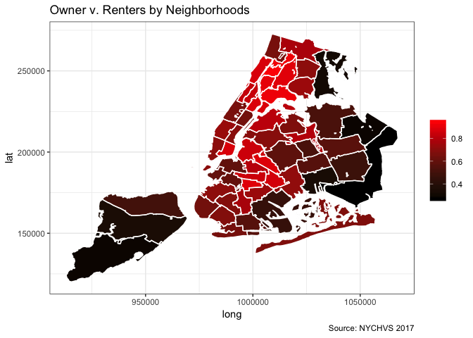

### Median Income of Households

``` r
MHI <- hvs.all %>%
       distinct(sba.name, Median.HH.Income.Year)

shp.df <- merge(shp.df, MHI, by.x = "NAME", by.y = "sba.name")

rm(MHI)
```

``` r
ggplot(shp.df) + 
      aes(long,lat,group=group) +
      geom_polygon(aes(fill= Median.HH.Income.Year)) + 
      scale_fill_gradient(low = "black", high = "red") +
      geom_path(color="white") + 
      theme_bw() +
      labs(title = "Median Household Income",
          caption = "Source: ACS 2017 5 year estimates",
         fill = NULL) 
```

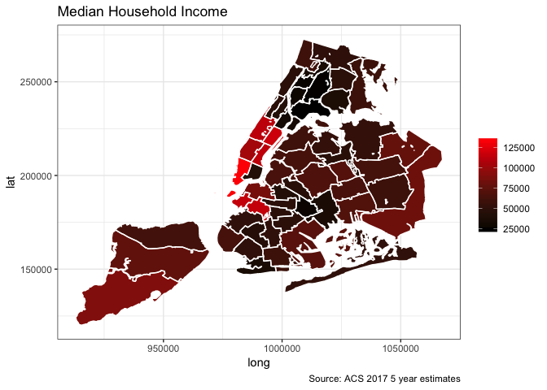

### Income Burdened Households

#### Less than Median

-   Those households whose household income is less than the Median Household Income in the Past 12 Months from the 2017 American Community Survey (Five year estimates)

``` r
Income.Burdened.Est <- rep.wts.2grps.SE(hvs.all,sba.name, HHinc.Less.Median)
```

``` r
#kable(dcast(melt(Income.Burdened.Est, id.vars=c("sba.name", "HHinc.Less.Median")), sba.name~variable+HHinc.Less.Median))
```

``` r
Income.Burdened.Est <- dcast(Income.Burdened.Est, sba.name ~ HHinc.Less.Median, value.var="N0")
kable(Income.Burdened.Est, format = 'html', col.names = c('SBA',"Above Median",'Below Median'))
```

<table>
<thead>
<tr>
<th style="text-align:left;">
SBA
</th>
<th style="text-align:right;">
Above Median
</th>
<th style="text-align:right;">
Below Median
</th>
</tr>
</thead>
<tbody>
<tr>
<td style="text-align:left;">
Astoria
</td>
<td style="text-align:right;">
39220.62
</td>
<td style="text-align:right;">
35524.12
</td>
</tr>
<tr>
<td style="text-align:left;">
Bay Ridge
</td>
<td style="text-align:right;">
25998.51
</td>
<td style="text-align:right;">
25617.88
</td>
</tr>
<tr>
<td style="text-align:left;">
Bayside / Little Neck
</td>
<td style="text-align:right;">
18925.61
</td>
<td style="text-align:right;">
22316.13
</td>
</tr>
<tr>
<td style="text-align:left;">
Bedford Stuyvesant
</td>
<td style="text-align:right;">
29502.12
</td>
<td style="text-align:right;">
21644.93
</td>
</tr>
<tr>
<td style="text-align:left;">
Bellerose / Rosedale
</td>
<td style="text-align:right;">
32686.71
</td>
<td style="text-align:right;">
27171.77
</td>
</tr>
<tr>
<td style="text-align:left;">
Bensonhurst
</td>
<td style="text-align:right;">
40709.65
</td>
<td style="text-align:right;">
31916.39
</td>
</tr>
<tr>
<td style="text-align:left;">
Borough Park
</td>
<td style="text-align:right;">
27773.84
</td>
<td style="text-align:right;">
18515.14
</td>
</tr>
<tr>
<td style="text-align:left;">
Brooklyn Heights / Fort Greene
</td>
<td style="text-align:right;">
29894.62
</td>
<td style="text-align:right;">
26232.04
</td>
</tr>
<tr>
<td style="text-align:left;">
Brownsville / Ocean Hill
</td>
<td style="text-align:right;">
23668.69
</td>
<td style="text-align:right;">
18442.23
</td>
</tr>
<tr>
<td style="text-align:left;">
Bushwick
</td>
<td style="text-align:right;">
21304.47
</td>
<td style="text-align:right;">
20452.14
</td>
</tr>
<tr>
<td style="text-align:left;">
Central Harlem
</td>
<td style="text-align:right;">
28136.48
</td>
<td style="text-align:right;">
26358.38
</td>
</tr>
<tr>
<td style="text-align:left;">
Chelsea / Clinton / Midtown
</td>
<td style="text-align:right;">
41561.60
</td>
<td style="text-align:right;">
35082.37
</td>
</tr>
<tr>
<td style="text-align:left;">
Coney Island
</td>
<td style="text-align:right;">
27256.93
</td>
<td style="text-align:right;">
22103.33
</td>
</tr>
<tr>
<td style="text-align:left;">
East Flatbush
</td>
<td style="text-align:right;">
20890.22
</td>
<td style="text-align:right;">
23498.41
</td>
</tr>
<tr>
<td style="text-align:left;">
East Harlem
</td>
<td style="text-align:right;">
22988.36
</td>
<td style="text-align:right;">
26184.39
</td>
</tr>
<tr>
<td style="text-align:left;">
East New York / Starret City
</td>
<td style="text-align:right;">
32005.62
</td>
<td style="text-align:right;">
23293.40
</td>
</tr>
<tr>
<td style="text-align:left;">
Elmhurst / Corona
</td>
<td style="text-align:right;">
30586.63
</td>
<td style="text-align:right;">
19876.81
</td>
</tr>
<tr>
<td style="text-align:left;">
Flatbush
</td>
<td style="text-align:right;">
32692.51
</td>
<td style="text-align:right;">
24109.01
</td>
</tr>
<tr>
<td style="text-align:left;">
Flatlands / Canarsie
</td>
<td style="text-align:right;">
33553.95
</td>
<td style="text-align:right;">
37293.12
</td>
</tr>
<tr>
<td style="text-align:left;">
Flushing / Whitestone
</td>
<td style="text-align:right;">
49476.65
</td>
<td style="text-align:right;">
36490.50
</td>
</tr>
<tr>
<td style="text-align:left;">
Forest Hills / Rego Park
</td>
<td style="text-align:right;">
25282.76
</td>
<td style="text-align:right;">
23502.84
</td>
</tr>
<tr>
<td style="text-align:left;">
Greenwich Village / Financial District
</td>
<td style="text-align:right;">
44733.37
</td>
<td style="text-align:right;">
36535.91
</td>
</tr>
<tr>
<td style="text-align:left;">
Highbridge / S. Concourse
</td>
<td style="text-align:right;">
28197.71
</td>
<td style="text-align:right;">
19239.78
</td>
</tr>
<tr>
<td style="text-align:left;">
Hillcrest / Fresh Meadows
</td>
<td style="text-align:right;">
29501.43
</td>
<td style="text-align:right;">
24258.33
</td>
</tr>
<tr>
<td style="text-align:left;">
Howard Beach / S. Ozone Park
</td>
<td style="text-align:right;">
20988.99
</td>
<td style="text-align:right;">
17343.47
</td>
</tr>
<tr>
<td style="text-align:left;">
Jackson Heights
</td>
<td style="text-align:right;">
28038.03
</td>
<td style="text-align:right;">
24903.17
</td>
</tr>
<tr>
<td style="text-align:left;">
Jamaica
</td>
<td style="text-align:right;">
36826.64
</td>
<td style="text-align:right;">
33744.67
</td>
</tr>
<tr>
<td style="text-align:left;">
Kew Gardens / Woodhaven
</td>
<td style="text-align:right;">
22145.70
</td>
<td style="text-align:right;">
23481.77
</td>
</tr>
<tr>
<td style="text-align:left;">
Kingsbridge Heights / Mosholu
</td>
<td style="text-align:right;">
27935.09
</td>
<td style="text-align:right;">
21024.60
</td>
</tr>
<tr>
<td style="text-align:left;">
Lower East Side / Chinatown
</td>
<td style="text-align:right;">
46056.83
</td>
<td style="text-align:right;">
28068.85
</td>
</tr>
<tr>
<td style="text-align:left;">
Mid-Island
</td>
<td style="text-align:right;">
24028.62
</td>
<td style="text-align:right;">
22555.11
</td>
</tr>
<tr>
<td style="text-align:left;">
Middle Village / Ridgewood
</td>
<td style="text-align:right;">
32967.98
</td>
<td style="text-align:right;">
32651.58
</td>
</tr>
<tr>
<td style="text-align:left;">
Morningside Heights / Hamilton Heights
</td>
<td style="text-align:right;">
27564.48
</td>
<td style="text-align:right;">
17788.33
</td>
</tr>
<tr>
<td style="text-align:left;">
Morrisania / East Tremont
</td>
<td style="text-align:right;">
31368.67
</td>
<td style="text-align:right;">
23096.40
</td>
</tr>
<tr>
<td style="text-align:left;">
Mott Haven / Hunts Point
</td>
<td style="text-align:right;">
22977.82
</td>
<td style="text-align:right;">
25996.83
</td>
</tr>
<tr>
<td style="text-align:left;">
North Crown Heights / Prospect Heights
</td>
<td style="text-align:right;">
28893.13
</td>
<td style="text-align:right;">
18121.32
</td>
</tr>
<tr>
<td style="text-align:left;">
North Shore
</td>
<td style="text-align:right;">
27924.91
</td>
<td style="text-align:right;">
31862.12
</td>
</tr>
<tr>
<td style="text-align:left;">
Park Slope / Carroll Gardens
</td>
<td style="text-align:right;">
24444.24
</td>
<td style="text-align:right;">
22263.71
</td>
</tr>
<tr>
<td style="text-align:left;">
Pelham Parkway
</td>
<td style="text-align:right;">
25599.90
</td>
<td style="text-align:right;">
18359.48
</td>
</tr>
<tr>
<td style="text-align:left;">
Riverdale / Kingsbridge
</td>
<td style="text-align:right;">
20203.26
</td>
<td style="text-align:right;">
24202.72
</td>
</tr>
<tr>
<td style="text-align:left;">
Rockaways
</td>
<td style="text-align:right;">
21101.49
</td>
<td style="text-align:right;">
21757.02
</td>
</tr>
<tr>
<td style="text-align:left;">
Sheepshead Bay / Gravesend
</td>
<td style="text-align:right;">
35088.50
</td>
<td style="text-align:right;">
25717.71
</td>
</tr>
<tr>
<td style="text-align:left;">
Soundview / Parkchester
</td>
<td style="text-align:right;">
35203.12
</td>
<td style="text-align:right;">
28704.52
</td>
</tr>
<tr>
<td style="text-align:left;">
South Crown Heights
</td>
<td style="text-align:right;">
22717.84
</td>
<td style="text-align:right;">
19329.66
</td>
</tr>
<tr>
<td style="text-align:left;">
South Shore
</td>
<td style="text-align:right;">
28841.79
</td>
<td style="text-align:right;">
25780.45
</td>
</tr>
<tr>
<td style="text-align:left;">
Stuyvesant Town / Turtle Bay
</td>
<td style="text-align:right;">
44170.54
</td>
<td style="text-align:right;">
33976.93
</td>
</tr>
<tr>
<td style="text-align:left;">
Sunnyside / Woodside
</td>
<td style="text-align:right;">
24337.40
</td>
<td style="text-align:right;">
26533.10
</td>
</tr>
<tr>
<td style="text-align:left;">
Sunset Park
</td>
<td style="text-align:right;">
22379.22
</td>
<td style="text-align:right;">
18105.16
</td>
</tr>
<tr>
<td style="text-align:left;">
Throgs Neck / Co-op City
</td>
<td style="text-align:right;">
18317.35
</td>
<td style="text-align:right;">
28294.55
</td>
</tr>
<tr>
<td style="text-align:left;">
University Heights / Fordham
</td>
<td style="text-align:right;">
25731.65
</td>
<td style="text-align:right;">
18639.80
</td>
</tr>
<tr>
<td style="text-align:left;">
Upper East Side
</td>
<td style="text-align:right;">
48338.98
</td>
<td style="text-align:right;">
60394.13
</td>
</tr>
<tr>
<td style="text-align:left;">
Upper West Side
</td>
<td style="text-align:right;">
51202.09
</td>
<td style="text-align:right;">
49483.29
</td>
</tr>
<tr>
<td style="text-align:left;">
Washington Heights / Inwood
</td>
<td style="text-align:right;">
39885.41
</td>
<td style="text-align:right;">
33485.81
</td>
</tr>
<tr>
<td style="text-align:left;">
Williamsbridge / Baychester
</td>
<td style="text-align:right;">
16712.50
</td>
<td style="text-align:right;">
26159.16
</td>
</tr>
<tr>
<td style="text-align:left;">
Williamsburg / Greenpoint
</td>
<td style="text-align:right;">
40006.75
</td>
<td style="text-align:right;">
23921.86
</td>
</tr>
</tbody>
</table>
``` r
names(Income.Burdened.Est)[c(2,3)] <- c("HH.Income.Above.Median", "HH.Below.Median")
centroids <- merge(centroids, Income.Burdened.Est, by = "sba.name")
rm(Income.Burdened.Est)
```

``` r
ggplot(shp.df) + 
      aes(long,lat,group=group) +
      geom_polygon() +
     geom_scatterpie(data = centroids, 
                    aes(long, lat),
                    cols = c("HH.Income.Above.Median", "HH.Below.Median"), 
                    alpha = 0.5) +
    scale_colour_manual(
        breaks = c("HH.Income.Above.Median","HH.Below.Median"),
        labels = c("Above", "Below"),
        values = c("HH.Income.Above.Median" = "blue",
                   "HH.Below.Median" = "orange")) +
      geom_path(color="white") + 
      theme_bw() +
      coord_fixed() +
      labs(title = "Income Burdened Households by Sub Borough Area",
         subtitle = "Hosehold Income below Median v. Household Income above Median",
         caption = "NYCHVS 2017, Rent Source: 2017 ACS 5-year estimate",
         fill = NULL)
```

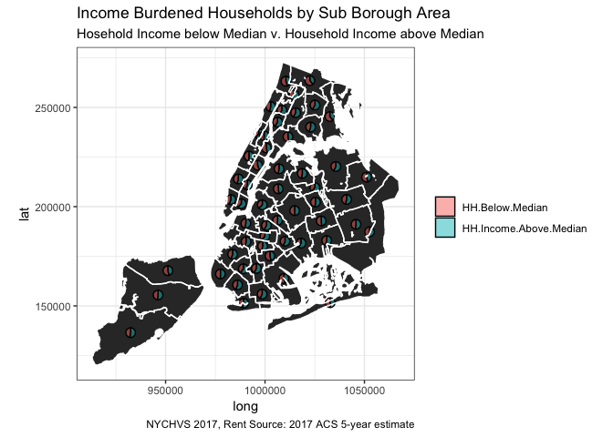

#### Less than 75% Quantile

``` r
Income.Burdened.Est <- rep.wts.2grps.SE(hvs.all,sba.name, HHinc.Less.75)
```

``` r
#kable(dcast(melt(Income.Burdened.Est, id.vars=c("sba.name", "HHinc.Less.75")), sba.name~variable+HHinc.Less.75))
```

``` r
Income.Burdened.Est <- dcast(Income.Burdened.Est, sba.name ~ HHinc.Less.75, value.var="N0")
kable(Income.Burdened.Est, format = 'html', col.names = c('SBA',"Above 75%",'Below 75%'))
```

<table>
<thead>
<tr>
<th style="text-align:left;">
SBA
</th>
<th style="text-align:right;">
Above 75%
</th>
<th style="text-align:right;">
Below 75%
</th>
</tr>
</thead>
<tbody>
<tr>
<td style="text-align:left;">
Astoria
</td>
<td style="text-align:right;">
18919.260
</td>
<td style="text-align:right;">
55825.48
</td>
</tr>
<tr>
<td style="text-align:left;">
Bay Ridge
</td>
<td style="text-align:right;">
13452.293
</td>
<td style="text-align:right;">
38164.09
</td>
</tr>
<tr>
<td style="text-align:left;">
Bayside / Little Neck
</td>
<td style="text-align:right;">
10285.946
</td>
<td style="text-align:right;">
30955.80
</td>
</tr>
<tr>
<td style="text-align:left;">
Bedford Stuyvesant
</td>
<td style="text-align:right;">
13010.388
</td>
<td style="text-align:right;">
38136.66
</td>
</tr>
<tr>
<td style="text-align:left;">
Bellerose / Rosedale
</td>
<td style="text-align:right;">
15329.285
</td>
<td style="text-align:right;">
44529.19
</td>
</tr>
<tr>
<td style="text-align:left;">
Bensonhurst
</td>
<td style="text-align:right;">
18029.661
</td>
<td style="text-align:right;">
54596.38
</td>
</tr>
<tr>
<td style="text-align:left;">
Borough Park
</td>
<td style="text-align:right;">
11824.422
</td>
<td style="text-align:right;">
34464.56
</td>
</tr>
<tr>
<td style="text-align:left;">
Brooklyn Heights / Fort Greene
</td>
<td style="text-align:right;">
14552.366
</td>
<td style="text-align:right;">
41574.29
</td>
</tr>
<tr>
<td style="text-align:left;">
Brownsville / Ocean Hill
</td>
<td style="text-align:right;">
10890.938
</td>
<td style="text-align:right;">
31219.99
</td>
</tr>
<tr>
<td style="text-align:left;">
Bushwick
</td>
<td style="text-align:right;">
10545.391
</td>
<td style="text-align:right;">
31211.22
</td>
</tr>
<tr>
<td style="text-align:left;">
Central Harlem
</td>
<td style="text-align:right;">
15439.089
</td>
<td style="text-align:right;">
39055.78
</td>
</tr>
<tr>
<td style="text-align:left;">
Chelsea / Clinton / Midtown
</td>
<td style="text-align:right;">
20283.293
</td>
<td style="text-align:right;">
56360.68
</td>
</tr>
<tr>
<td style="text-align:left;">
Coney Island
</td>
<td style="text-align:right;">
12831.219
</td>
<td style="text-align:right;">
36529.04
</td>
</tr>
<tr>
<td style="text-align:left;">
East Flatbush
</td>
<td style="text-align:right;">
11326.464
</td>
<td style="text-align:right;">
33062.17
</td>
</tr>
<tr>
<td style="text-align:left;">
East Harlem
</td>
<td style="text-align:right;">
13076.105
</td>
<td style="text-align:right;">
36096.64
</td>
</tr>
<tr>
<td style="text-align:left;">
East New York / Starret City
</td>
<td style="text-align:right;">
14352.054
</td>
<td style="text-align:right;">
40946.96
</td>
</tr>
<tr>
<td style="text-align:left;">
Elmhurst / Corona
</td>
<td style="text-align:right;">
12673.711
</td>
<td style="text-align:right;">
37789.72
</td>
</tr>
<tr>
<td style="text-align:left;">
Flatbush
</td>
<td style="text-align:right;">
14414.738
</td>
<td style="text-align:right;">
42386.78
</td>
</tr>
<tr>
<td style="text-align:left;">
Flatlands / Canarsie
</td>
<td style="text-align:right;">
17783.453
</td>
<td style="text-align:right;">
53063.62
</td>
</tr>
<tr>
<td style="text-align:left;">
Flushing / Whitestone
</td>
<td style="text-align:right;">
21724.802
</td>
<td style="text-align:right;">
64242.35
</td>
</tr>
<tr>
<td style="text-align:left;">
Forest Hills / Rego Park
</td>
<td style="text-align:right;">
12022.833
</td>
<td style="text-align:right;">
36762.77
</td>
</tr>
<tr>
<td style="text-align:left;">
Greenwich Village / Financial District
</td>
<td style="text-align:right;">
20850.571
</td>
<td style="text-align:right;">
60418.70
</td>
</tr>
<tr>
<td style="text-align:left;">
Highbridge / S. Concourse
</td>
<td style="text-align:right;">
12658.375
</td>
<td style="text-align:right;">
34779.12
</td>
</tr>
<tr>
<td style="text-align:left;">
Hillcrest / Fresh Meadows
</td>
<td style="text-align:right;">
13206.078
</td>
<td style="text-align:right;">
40553.68
</td>
</tr>
<tr>
<td style="text-align:left;">
Howard Beach / S. Ozone Park
</td>
<td style="text-align:right;">
9837.919
</td>
<td style="text-align:right;">
28494.55
</td>
</tr>
<tr>
<td style="text-align:left;">
Jackson Heights
</td>
<td style="text-align:right;">
13150.890
</td>
<td style="text-align:right;">
39790.32
</td>
</tr>
<tr>
<td style="text-align:left;">
Jamaica
</td>
<td style="text-align:right;">
17450.612
</td>
<td style="text-align:right;">
53120.69
</td>
</tr>
<tr>
<td style="text-align:left;">
Kew Gardens / Woodhaven
</td>
<td style="text-align:right;">
11731.195
</td>
<td style="text-align:right;">
33896.27
</td>
</tr>
<tr>
<td style="text-align:left;">
Kingsbridge Heights / Mosholu
</td>
<td style="text-align:right;">
11995.343
</td>
<td style="text-align:right;">
36964.34
</td>
</tr>
<tr>
<td style="text-align:left;">
Lower East Side / Chinatown
</td>
<td style="text-align:right;">
19562.694
</td>
<td style="text-align:right;">
54562.99
</td>
</tr>
<tr>
<td style="text-align:left;">
Mid-Island
</td>
<td style="text-align:right;">
11368.732
</td>
<td style="text-align:right;">
35215.00
</td>
</tr>
<tr>
<td style="text-align:left;">
Middle Village / Ridgewood
</td>
<td style="text-align:right;">
16523.031
</td>
<td style="text-align:right;">
49096.53
</td>
</tr>
<tr>
<td style="text-align:left;">
Morningside Heights / Hamilton Heights
</td>
<td style="text-align:right;">
15510.830
</td>
<td style="text-align:right;">
29841.97
</td>
</tr>
<tr>
<td style="text-align:left;">
Morrisania / East Tremont
</td>
<td style="text-align:right;">
14516.283
</td>
<td style="text-align:right;">
39948.80
</td>
</tr>
<tr>
<td style="text-align:left;">
Mott Haven / Hunts Point
</td>
<td style="text-align:right;">
13400.180
</td>
<td style="text-align:right;">
35574.47
</td>
</tr>
<tr>
<td style="text-align:left;">
North Crown Heights / Prospect Heights
</td>
<td style="text-align:right;">
12232.826
</td>
<td style="text-align:right;">
34781.63
</td>
</tr>
<tr>
<td style="text-align:left;">
North Shore
</td>
<td style="text-align:right;">
15129.795
</td>
<td style="text-align:right;">
44657.23
</td>
</tr>
<tr>
<td style="text-align:left;">
Park Slope / Carroll Gardens
</td>
<td style="text-align:right;">
11469.340
</td>
<td style="text-align:right;">
35238.61
</td>
</tr>
<tr>
<td style="text-align:left;">
Pelham Parkway
</td>
<td style="text-align:right;">
11892.371
</td>
<td style="text-align:right;">
32067.02
</td>
</tr>
<tr>
<td style="text-align:left;">
Riverdale / Kingsbridge
</td>
<td style="text-align:right;">
12107.160
</td>
<td style="text-align:right;">
32298.82
</td>
</tr>
<tr>
<td style="text-align:left;">
Rockaways
</td>
<td style="text-align:right;">
10516.700
</td>
<td style="text-align:right;">
32341.81
</td>
</tr>
<tr>
<td style="text-align:left;">
Sheepshead Bay / Gravesend
</td>
<td style="text-align:right;">
15200.746
</td>
<td style="text-align:right;">
45605.47
</td>
</tr>
<tr>
<td style="text-align:left;">
Soundview / Parkchester
</td>
<td style="text-align:right;">
16767.936
</td>
<td style="text-align:right;">
47139.71
</td>
</tr>
<tr>
<td style="text-align:left;">
South Crown Heights
</td>
<td style="text-align:right;">
10510.999
</td>
<td style="text-align:right;">
31536.49
</td>
</tr>
<tr>
<td style="text-align:left;">
South Shore
</td>
<td style="text-align:right;">
13914.267
</td>
<td style="text-align:right;">
40707.97
</td>
</tr>
<tr>
<td style="text-align:left;">
Stuyvesant Town / Turtle Bay
</td>
<td style="text-align:right;">
19711.015
</td>
<td style="text-align:right;">
58436.45
</td>
</tr>
<tr>
<td style="text-align:left;">
Sunnyside / Woodside
</td>
<td style="text-align:right;">
13517.337
</td>
<td style="text-align:right;">
37353.17
</td>
</tr>
<tr>
<td style="text-align:left;">
Sunset Park
</td>
<td style="text-align:right;">
9383.550
</td>
<td style="text-align:right;">
31100.83
</td>
</tr>
<tr>
<td style="text-align:left;">
Throgs Neck / Co-op City
</td>
<td style="text-align:right;">
12895.467
</td>
<td style="text-align:right;">
33716.43
</td>
</tr>
<tr>
<td style="text-align:left;">
University Heights / Fordham
</td>
<td style="text-align:right;">
11715.133
</td>
<td style="text-align:right;">
32656.32
</td>
</tr>
<tr>
<td style="text-align:left;">
Upper East Side
</td>
<td style="text-align:right;">
27923.323
</td>
<td style="text-align:right;">
80809.78
</td>
</tr>
<tr>
<td style="text-align:left;">
Upper West Side
</td>
<td style="text-align:right;">
25935.189
</td>
<td style="text-align:right;">
74750.20
</td>
</tr>
<tr>
<td style="text-align:left;">
Washington Heights / Inwood
</td>
<td style="text-align:right;">
22578.443
</td>
<td style="text-align:right;">
50792.78
</td>
</tr>
<tr>
<td style="text-align:left;">
Williamsbridge / Baychester
</td>
<td style="text-align:right;">
11532.205
</td>
<td style="text-align:right;">
31339.46
</td>
</tr>
<tr>
<td style="text-align:left;">
Williamsburg / Greenpoint
</td>
<td style="text-align:right;">
16257.618
</td>
<td style="text-align:right;">
47670.99
</td>
</tr>
</tbody>
</table>
``` r
names(Income.Burdened.Est)[c(2,3)] <- c("HH.Income.Above.75", "HH.Income.Below.75")

Income.Burdened.Est <- Income.Burdened.Est %>%
                       mutate(PropAbove75 = HH.Income.Above.75/(HH.Income.Above.75 + HH.Income.Below.75))
```

``` r
shp.df <- merge(shp.df, Income.Burdened.Est, by.x = "NAME", by.y = "sba.name")

rm(Income.Burdened.Est)
```

``` r
ggplot(shp.df) + 
      aes(long,lat,group=group) +
      geom_polygon(aes(fill=PropAbove75)) + 
      scale_fill_gradient(low = "black", high = "red") +
      geom_path(color="white") + 
      theme_bw() +
      labs(title = "Proportion of Households Above 75% Quantile",
         caption = "Source: NYCHVS 2017",
         fill = NULL) 
```

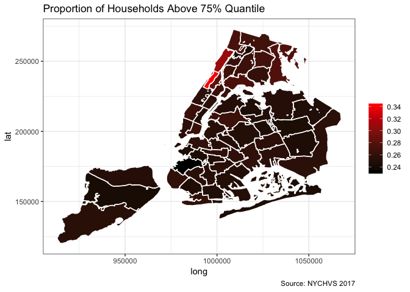

#### Less than 25% Quantile

``` r
Income.Burdened.Est <- rep.wts.2grps.SE(hvs.all,sba.name, HHinc.Less.25)
```

``` r
#kable(dcast(melt(Income.Burdened.Est, id.vars=c("sba.name", "HHinc.Less.25")), sba.name~variable+HHinc.Less.25))
```

``` r
Income.Burdened.Est <- dcast(Income.Burdened.Est, sba.name ~ HHinc.Less.25, value.var="N0")
kable(Income.Burdened.Est, format = 'html', col.names = c('SBA',"Above 75%",'Below 75%'))
```

<table>
<thead>
<tr>
<th style="text-align:left;">
SBA
</th>
<th style="text-align:right;">
Above 75%
</th>
<th style="text-align:right;">
Below 75%
</th>
</tr>
</thead>
<tbody>
<tr>
<td style="text-align:left;">
Astoria
</td>
<td style="text-align:right;">
55716.22
</td>
<td style="text-align:right;">
19028.518
</td>
</tr>
<tr>
<td style="text-align:left;">
Bay Ridge
</td>
<td style="text-align:right;">
38885.80
</td>
<td style="text-align:right;">
12730.587
</td>
</tr>
<tr>
<td style="text-align:left;">
Bayside / Little Neck
</td>
<td style="text-align:right;">
31073.58
</td>
<td style="text-align:right;">
10168.166
</td>
</tr>
<tr>
<td style="text-align:left;">
Bedford Stuyvesant
</td>
<td style="text-align:right;">
38730.88
</td>
<td style="text-align:right;">
12416.166
</td>
</tr>
<tr>
<td style="text-align:left;">
Bellerose / Rosedale
</td>
<td style="text-align:right;">
45113.30
</td>
<td style="text-align:right;">
14745.176
</td>
</tr>
<tr>
<td style="text-align:left;">
Bensonhurst
</td>
<td style="text-align:right;">
54682.80
</td>
<td style="text-align:right;">
17943.245
</td>
</tr>
<tr>
<td style="text-align:left;">
Borough Park
</td>
<td style="text-align:right;">
33930.22
</td>
<td style="text-align:right;">
12358.762
</td>
</tr>
<tr>
<td style="text-align:left;">
Brooklyn Heights / Fort Greene
</td>
<td style="text-align:right;">
43329.98
</td>
<td style="text-align:right;">
12796.679
</td>
</tr>
<tr>
<td style="text-align:left;">
Brownsville / Ocean Hill
</td>
<td style="text-align:right;">
31896.84
</td>
<td style="text-align:right;">
10214.082
</td>
</tr>
<tr>
<td style="text-align:left;">
Bushwick
</td>
<td style="text-align:right;">
30874.65
</td>
<td style="text-align:right;">
10881.966
</td>
</tr>
<tr>
<td style="text-align:left;">
Central Harlem
</td>
<td style="text-align:right;">
42602.12
</td>
<td style="text-align:right;">
11892.749
</td>
</tr>
<tr>
<td style="text-align:left;">
Chelsea / Clinton / Midtown
</td>
<td style="text-align:right;">
59031.39
</td>
<td style="text-align:right;">
17612.575
</td>
</tr>
<tr>
<td style="text-align:left;">
Coney Island
</td>
<td style="text-align:right;">
38015.75
</td>
<td style="text-align:right;">
11344.503
</td>
</tr>
<tr>
<td style="text-align:left;">
East Flatbush
</td>
<td style="text-align:right;">
33646.28
</td>
<td style="text-align:right;">
10742.354
</td>
</tr>
<tr>
<td style="text-align:left;">
East Harlem
</td>
<td style="text-align:right;">
37264.22
</td>
<td style="text-align:right;">
11908.526
</td>
</tr>
<tr>
<td style="text-align:left;">
East New York / Starret City
</td>
<td style="text-align:right;">
42024.37
</td>
<td style="text-align:right;">
13274.641
</td>
</tr>
<tr>
<td style="text-align:left;">
Elmhurst / Corona
</td>
<td style="text-align:right;">
37829.67
</td>
<td style="text-align:right;">
12633.769
</td>
</tr>
<tr>
<td style="text-align:left;">
Flatbush
</td>
<td style="text-align:right;">
43438.38
</td>
<td style="text-align:right;">
13363.138
</td>
</tr>
<tr>
<td style="text-align:left;">
Flatlands / Canarsie
</td>
<td style="text-align:right;">
53003.76
</td>
<td style="text-align:right;">
17843.309
</td>
</tr>
<tr>
<td style="text-align:left;">
Flushing / Whitestone
</td>
<td style="text-align:right;">
64786.48
</td>
<td style="text-align:right;">
21180.670
</td>
</tr>
<tr>
<td style="text-align:left;">
Forest Hills / Rego Park
</td>
<td style="text-align:right;">
36672.88
</td>
<td style="text-align:right;">
12112.726
</td>
</tr>
<tr>
<td style="text-align:left;">
Greenwich Village / Financial District
</td>
<td style="text-align:right;">
61358.43
</td>
<td style="text-align:right;">
19910.841
</td>
</tr>
<tr>
<td style="text-align:left;">
Highbridge / S. Concourse
</td>
<td style="text-align:right;">
36576.49
</td>
<td style="text-align:right;">
10860.997
</td>
</tr>
<tr>
<td style="text-align:left;">
Hillcrest / Fresh Meadows
</td>
<td style="text-align:right;">
40694.34
</td>
<td style="text-align:right;">
13065.416
</td>
</tr>
<tr>
<td style="text-align:left;">
Howard Beach / S. Ozone Park
</td>
<td style="text-align:right;">
29560.35
</td>
<td style="text-align:right;">
8772.119
</td>
</tr>
<tr>
<td style="text-align:left;">
Jackson Heights
</td>
<td style="text-align:right;">
40230.86
</td>
<td style="text-align:right;">
12710.343
</td>
</tr>
<tr>
<td style="text-align:left;">
Jamaica
</td>
<td style="text-align:right;">
52888.71
</td>
<td style="text-align:right;">
17682.594
</td>
</tr>
<tr>
<td style="text-align:left;">
Kew Gardens / Woodhaven
</td>
<td style="text-align:right;">
34143.59
</td>
<td style="text-align:right;">
11483.874
</td>
</tr>
<tr>
<td style="text-align:left;">
Kingsbridge Heights / Mosholu
</td>
<td style="text-align:right;">
36274.20
</td>
<td style="text-align:right;">
12685.487
</td>
</tr>
<tr>
<td style="text-align:left;">
Lower East Side / Chinatown
</td>
<td style="text-align:right;">
56595.41
</td>
<td style="text-align:right;">
17530.278
</td>
</tr>
<tr>
<td style="text-align:left;">
Mid-Island
</td>
<td style="text-align:right;">
35044.83
</td>
<td style="text-align:right;">
11538.900
</td>
</tr>
<tr>
<td style="text-align:left;">
Middle Village / Ridgewood
</td>
<td style="text-align:right;">
49438.30
</td>
<td style="text-align:right;">
16181.264
</td>
</tr>
<tr>
<td style="text-align:left;">
Morningside Heights / Hamilton Heights
</td>
<td style="text-align:right;">
36738.43
</td>
<td style="text-align:right;">
8614.371
</td>
</tr>
<tr>
<td style="text-align:left;">
Morrisania / East Tremont
</td>
<td style="text-align:right;">
41360.35
</td>
<td style="text-align:right;">
13104.729
</td>
</tr>
<tr>
<td style="text-align:left;">
Mott Haven / Hunts Point
</td>
<td style="text-align:right;">
37819.36
</td>
<td style="text-align:right;">
11155.291
</td>
</tr>
<tr>
<td style="text-align:left;">
North Crown Heights / Prospect Heights
</td>
<td style="text-align:right;">
35409.60
</td>
<td style="text-align:right;">
11604.854
</td>
</tr>
<tr>
<td style="text-align:left;">
North Shore
</td>
<td style="text-align:right;">
44716.91
</td>
<td style="text-align:right;">
15070.116
</td>
</tr>
<tr>
<td style="text-align:left;">
Park Slope / Carroll Gardens
</td>
<td style="text-align:right;">
34821.80
</td>
<td style="text-align:right;">
11886.157
</td>
</tr>
<tr>
<td style="text-align:left;">
Pelham Parkway
</td>
<td style="text-align:right;">
32841.01
</td>
<td style="text-align:right;">
11118.381
</td>
</tr>
<tr>
<td style="text-align:left;">
Riverdale / Kingsbridge
</td>
<td style="text-align:right;">
34390.14
</td>
<td style="text-align:right;">
10015.846
</td>
</tr>
<tr>
<td style="text-align:left;">
Rockaways
</td>
<td style="text-align:right;">
32510.19
</td>
<td style="text-align:right;">
10348.314
</td>
</tr>
<tr>
<td style="text-align:left;">
Sheepshead Bay / Gravesend
</td>
<td style="text-align:right;">
46331.13
</td>
<td style="text-align:right;">
14475.080
</td>
</tr>
<tr>
<td style="text-align:left;">
Soundview / Parkchester
</td>
<td style="text-align:right;">
49446.90
</td>
<td style="text-align:right;">
14460.746
</td>
</tr>
<tr>
<td style="text-align:left;">
South Crown Heights
</td>
<td style="text-align:right;">
31937.78
</td>
<td style="text-align:right;">
10109.712
</td>
</tr>
<tr>
<td style="text-align:left;">
South Shore
</td>
<td style="text-align:right;">
41475.30
</td>
<td style="text-align:right;">
13146.931
</td>
</tr>
<tr>
<td style="text-align:left;">
Stuyvesant Town / Turtle Bay
</td>
<td style="text-align:right;">
58882.10
</td>
<td style="text-align:right;">
19265.369
</td>
</tr>
<tr>
<td style="text-align:left;">
Sunnyside / Woodside
</td>
<td style="text-align:right;">
37883.54
</td>
<td style="text-align:right;">
12986.968
</td>
</tr>
<tr>
<td style="text-align:left;">
Sunset Park
</td>
<td style="text-align:right;">
30057.85
</td>
<td style="text-align:right;">
10426.530
</td>
</tr>
<tr>
<td style="text-align:left;">
Throgs Neck / Co-op City
</td>
<td style="text-align:right;">
35434.48
</td>
<td style="text-align:right;">
11177.416
</td>
</tr>
<tr>
<td style="text-align:left;">
University Heights / Fordham
</td>
<td style="text-align:right;">
33502.70
</td>
<td style="text-align:right;">
10868.751
</td>
</tr>
<tr>
<td style="text-align:left;">
Upper East Side
</td>
<td style="text-align:right;">
83634.69
</td>
<td style="text-align:right;">
25098.420
</td>
</tr>
<tr>
<td style="text-align:left;">
Upper West Side
</td>
<td style="text-align:right;">
77072.77
</td>
<td style="text-align:right;">
23612.617
</td>
</tr>
<tr>
<td style="text-align:left;">
Washington Heights / Inwood
</td>
<td style="text-align:right;">
57762.25
</td>
<td style="text-align:right;">
15608.967
</td>
</tr>
<tr>
<td style="text-align:left;">
Williamsbridge / Baychester
</td>
<td style="text-align:right;">
31993.68
</td>
<td style="text-align:right;">
10877.986
</td>
</tr>
<tr>
<td style="text-align:left;">
Williamsburg / Greenpoint
</td>
<td style="text-align:right;">
48254.32
</td>
<td style="text-align:right;">
15674.288
</td>
</tr>
</tbody>
</table>
``` r
names(Income.Burdened.Est)[c(2,3)] <- c("HH.Income.Above.25", "HH.Income.Below.25")

Income.Burdened.Est <- Income.Burdened.Est %>%
                       mutate(PropBelow25 = HH.Income.Below.25/(HH.Income.Above.25 + HH.Income.Below.25))
```

``` r
shp.df <- merge(shp.df, Income.Burdened.Est, by.x = "NAME", by.y = "sba.name")

rm(Income.Burdened.Est)
```

``` r
ggplot(shp.df) + 
      aes(long,lat,group=group) +
      geom_polygon(aes(fill=PropBelow25)) + 
      scale_fill_gradient(low = "black", high = "red") +
      geom_path(color="white") + 
      theme_bw() +
      labs(title = "Proportion of Households Below 25% Quantile",
         caption = "Source: NYCHVS 2017",
         fill = NULL) 
```

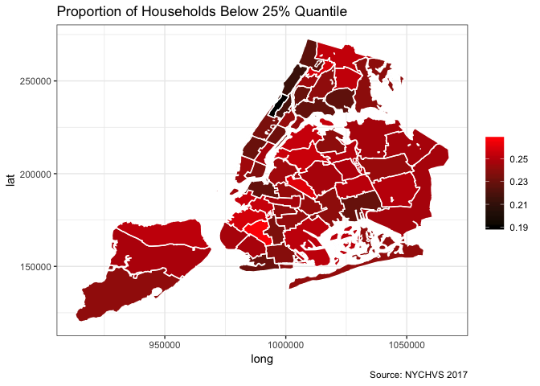

### Median Gross Rent

``` r
MGR <- hvs.all %>%
       distinct(sba.name, Median.Gross.Rent)

shp.df <- merge(shp.df, MGR, by.x = "NAME", by.y = "sba.name")

rm(MGR)

ggplot(shp.df) + 
      aes(long,lat,group=group) +
      geom_polygon(aes(fill= Median.Gross.Rent)) + 
      scale_fill_gradient(low = "black", high = "red") +
      geom_path(color="white") + 
      theme_bw() +
         labs(title = "Median Gross Rent",
         caption = "Source: ACS 2017 5 year estimates",
         fill = NULL) 
```

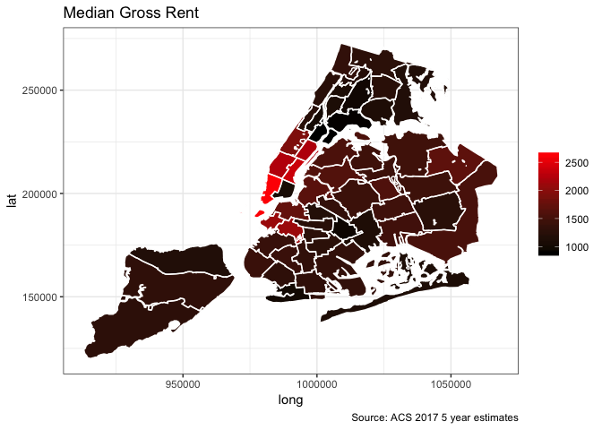

``` r
renters <- filter(hvs.all, Owner.Renter == 'Renter')
renters <- filter(renters, Monthly.Gross.Rent != 99999) 
```

``` r
Rent.Burdened.Est <- rep.wts.2grps.SE(renters,sba.name, Rent.Less.Median)
```

``` r
#kable(dcast(melt(Rent.Burdened.Est, id.vars=c("sba.name", "Rent.Less.Median")), sba.name~variable+Rent.Less.Median))
```

``` r
Rent.Burdened.Est <- dcast(Rent.Burdened.Est, sba.name ~ Rent.Less.Median, value.var="N0")
kable(Rent.Burdened.Est, format = 'html', col.names = c('SBA',"Above Median",'Below Median'))
```

<table>
<thead>
<tr>
<th style="text-align:left;">
SBA
</th>
<th style="text-align:right;">
Above Median
</th>
<th style="text-align:right;">
Below Median
</th>
</tr>
</thead>
<tbody>
<tr>
<td style="text-align:left;">
Astoria
</td>
<td style="text-align:right;">
34336.067
</td>
<td style="text-align:right;">
25155.278
</td>
</tr>
<tr>
<td style="text-align:left;">
Bay Ridge
</td>
<td style="text-align:right;">
16948.344
</td>
<td style="text-align:right;">
14286.220
</td>
</tr>
<tr>
<td style="text-align:left;">
Bayside / Little Neck
</td>
<td style="text-align:right;">
6787.581
</td>
<td style="text-align:right;">
4242.606
</td>
</tr>
<tr>
<td style="text-align:left;">
Bedford Stuyvesant
</td>
<td style="text-align:right;">
23341.209
</td>
<td style="text-align:right;">
16889.967
</td>
</tr>
<tr>
<td style="text-align:left;">
Bellerose / Rosedale
</td>
<td style="text-align:right;">
8524.285
</td>
<td style="text-align:right;">
6023.945
</td>
</tr>
<tr>
<td style="text-align:left;">
Bensonhurst
</td>
<td style="text-align:right;">
24763.737
</td>
<td style="text-align:right;">
22469.565
</td>
</tr>
<tr>
<td style="text-align:left;">
Borough Park
</td>
<td style="text-align:right;">
16082.901
</td>
<td style="text-align:right;">
14391.255
</td>
</tr>
<tr>
<td style="text-align:left;">
Brooklyn Heights / Fort Greene
</td>
<td style="text-align:right;">
17352.711
</td>
<td style="text-align:right;">
15789.624
</td>
</tr>
<tr>
<td style="text-align:left;">
Brownsville / Ocean Hill
</td>
<td style="text-align:right;">
22721.199
</td>
<td style="text-align:right;">
12927.143
</td>
</tr>
<tr>
<td style="text-align:left;">
Bushwick
</td>
<td style="text-align:right;">
20487.934
</td>
<td style="text-align:right;">
15559.203
</td>
</tr>
<tr>
<td style="text-align:left;">
Central Harlem
</td>
<td style="text-align:right;">
27075.478
</td>
<td style="text-align:right;">
17162.049
</td>
</tr>
<tr>
<td style="text-align:left;">
Chelsea / Clinton / Midtown
</td>
<td style="text-align:right;">
35366.777
</td>
<td style="text-align:right;">
20340.744
</td>
</tr>
<tr>
<td style="text-align:left;">
Coney Island
</td>
<td style="text-align:right;">
23591.582
</td>
<td style="text-align:right;">
7062.898
</td>
</tr>
<tr>
<td style="text-align:left;">
East Flatbush
</td>
<td style="text-align:right;">
17228.586
</td>
<td style="text-align:right;">
14206.347
</td>
</tr>
<tr>
<td style="text-align:left;">
East Harlem
</td>
<td style="text-align:right;">
26613.642
</td>
<td style="text-align:right;">
16406.651
</td>
</tr>
<tr>
<td style="text-align:left;">
East New York / Starret City
</td>
<td style="text-align:right;">
19876.545
</td>
<td style="text-align:right;">
16809.103
</td>
</tr>
<tr>
<td style="text-align:left;">
Elmhurst / Corona
</td>
<td style="text-align:right;">
21744.018
</td>
<td style="text-align:right;">
15806.185
</td>
</tr>
<tr>
<td style="text-align:left;">
Flatbush
</td>
<td style="text-align:right;">
26242.942
</td>
<td style="text-align:right;">
15581.654
</td>
</tr>
<tr>
<td style="text-align:left;">
Flatlands / Canarsie
</td>
<td style="text-align:right;">
15296.602
</td>
<td style="text-align:right;">
15765.943
</td>
</tr>
<tr>
<td style="text-align:left;">
Flushing / Whitestone
</td>
<td style="text-align:right;">
24803.418
</td>
<td style="text-align:right;">
17776.632
</td>
</tr>
<tr>
<td style="text-align:left;">
Forest Hills / Rego Park
</td>
<td style="text-align:right;">
14637.118
</td>
<td style="text-align:right;">
9996.166
</td>
</tr>
<tr>
<td style="text-align:left;">
Greenwich Village / Financial District
</td>
<td style="text-align:right;">
37280.343
</td>
<td style="text-align:right;">
19251.836
</td>
</tr>
<tr>
<td style="text-align:left;">
Highbridge / S. Concourse
</td>
<td style="text-align:right;">
24306.426
</td>
<td style="text-align:right;">
18065.200
</td>
</tr>
<tr>
<td style="text-align:left;">
Hillcrest / Fresh Meadows
</td>
<td style="text-align:right;">
19379.514
</td>
<td style="text-align:right;">
10349.080
</td>
</tr>
<tr>
<td style="text-align:left;">
Howard Beach / S. Ozone Park
</td>
<td style="text-align:right;">
6442.418
</td>
<td style="text-align:right;">
6449.960
</td>
</tr>
<tr>
<td style="text-align:left;">
Jackson Heights
</td>
<td style="text-align:right;">
21282.529
</td>
<td style="text-align:right;">
13241.845
</td>
</tr>
<tr>
<td style="text-align:left;">
Jamaica
</td>
<td style="text-align:right;">
22293.657
</td>
<td style="text-align:right;">
10168.146
</td>
</tr>
<tr>
<td style="text-align:left;">
Kew Gardens / Woodhaven
</td>
<td style="text-align:right;">
12156.487
</td>
<td style="text-align:right;">
12501.047
</td>
</tr>
<tr>
<td style="text-align:left;">
Kingsbridge Heights / Mosholu
</td>
<td style="text-align:right;">
26823.768
</td>
<td style="text-align:right;">
17567.244
</td>
</tr>
<tr>
<td style="text-align:left;">
Lower East Side / Chinatown
</td>
<td style="text-align:right;">
38686.298
</td>
<td style="text-align:right;">
25672.737
</td>
</tr>
<tr>
<td style="text-align:left;">
Mid-Island
</td>
<td style="text-align:right;">
6691.617
</td>
<td style="text-align:right;">
7883.946
</td>
</tr>
<tr>
<td style="text-align:left;">
Middle Village / Ridgewood
</td>
<td style="text-align:right;">
21429.899
</td>
<td style="text-align:right;">
15008.628
</td>
</tr>
<tr>
<td style="text-align:left;">
Morningside Heights / Hamilton Heights
</td>
<td style="text-align:right;">
21721.250
</td>
<td style="text-align:right;">
15255.337
</td>
</tr>
<tr>
<td style="text-align:left;">
Morrisania / East Tremont
</td>
<td style="text-align:right;">
30811.141
</td>
<td style="text-align:right;">
15538.569
</td>
</tr>
<tr>
<td style="text-align:left;">
Mott Haven / Hunts Point
</td>
<td style="text-align:right;">
25843.405
</td>
<td style="text-align:right;">
17205.559
</td>
</tr>
<tr>
<td style="text-align:left;">
North Crown Heights / Prospect Heights
</td>
<td style="text-align:right;">
22575.966
</td>
<td style="text-align:right;">
16234.450
</td>
</tr>
<tr>
<td style="text-align:left;">
North Shore
</td>
<td style="text-align:right;">
16904.739
</td>
<td style="text-align:right;">
12080.890
</td>
</tr>
<tr>
<td style="text-align:left;">
Park Slope / Carroll Gardens
</td>
<td style="text-align:right;">
16753.916
</td>
<td style="text-align:right;">
11227.630
</td>
</tr>
<tr>
<td style="text-align:left;">
Pelham Parkway
</td>
<td style="text-align:right;">
15750.222
</td>
<td style="text-align:right;">
13730.034
</td>
</tr>
<tr>
<td style="text-align:left;">
Riverdale / Kingsbridge
</td>
<td style="text-align:right;">
12298.157
</td>
<td style="text-align:right;">
14354.538
</td>
</tr>
<tr>
<td style="text-align:left;">
Rockaways
</td>
<td style="text-align:right;">
16961.198
</td>
<td style="text-align:right;">
11440.818
</td>
</tr>
<tr>
<td style="text-align:left;">
Sheepshead Bay / Gravesend
</td>
<td style="text-align:right;">
18579.969
</td>
<td style="text-align:right;">
14591.001
</td>
</tr>
<tr>
<td style="text-align:left;">
Soundview / Parkchester
</td>
<td style="text-align:right;">
26758.279
</td>
<td style="text-align:right;">
20092.366
</td>
</tr>
<tr>
<td style="text-align:left;">
South Crown Heights
</td>
<td style="text-align:right;">
21263.405
</td>
<td style="text-align:right;">
14982.912
</td>
</tr>
<tr>
<td style="text-align:left;">
South Shore
</td>
<td style="text-align:right;">
5398.954
</td>
<td style="text-align:right;">
7385.736
</td>
</tr>
<tr>
<td style="text-align:left;">
Stuyvesant Town / Turtle Bay
</td>
<td style="text-align:right;">
33763.159
</td>
<td style="text-align:right;">
19487.568
</td>
</tr>
<tr>
<td style="text-align:left;">
Sunnyside / Woodside
</td>
<td style="text-align:right;">
15678.775
</td>
<td style="text-align:right;">
18397.560
</td>
</tr>
<tr>
<td style="text-align:left;">
Sunset Park
</td>
<td style="text-align:right;">
16645.768
</td>
<td style="text-align:right;">
11427.839
</td>
</tr>
<tr>
<td style="text-align:left;">
Throgs Neck / Co-op City
</td>
<td style="text-align:right;">
7973.084
</td>
<td style="text-align:right;">
5892.562
</td>
</tr>
<tr>
<td style="text-align:left;">
University Heights / Fordham
</td>
<td style="text-align:right;">
30387.181
</td>
<td style="text-align:right;">
10656.962
</td>
</tr>
<tr>
<td style="text-align:left;">
Upper East Side
</td>
<td style="text-align:right;">
40752.680
</td>
<td style="text-align:right;">
28198.569
</td>
</tr>
<tr>
<td style="text-align:left;">
Upper West Side
</td>
<td style="text-align:right;">
41681.413
</td>
<td style="text-align:right;">
22605.552
</td>
</tr>
<tr>
<td style="text-align:left;">
Washington Heights / Inwood
</td>
<td style="text-align:right;">
40735.760
</td>
<td style="text-align:right;">
21876.399
</td>
</tr>
<tr>
<td style="text-align:left;">
Williamsbridge / Baychester
</td>
<td style="text-align:right;">
16820.566
</td>
<td style="text-align:right;">
15288.782
</td>
</tr>
<tr>
<td style="text-align:left;">
Williamsburg / Greenpoint
</td>
<td style="text-align:right;">
32829.669
</td>
<td style="text-align:right;">
20405.789
</td>
</tr>
</tbody>
</table>
``` r
names(Rent.Burdened.Est)[c(2,3)] <- c("HH.Rent.Above.Median", "HH.Rent.Below.Median")
```

``` r
Rent.Burdened.Est <- Rent.Burdened.Est %>%
                      mutate(PropRentBelowMedian = HH.Rent.Below.Median/(HH.Rent.Above.Median+
                                                                           HH.Rent.Below.Median))
```

``` r
shp.df <- merge(shp.df, Rent.Burdened.Est, by.x = "NAME", by.y = "sba.name")

rm(Rent.Burdened.Est)
```

``` r
ggplot(shp.df) + 
      aes(long,lat,group=group) +
      geom_polygon(aes(fill=PropRentBelowMedian)) + 
      scale_fill_gradient(low = "black", high = "red") +
      geom_path(color="white") + 
      theme_bw() +
      labs(title = "Proportion of Households with Rent Less than Median",
         caption = "Sources: NYCHVS 2017, ACS 2017 5 year estimates",
         fill = NULL) 
```

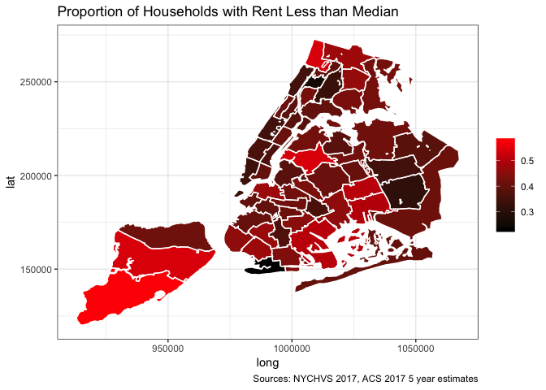

### Educational Attainment

``` r
ed <- hvs.all %>%
        distinct(sba.name, Bachelors.Degree)

shp.df <- merge(shp.df, ed, by.x = "NAME", by.y = "sba.name")

rm(ed)
```

``` r
ggplot(shp.df) + 
      aes(long,lat,group=group) +
      geom_polygon(aes(fill=Bachelors.Degree)) + 
      scale_fill_gradient(low = "black", high = "red") +
      geom_path(color="white") + 
      theme_bw() +
      labs(title = "Estimate: People over 25 w. Bachelor's Degree",
         caption = "Source: ACS 2017 5 year estimates",
         fill = NULL) 
```

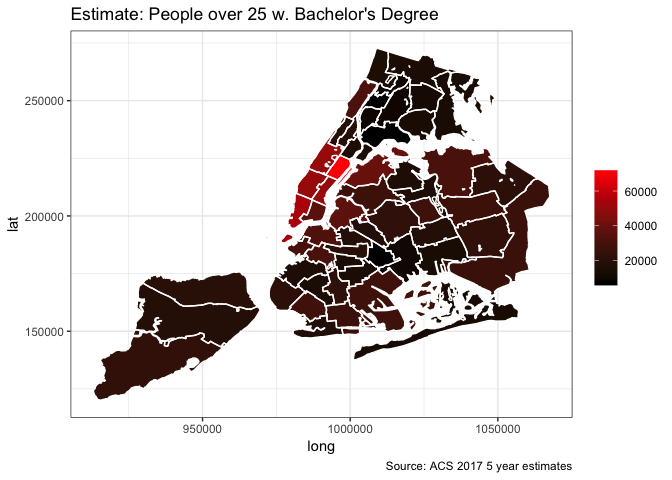

#### Median Household Income v. Amount of People Over 25 w. Bachelor's Degrees

``` r
ggplot(acs) +
  aes(x=Median.HH.Income.Year, y = Bachelors.Degree) +
  geom_point() + 
  geom_smooth(method = "lm", se = FALSE) +
    labs(title = "Population w. Bachelor's Degrees v. Median Household Income",
         caption = "Source: ACS 2017 5 year estimates",
         x = 'Median Household Income',
         y = "Population with Bachelor's Degrees",
         fill = NULL) 
```

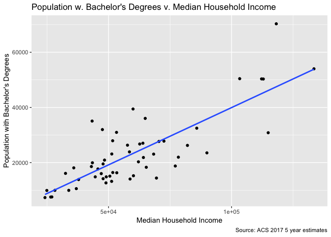

#### Median Rent v. Amount of People Over 25 w. Bachelor's Degrees

``` r
ggplot(acs) +
  aes(x=Median.Gross.Rent, y = Bachelors.Degree) +
  geom_point() + 
  geom_smooth(method = "lm", se = FALSE) +
    labs(title = "Population w. Bachelor's Degrees v. Median Gross Rent",
         caption = "Source: ACS 2017 5 year estimates",
         x = 'Median Gross Rent',
         y = "Population with Bachelor's Degrees",
         fill = NULL) 
```

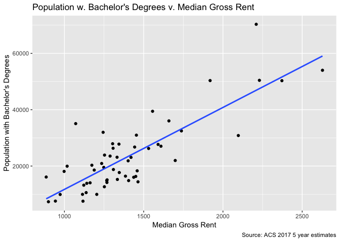

### Racial Composition

``` r
race <- hvs.all %>%
        distinct(sba.name, Prop.Nonwhite)

shp.df <- merge(shp.df, race, by.x = "NAME", by.y = "sba.name")

rm(race)
```

``` r
ggplot(shp.df) + 
      aes(long,lat,group=group) +
      geom_polygon(aes(fill=Prop.Nonwhite)) + 
      scale_fill_gradient(low = "black", high = "red") +
      geom_path(color="white") + 
      theme_bw() +
      labs(title = "Racial Composition of NYC Neighborhoods",
         caption = "Source: ACS 2017 5 year estimates",
         fill = NULL) 
```

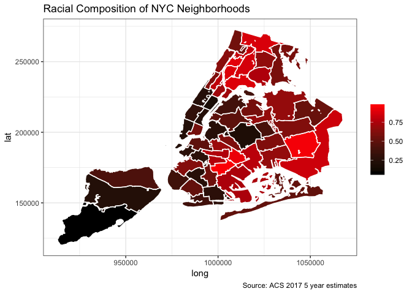

#### Proportion Nonwhite v. Median Household Income

``` r
options(scipen = 999)
ggplot(acs) +
  aes(x=Median.HH.Income.Year, y = Prop.Nonwhite) +
  geom_point() + 
  geom_smooth(method = "lm", se = FALSE) +
    labs(title = "Proportion Non White v. Median Household Income",
         subtitle = 'Proportion of Population Nonwhite',
         caption = "Source: ACS 2017 5 year estimates",
         x = 'Median Household Income',
         y = "Proportion Non White ",
         fill = NULL) 
```

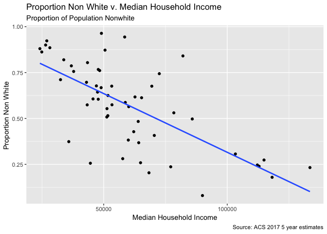

-   Supports the notion that NYC neighborhoods that are economically segregated tend to be racially segregated, as well

#### Proportion Nonwhite v. Median Rent

``` r
options(scipen = 999)
ggplot(acs) +
  aes(x=Median.Gross.Rent, y = Prop.Nonwhite) +
  geom_point() + 
  geom_smooth(method = "lm", se = FALSE) +
    labs(title = "Proportion Non White v. Median Gross Rent",
         subtitle = 'Proportion of Population Nonwhite',
         caption = "Source: ACS 2017 5 year estimates",
         x = 'Median Gross Rent',
         y = "Proportion Non White ",
         fill = NULL) 
```

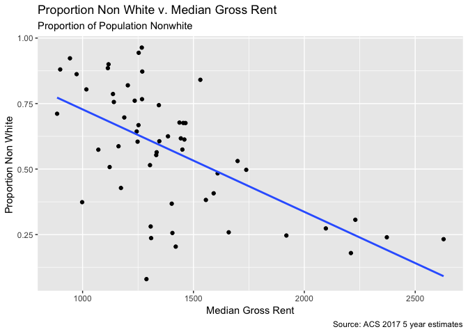

### Household composition

``` r
hhinc.comp <- hvs.all %>%
              select(hhinc, Household.Composition) %>%
              filter(hhinc != 9999999)

hhinc.comp <- hhinc.comp %>%
  mutate(group = case_when(
    grepl("Married", hhinc.comp$Household.Composition) ~ 'Married',
    Household.Composition == "SoleMale" | Household.Composition == "SoleFemale" ~ 'Sole',
    Household.Composition == 'Malew.Kids' | Household.Composition == 'Femalew.Kids' ~ 'Single Parent',
    Household.Composition == 'Femalew.Adults' | Household.Composition == 'Femalew.AdultsKids'|
      Household.Composition == 'Malew.Adults' | Household.Composition == 'Malew.AdultsKids' ~ 'Mixed'
  ))

ggplot(hhinc.comp, aes(x = Household.Composition, y = hhinc, fill = Household.Composition)) +
  geom_boxplot(outlier.shape = NA) +
  scale_y_continuous(limits = quantile(hhinc.comp$hhinc, c(0.1, 0.9)))+
  facet_wrap(~group, scales = 'free', ncol = 2) +
  theme(axis.text.x = element_text(size = 10, angle = 25, hjust = 1))+
  labs(title = "Household income v. Household composition",
         subtitle = 'Total household income',
         caption = "Source: NYCHVS 2017",
         x = 'Household Composition',
         y = "Household Income ",
         fill = NULL) 
```

    ## Warning: Removed 2582 rows containing non-finite values (stat_boxplot).

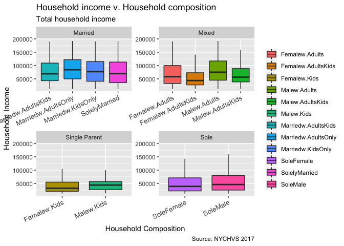

### Evicted/Displaced Renters

``` r
renters.evicted <- filter(renters, Evicted.Displaced=='Yes')
renters.evicted  <- rep.wts.2grps.SE(renters.evicted, sba.name, Evicted.Displaced)
```

``` r
#kable(dcast(melt(renters.evicted, id.vars=c("sba.name","Evicted.Displaced")),sba.name~variable+Evicted.Displaced))
```

``` r
renters.evicted <- dcast(renters.evicted, sba.name ~ Evicted.Displaced, value.var="N0")
kable(renters.evicted, format = 'html', col.names = c('SBA','Evicted'))
```

<table>
<thead>
<tr>
<th style="text-align:left;">
SBA
</th>
<th style="text-align:right;">
Evicted
</th>
</tr>
</thead>
<tbody>
<tr>
<td style="text-align:left;">
Astoria
</td>
<td style="text-align:right;">
688.56848
</td>
</tr>
<tr>
<td style="text-align:left;">
Bay Ridge
</td>
<td style="text-align:right;">
215.16860
</td>
</tr>
<tr>
<td style="text-align:left;">
Bedford Stuyvesant
</td>
<td style="text-align:right;">
241.58582
</td>
</tr>
<tr>
<td style="text-align:left;">
Bellerose / Rosedale
</td>
<td style="text-align:right;">
258.03112
</td>
</tr>
<tr>
<td style="text-align:left;">
Bensonhurst
</td>
<td style="text-align:right;">
633.17506
</td>
</tr>
<tr>
<td style="text-align:left;">
Brooklyn Heights / Fort Greene
</td>
<td style="text-align:right;">
162.66165
</td>
</tr>
<tr>
<td style="text-align:left;">
Brownsville / Ocean Hill
</td>
<td style="text-align:right;">
730.86092
</td>
</tr>
<tr>
<td style="text-align:left;">
Chelsea / Clinton / Midtown
</td>
<td style="text-align:right;">
248.38416
</td>
</tr>
<tr>
<td style="text-align:left;">
East Flatbush
</td>
<td style="text-align:right;">
232.68210
</td>
</tr>
<tr>
<td style="text-align:left;">
East New York / Starret City
</td>
<td style="text-align:right;">
773.54060
</td>
</tr>
<tr>
<td style="text-align:left;">
Elmhurst / Corona
</td>
<td style="text-align:right;">
458.46842
</td>
</tr>
<tr>
<td style="text-align:left;">
Flatbush
</td>
<td style="text-align:right;">
198.91564
</td>
</tr>
<tr>
<td style="text-align:left;">
Flatlands / Canarsie
</td>
<td style="text-align:right;">
541.64288
</td>
</tr>
<tr>
<td style="text-align:left;">
Flushing / Whitestone
</td>
<td style="text-align:right;">
282.29198
</td>
</tr>
<tr>
<td style="text-align:left;">
Greenwich Village / Financial District
</td>
<td style="text-align:right;">
474.57716
</td>
</tr>
<tr>
<td style="text-align:left;">
Highbridge / S. Concourse
</td>
<td style="text-align:right;">
4.74276
</td>
</tr>
<tr>
<td style="text-align:left;">
Jackson Heights
</td>
<td style="text-align:right;">
220.68208
</td>
</tr>
<tr>
<td style="text-align:left;">
Jamaica
</td>
<td style="text-align:right;">
480.27930
</td>
</tr>
<tr>
<td style="text-align:left;">
Kingsbridge Heights / Mosholu
</td>
<td style="text-align:right;">
169.12090
</td>
</tr>
<tr>
<td style="text-align:left;">
Lower East Side / Chinatown
</td>
<td style="text-align:right;">
502.34628
</td>
</tr>
<tr>
<td style="text-align:left;">
Morrisania / East Tremont
</td>
<td style="text-align:right;">
1198.16056
</td>
</tr>
<tr>
<td style="text-align:left;">
Mott Haven / Hunts Point
</td>
<td style="text-align:right;">
207.27634
</td>
</tr>
<tr>
<td style="text-align:left;">
North Crown Heights / Prospect Heights
</td>
<td style="text-align:right;">
264.27208
</td>
</tr>
<tr>
<td style="text-align:left;">
North Shore
</td>
<td style="text-align:right;">
262.01078
</td>
</tr>
<tr>
<td style="text-align:left;">
Sheepshead Bay / Gravesend
</td>
<td style="text-align:right;">
323.20872
</td>
</tr>
<tr>
<td style="text-align:left;">
South Crown Heights
</td>
<td style="text-align:right;">
250.77844
</td>
</tr>
<tr>
<td style="text-align:left;">
Stuyvesant Town / Turtle Bay
</td>
<td style="text-align:right;">
445.24328
</td>
</tr>
<tr>
<td style="text-align:left;">
Sunset Park
</td>
<td style="text-align:right;">
453.05472
</td>
</tr>
<tr>
<td style="text-align:left;">
Upper East Side
</td>
<td style="text-align:right;">
240.33762
</td>
</tr>
<tr>
<td style="text-align:left;">
Upper West Side
</td>
<td style="text-align:right;">
262.47670
</td>
</tr>
<tr>
<td style="text-align:left;">
Washington Heights / Inwood
</td>
<td style="text-align:right;">
604.37258
</td>
</tr>
<tr>
<td style="text-align:left;">
Williamsburg / Greenpoint
</td>
<td style="text-align:right;">
294.72832
</td>
</tr>
</tbody>
</table>
``` r
names(renters.evicted)[2] <- c("Evicted.HH.Est")
```

``` r
extra <- unique(shp.df$NAME[!shp.df$NAME %in% renters.evicted$sba.name])
extra <-data.frame(sba.name = extra, Evicted.HH.Est = 0)
renters.evicted <- rbind(renters.evicted, extra)
rm(extra)
```

``` r
shp.df <- merge(shp.df, renters.evicted, by.x = "NAME", by.y = "sba.name")
rm(renters.evicted)
```

``` r
ggplot(shp.df) + 
      aes(long,lat,group=group) +
      geom_polygon(aes(fill=Evicted.HH.Est)) + 
      scale_fill_gradient(low = "black", high = "red") +
      geom_path(color="white") + 
      theme_bw() +
      labs(title = "Estimate: Evicted/Displaced Population",
         caption = "Source: NYCHVS 2017",
         fill = NULL) 
```

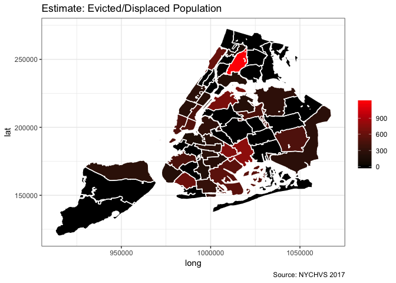

Examining Evicted Individuals
-----------------------------

### Household Income less than Neighborhood Median

``` r
renters.evicted <- filter(renters, Evicted.Displaced=='Yes')
renters.evicted  <- rep.wts.grp.SE(renters.evicted, HHinc.Less.Median)
```

``` r
  ggplot(data = renters.evicted,aes(x=HHinc.Less.Median, y = N0, fill=factor(HHinc.Less.Median))) +
    geom_bar(stat = 'identity') +
      labs(title = "Evicted/Displaced with Income less than Neighborhood Median",
         caption = "Source: NYCHVS 2017",
         x = "Income Less than Neighborhood Median",
         y = 'Estimate',
         fill = NULL)     
```

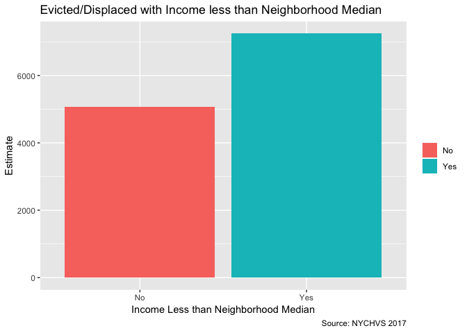

### Rent less than Neighborhood Median

``` r
renters.evicted <- filter(renters, Evicted.Displaced=='Yes')
renters.evicted  <- rep.wts.grp.SE(renters.evicted, Rent.Less.Median)
```

``` r
  ggplot(data = renters.evicted,aes(x=Rent.Less.Median, y = N0, fill=factor(Rent.Less.Median))) +
    geom_bar(stat = 'identity') +
      labs(title = "Evicted/Displaced with Rent less than Neighborhood Median",
         caption = "Source: NYCHVS 2017",
         x = "Rent Less than Neighborhood Median",
         y = 'Estimate',
         fill = NULL)   
```

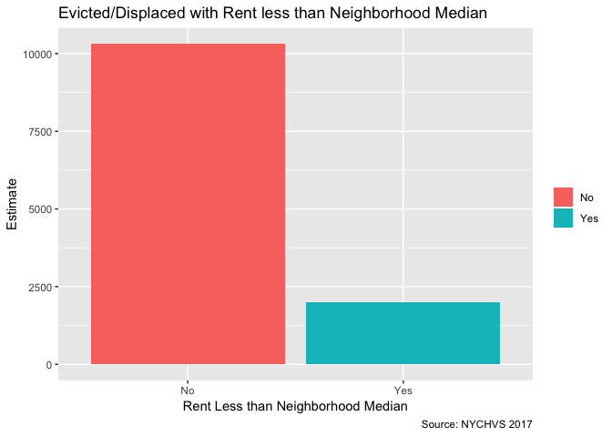

``` r
rm(renters.evicted)
```

### Evictions by Gentrification Status

``` r
renters.gentrifying <- filter(renters, Evicted.Displaced=='Yes')
renters.gentrifying  <- rep.wts.grp.SE(renters.gentrifying, Gentrifying)
```

``` r
ggplot(data = renters.gentrifying,aes(x=Gentrifying, y = N0, fill=factor(Gentrifying))) +
       geom_bar(stat = 'identity') +
       labs(title = "Evicted/Displaced by Neighborhood Gentrification Status",
       caption = "Source: NYCHVS 2017",
         x = "Gentrification Status",
         y = 'Estimate',
         fill = NULL)    
```

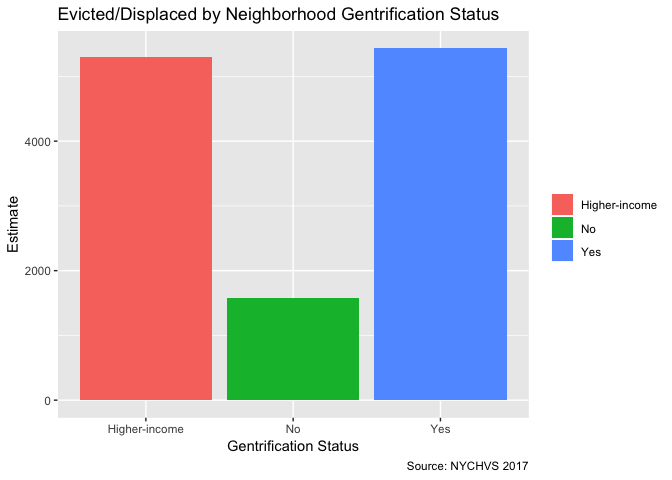

``` r
rm(renters.gentrifying)
```

### Evictions by Househould Composition

``` r
renters.hc <- filter(renters, Evicted.Displaced=='Yes')
renters.hc  <- rep.wts.grp.SE(renters.hc, Household.Composition)
```

``` r
ggplot(data = renters.hc,aes(x=Household.Composition, y = N0, fill=factor(Household.Composition))) +
       geom_bar(stat = 'identity') +
       labs(title = "Evicted/Displaced by Household Composition",
       caption = "Source: NYCHVS 2017",
         x = "Household Composition",
         y = 'Estimate',
         fill = NULL)+
       coord_flip() 
```

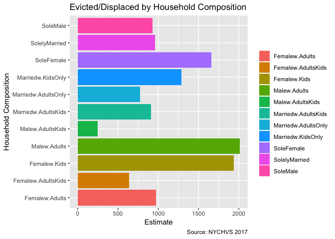

``` r
rm(renters.hc)
```

### Evictions When Income was not Less than Neighborhood Median + Rent was not Less than Neighborhood Median

``` r
Unusual <- filter(renters, Evicted.Displaced == 'Yes' & Rent.Less.Median == 'No' & HHinc.Less.Median == 'No')
```

#### Gentrifying Neighborhood

``` r
Unusual.Gent <- rep.wts.grp.SE(Unusual, Gentrifying)

ggplot(data = Unusual.Gent, aes(x=Gentrifying, y = N0, fill = factor(Gentrifying))) +
  geom_bar(stat='identity') +
      labs(title = "Evicted/Displaced by Gentrification Status",
      subtitle = "For households with Rent and Household Income not less than Neighborhood Median",
      caption = "Source: NYCHVS 2017",
      x = "Gentrification Status",
      y = 'Estimate',
      fill = NULL)    
```

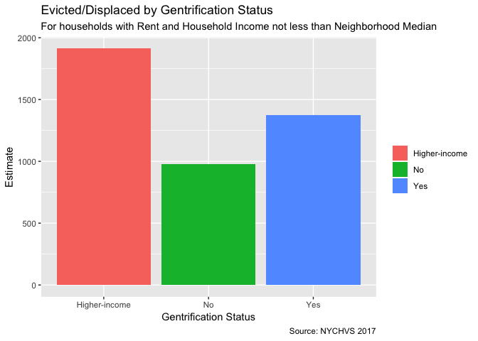

``` r
rm(Unusual.Gent)
```

#### Household Type

``` r
Unusual.HouseholdComposition <- rep.wts.grp.SE(Unusual, Household.Composition)
ggplot(data = Unusual.HouseholdComposition, aes(x=Household.Composition, y = N0, fill =
                                                  factor(Household.Composition))) +
  geom_bar(stat='identity') +
      labs(title = "Evicted/Displaced by Household Type",
      subtitle = "For households with Rent and Household Income not less than Neighborhood Median",
      caption = "Source: NYCHVS 2017",
      x = "Household Type",
      y = 'Estimate',
      fill = NULL) + 
      coord_flip()
```

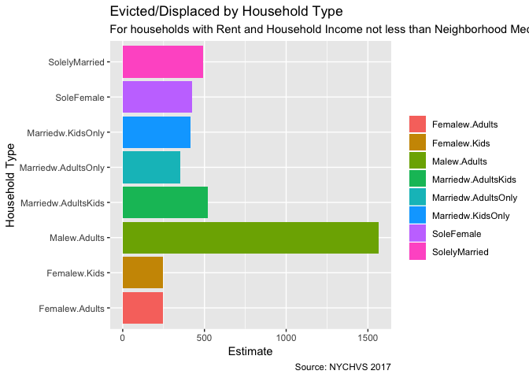

``` r
rm(Unusual.HouseholdComposition)
```

#### Age

``` r
Unusual.Age <- rep.wts.grp.SE(Unusual, AgeCat)

ggplot(data = Unusual.Age, aes(x=AgeCat, y = N0, fill =
                                                  factor(AgeCat))) +
  geom_bar(stat='identity') +
      labs(title = "Evicted/Displaced by Age",
      subtitle = "For households with Rent and Household Income not less than Neighborhood Median",
      caption = "Source: NYCHVS 2017",
      x = "Age",
      y = 'Estimate',
      fill = NULL) + 
      coord_flip()
```

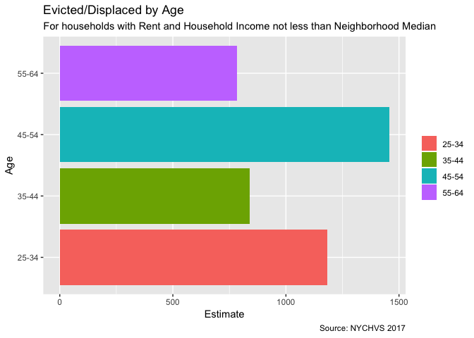

``` r
rm(Unusual.Age)
```

#### Housing Type

``` r
Unusual.HousingType <- rep.wts.grp.SE(Unusual, Contrl.Status.Recode)

ggplot(data = Unusual.HousingType, aes(x=Contrl.Status.Recode, y = N0, fill =
                                                  factor(Contrl.Status.Recode))) +
  geom_bar(stat='identity') +
      labs(title = "Evicted/Displaced by Housing Type",
      subtitle = "For households with Rent and Household Income not less than Neighborhood Median",
      caption = "Source: NYCHVS 2017",
      x = "Housing Type",
      y = 'Estimate',
      fill = NULL) + 
      coord_flip()
```

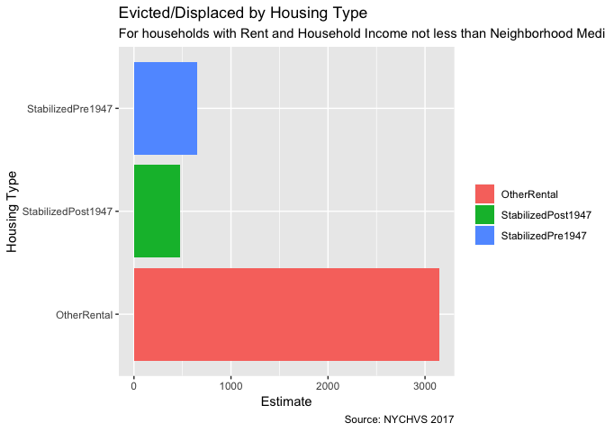

``` r
rm(Unusual.HousingType)
```

Conclusions
-----------

-   At least in NYC, it seems that most evictions are due to household income constraints. We can postulate that people with income constraints are being driven out by changing neighborhood characteristics, but we cannot say for certain that these evictions are 'coerced' or 'routine'.

-   I am suprised by the households that were evicted/displaced without any income and/or rent constraints, it is hard to classify these types of evictions since it seems that they are mostly at random.

-   Although we hear about coereced evictions happening in NYC neighborhoods, perhaps they are not as prominent as we think. We hear about the tragic cases and how it affects the individuals involved, but perhaps they are more isolated than we care to give on. Sometimes news stories of tragic events can make people think events are more prominent than they actually are in reality.

-   Though the lack of key findings in the EDA could be due to 'sensationalism', I think what really constrained this project, as I have been saying from the start, is the lack of transparent evictions data in NYC. The ecourts system makes it difficult to scrape case information and all landlord tenant cases are removed from the site 14 days after any court appearance. Scheduled Marshal Evictions are released on NYC open data, but the case numbers do not correspond to relevant cases in the ecourts system, therefore making it hard to get more necessary information surrounding the case.

-   Using the NYCHVS survey allows us to identify renters who were evicted/displaced, we are also able to glean more information about the households, such as income, current rent, household composition, and household condition. However, there are some negatives to using the survey:

1.  We have to assume people are staying in the same neighborhood after they were evicted
2.  We have to trust people's suvey responses (response bias)
3.  Partly my fault, but this is a cross-sectional analysis, I could have dived deeper and did a longitudinal analysis with data dating back to the 1990s. (Time is of the essence)
