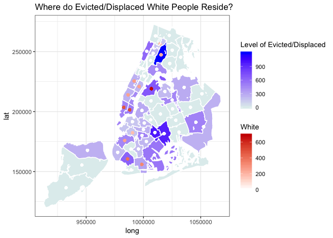

What's Happened ?! A Transparent Lamentation
--------------------------------------------

-   I believe in being transparent. This semester has not gone as planned and I probably bit off more than I could chew. I am taking five classes, working 20 hours a week, and I live in Staten Island, which is not particularly close.
-   On top of all this, I was sick three times in the first six weeks of the semester. Two of these illnesses were pretty serious.
-   I tried to work as best as I could and consolidate my ideas, but it was hard when I was in a 'brain fog.'
-   However, I am not letting this deter me for the following reasons:

1.  I still believe my project is interesting and that I could reveal unique insights
2.  I believe in my own capabilities
3.  I realized changing the scope to be more manageable is okay because I can always return to this project and make it the best it could be over a longer time period

Where is my Project going now? Putting my Best Foot Forward
-----------------------------------------------------------

I think it is best to explain the original idea(s) and how I have changed my scope since the beginning of the semester. I will also explain how I plan to attack the project given the time left (six weeks).

### Original Idea: Broad, Unfocused, Perhaps Impossible

I was always interested in evictions and housing court in NYC ever since I read about it at my internship with the NYC Department for the Aging. In that summer I read all about "coerced" evictions and how tragic they are for already vulnerable populations. It resonated with me because I felt that it was truly unfair that landlords were able to get away this illegal act.

With this in mind, my initial goal for the project was to understand coerced evictions at a deeper level. I wanted to use some sort of model that compared results from coerced evictions to those from "delinquent" (traditional) evictions and see if there were any features that were important in predicting coerced evictions. This task was difficult for a variety of reasons:

-   It was hard to differentiate coerced evictions from traditional evictions
-   Scraping landlord/tenant case outcomes from NYS courts was practically impossible because they are removed 2 weeks after the final court appearance
-   The final court appearance may not actually be the final court appearance because both parties can reopen a case (this could get confusing to track)
-   The "we'll never truly know factor"

Overall, studying housing/evictions in NYC is a hard task because you will never truly know what went on in court unless you read over court documents, interview individuals (both landlords + tenants), and still then you always know that there are two sides to every story. While this idea was interesting, it led me on alot of leads, but these leads usually were dead ends. In sum, I kept on accumulating and cleaning new data, however because my initial goal was too misguided and practically impossible to accomplish without taking a 'mixed-methods' approach, I could do very little with this data except look for more 'new leads.'

While accumulating data and making new connections could help other researchers explore the NYC housing landscape, I do want to answer a guided question. As a result, I made my question(s) more tangible so that I can actually run some analyses and come up with my own insights.

### New Idea: Manageable given Time Constraints, More Focused, and Possibility for Expansion

As previously stated, I realized that my old idea classifying coerced evictions from more "standard" evictions would be hard given the time constraints and circumstances of the semester. Nevertheless, I came across an article that I preivoulsy read when I first started the project. The article *The Right to Stay Put, Revisited: Gentrification and Resistance to Displacement in New York City* helped me realize that I was more interested in the aftermath of an eviction rather than the eviction itself. I now know that I am fascinated by transient movement and quite frankly I am interested in where people end up moving after becoming evicted and/or displaced. The article also reintroduced me to the NYC Housing Vacancy Survey, which is helpful because it gives information on indviduals. One of my major struggles with the evictions idea was that I never had information about individuals, rather I had information about buildings and neighborhoods.

Using the NYC Housing Vacancy survey, I can get demographic information about people that have recently moved. The survey asks a specific question: Reason for household moving and respondents can answer with the following choices:

-   Change in employment status
-   Loooking for work
-   Commuting reasons
-   To attend school
-   Other financial/employmeny reason
-   Need larger house/apartment
-   Recently widowed, family decreased
-   Newly married
-   Moved to be with relatives or closer to relatives
-   Wanted to estbalish separate household
-   Other family reason
-   Wanted this neighborhood/better neighborhood services
-   Other neighborhood reason
-   Wanted to own residence
-   Wanted to rent residence
-   Wanted greater housing affordability
-   Wanted better quality housing
-   Evicted, displaced, or harassment by landlord (self-report)
-   Other housing reason
-   Any other reason

Unlike the initial idea, with the selection choices provided by the NYC HVS, I can separate people who have moved for their "own convenience" from people who are displaced.

Therefore, my evolved idea is still in the housing realm, but I am now focused on differentiating displaced people from people who have moved in the more traditional sense. I plan to follow the models that the authors from the above article used in their analysis. Their models utilized demographic, racial, and income indicators along with housing quality and regulatory characteristics to classify those who were displaced from those who were able to have a say in their move. The models that the authors used included neighborhood fixed effects, which I also plan to use, as well.

However, I do aim to include the data that I have already collected as indicators. Most of the data that I have collected can classify various neighborhoods. Therefore, I am in a pretty good position because I can recreate the models that the authors used, which were logistic regression with fixed effects for neighborhoods, as well as create a new multilevel model that includes neighborhood level characteristics, such as number of evictions, number of cases brought to housing court, number of rent stabilized apartments in the area, as well as an indicator for whether there is a presence of "bad" landlords in that area.

To expedite this process because I am a bit behind, I will do a cross-sectional analysis using the 2017 NYC HVS.

Along with the modeling aspect, I also want to display where different groups of people usually end up based on different ideas of 'displacement.' In the above bullet list, you can see that the most obvious measure for whether someone is displaced is *Evicted, displaced, or harassment by landlord*, however in various papers that I have read they have also included *Wanted greater housing affordability* as a measure of displacement. In some ways, I can see how *housing affordability* coinsides with displacement, but I do feel that the *evicted,displaced, or harassment by landlord* variable carries more weight. Nevertheless, I am interested in seeing what neighborhoods people end up in depending on whether they selected *evicted* or *housing affordability*. I also feel that this would be interesting to see how this varies by race and income. Finally, classifying the neighborhoods where people end up in based on neighborhood characteristics can also be telling.

So far, I have started the exploratory aspect of the analysis mentioned in the above paragraph. I have not done the modeling yet, but I do have the datasets that I plan to use and I will create a nice multielvel model dataset. Please see the video on Classes, as well as the What's to Come section to better understand how I will proceeed! The following section of this presentation will show some initial results that compares *evicted, displaced, or harassment by landlord* respondents to those that *wanted greated housing affordability.*

Analysis so Far
---------------

### How many people recently moved in NYC (2014-2017)?

``` r
# Examine the Reason for HH Moving Variable 
  # Subset moved people 
  moved <- filter(hvs, X_6 != "Not Reported" & X_6 != "Not Applicable") 
  
  # Okay so we see that (from respondents there are only 3,266 observations that moved) - obviously 
  # this is more when we add up the sampling weights etc, so let's do that now 
  # The full Sample ('Recently Moved') Estimated 
    # just add up the household weights! 
    # note household weights have 5 implied decimal places (so after will divide by 100,000)
    moved$hhweight <- as.numeric(as.character(moved$hhweight))
    sum(moved$hhweight)/100000
```

    ## [1] 781263.1

``` r
    # The Full-Sample Recently Moved Estimate for all of NYC is : 781,263 (those who moved after 2013)
  # Calculate the SE for this estimate 
    rep.wts.SE(moved) # the SE is 10,945.73 
```

    ## [1] 10945.73

### Why were people moving?

``` r
    moved %>% 
      select(X_6) %>%
      group_by(X_6) %>%
      summarise(n = n()) %>%
      arrange(desc(n)) %>%
    ggplot(aes(x=X_6, y = n)) +
      geom_bar(stat = "identity") +
      coord_flip() +
      ggtitle('Moved Reason - 2017 NYC HVS')
```


### Where do Evicted/Displaced/Harassed people reside now?

``` r
    moved %>%
      select(sba.name, X_6) %>%
      filter(X_6 == 'Evicted, displaced, landlord harassment') %>%
      group_by(sba.name) %>%
      summarise(n=n()) %>%
      arrange(desc(n)) %>%
    ggplot(aes(x=sba.name, y=n))+
      geom_bar(stat = 'identity') + 
      coord_flip() +
      ggtitle("Where do Evicted/Displaced People Move?")
```


### Sample Estimates for where Evicted/Displaced/Harassed people reside now

``` r
# Will include the full sample estimate (sum of hhweight)
# Will also include the SE estimate from the replicate weights 
# Basically Estimates by Neighborhood ! 
    # will include estimate (sum of hhweight)
    # SE estimate (using replicate weights)
    
    evicted.displaced <- moved %>%
      filter(X_6 == 'Evicted, displaced, landlord harassment')
    
    EstbyNeighborhood.ed <- rep.wts.grp.SE(evicted.displaced, sba.name)
```

    ## Warning: funs() is soft deprecated as of dplyr 0.8.0
    ## please use list() instead
    ## 
    ## # Before:
    ## funs(name = f(.)
    ## 
    ## # After: 
    ## list(name = ~f(.))
    ## This warning is displayed once per session.

``` r
    kable(EstbyNeighborhood.ed, format = 'html', col.names = c('SBA', 'Sample Estimate', 'Var', 'SE'))
```

<table>
<thead>
<tr>
<th style="text-align:left;">
SBA
</th>
<th style="text-align:right;">
Sample Estimate
</th>
<th style="text-align:right;">
Var
</th>
<th style="text-align:right;">
SE
</th>
</tr>
</thead>
<tbody>
<tr>
<td style="text-align:left;">
Morrisania / East Tremont
</td>
<td style="text-align:right;">
1198.16056
</td>
<td style="text-align:right;">
261986.56165
</td>
<td style="text-align:right;">
511.846228
</td>
</tr>
<tr>
<td style="text-align:left;">
Brownsville / Ocean Hill
</td>
<td style="text-align:right;">
985.03458
</td>
<td style="text-align:right;">
268995.64152
</td>
<td style="text-align:right;">
518.647897
</td>
</tr>
<tr>
<td style="text-align:left;">
East New York / Starret City
</td>
<td style="text-align:right;">
958.32192
</td>
<td style="text-align:right;">
334675.47580
</td>
<td style="text-align:right;">
578.511431
</td>
</tr>
<tr>
<td style="text-align:left;">
Astoria
</td>
<td style="text-align:right;">
688.56848
</td>
<td style="text-align:right;">
158296.70253
</td>
<td style="text-align:right;">
397.865181
</td>
</tr>
<tr>
<td style="text-align:left;">
Bensonhurst
</td>
<td style="text-align:right;">
633.17506
</td>
<td style="text-align:right;">
139707.73063
</td>
<td style="text-align:right;">
373.774973
</td>
</tr>
<tr>
<td style="text-align:left;">
Washington Heights / Inwood
</td>
<td style="text-align:right;">
604.37258
</td>
<td style="text-align:right;">
110711.00806
</td>
<td style="text-align:right;">
332.732638
</td>
</tr>
<tr>
<td style="text-align:left;">
Flatlands / Canarsie
</td>
<td style="text-align:right;">
541.64288
</td>
<td style="text-align:right;">
139515.42068
</td>
<td style="text-align:right;">
373.517631
</td>
</tr>
<tr>
<td style="text-align:left;">
Lower East Side / Chinatown
</td>
<td style="text-align:right;">
502.34628
</td>
<td style="text-align:right;">
131348.82249
</td>
<td style="text-align:right;">
362.420781
</td>
</tr>
<tr>
<td style="text-align:left;">
Jamaica
</td>
<td style="text-align:right;">
480.27930
</td>
<td style="text-align:right;">
117305.19661
</td>
<td style="text-align:right;">
342.498462
</td>
</tr>
<tr>
<td style="text-align:left;">
South Crown Heights
</td>
<td style="text-align:right;">
475.14216
</td>
<td style="text-align:right;">
115724.78802
</td>
<td style="text-align:right;">
340.183462
</td>
</tr>
<tr>
<td style="text-align:left;">
Greenwich Village / Financial District
</td>
<td style="text-align:right;">
474.57716
</td>
<td style="text-align:right;">
110591.67397
</td>
<td style="text-align:right;">
332.553265
</td>
</tr>
<tr>
<td style="text-align:left;">
Elmhurst / Corona
</td>
<td style="text-align:right;">
458.46842
</td>
<td style="text-align:right;">
100935.55050
</td>
<td style="text-align:right;">
317.703558
</td>
</tr>
<tr>
<td style="text-align:left;">
Sunset Park
</td>
<td style="text-align:right;">
453.05472
</td>
<td style="text-align:right;">
104873.14734
</td>
<td style="text-align:right;">
323.841238
</td>
</tr>
<tr>
<td style="text-align:left;">
Stuyvesant Town / Turtle Bay
</td>
<td style="text-align:right;">
445.24328
</td>
<td style="text-align:right;">
103842.14681
</td>
<td style="text-align:right;">
322.245476
</td>
</tr>
<tr>
<td style="text-align:left;">
Mott Haven / Hunts Point
</td>
<td style="text-align:right;">
439.91290
</td>
<td style="text-align:right;">
88650.11732
</td>
<td style="text-align:right;">
297.741696
</td>
</tr>
<tr>
<td style="text-align:left;">
Sheepshead Bay / Gravesend
</td>
<td style="text-align:right;">
323.20872
</td>
<td style="text-align:right;">
105452.72499
</td>
<td style="text-align:right;">
324.734853
</td>
</tr>
<tr>
<td style="text-align:left;">
Williamsburg / Greenpoint
</td>
<td style="text-align:right;">
294.72832
</td>
<td style="text-align:right;">
84646.43172
</td>
<td style="text-align:right;">
290.940598
</td>
</tr>
<tr>
<td style="text-align:left;">
Flushing / Whitestone
</td>
<td style="text-align:right;">
282.29198
</td>
<td style="text-align:right;">
92760.84720
</td>
<td style="text-align:right;">
304.566655
</td>
</tr>
<tr>
<td style="text-align:left;">
North Crown Heights / Prospect Heights
</td>
<td style="text-align:right;">
264.27208
</td>
<td style="text-align:right;">
69215.62487
</td>
<td style="text-align:right;">
263.088625
</td>
</tr>
<tr>
<td style="text-align:left;">
Upper West Side
</td>
<td style="text-align:right;">
262.47670
</td>
<td style="text-align:right;">
69403.24976
</td>
<td style="text-align:right;">
263.444965
</td>
</tr>
<tr>
<td style="text-align:left;">
North Shore
</td>
<td style="text-align:right;">
262.01078
</td>
<td style="text-align:right;">
60972.73306
</td>
<td style="text-align:right;">
246.926574
</td>
</tr>
<tr>
<td style="text-align:left;">
Bellerose / Rosedale
</td>
<td style="text-align:right;">
258.03112
</td>
<td style="text-align:right;">
68776.97334
</td>
<td style="text-align:right;">
262.253643
</td>
</tr>
<tr>
<td style="text-align:left;">
Chelsea / Clinton / Midtown
</td>
<td style="text-align:right;">
248.38416
</td>
<td style="text-align:right;">
57769.26892
</td>
<td style="text-align:right;">
240.352385
</td>
</tr>
<tr>
<td style="text-align:left;">
Bedford Stuyvesant
</td>
<td style="text-align:right;">
241.58582
</td>
<td style="text-align:right;">
58957.30437
</td>
<td style="text-align:right;">
242.811253
</td>
</tr>
<tr>
<td style="text-align:left;">
Upper East Side
</td>
<td style="text-align:right;">
240.33762
</td>
<td style="text-align:right;">
55895.51061
</td>
<td style="text-align:right;">
236.422314
</td>
</tr>
<tr>
<td style="text-align:left;">
University Heights / Fordham
</td>
<td style="text-align:right;">
235.49840
</td>
<td style="text-align:right;">
56075.42293
</td>
<td style="text-align:right;">
236.802498
</td>
</tr>
<tr>
<td style="text-align:left;">
East Flatbush
</td>
<td style="text-align:right;">
232.68210
</td>
<td style="text-align:right;">
61130.65025
</td>
<td style="text-align:right;">
247.246133
</td>
</tr>
<tr>
<td style="text-align:left;">
Jackson Heights
</td>
<td style="text-align:right;">
220.68208
</td>
<td style="text-align:right;">
46439.80835
</td>
<td style="text-align:right;">
215.498975
</td>
</tr>
<tr>
<td style="text-align:left;">
Bay Ridge
</td>
<td style="text-align:right;">
215.16860
</td>
<td style="text-align:right;">
40839.72152
</td>
<td style="text-align:right;">
202.088400
</td>
</tr>
<tr>
<td style="text-align:left;">
Flatbush
</td>
<td style="text-align:right;">
198.91564
</td>
<td style="text-align:right;">
39904.25988
</td>
<td style="text-align:right;">
199.760506
</td>
</tr>
<tr>
<td style="text-align:left;">
Kingsbridge Heights / Mosholu
</td>
<td style="text-align:right;">
169.12090
</td>
<td style="text-align:right;">
22614.42911
</td>
<td style="text-align:right;">
150.380947
</td>
</tr>
<tr>
<td style="text-align:left;">
Park Slope / Carroll Gardens
</td>
<td style="text-align:right;">
168.11172
</td>
<td style="text-align:right;">
28124.49611
</td>
<td style="text-align:right;">
167.703596
</td>
</tr>
<tr>
<td style="text-align:left;">
Brooklyn Heights / Fort Greene
</td>
<td style="text-align:right;">
162.66165
</td>
<td style="text-align:right;">
24396.84074
</td>
<td style="text-align:right;">
156.194881
</td>
</tr>
<tr>
<td style="text-align:left;">
Highbridge / S. Concourse
</td>
<td style="text-align:right;">
4.74276
</td>
<td style="text-align:right;">
21.55484
</td>
<td style="text-align:right;">
4.642719
</td>
</tr>
</tbody>
</table>
### Where do People Move When they seek Greater Housing Affordability?

``` r
  moved %>%
      select(sba.name, X_6) %>%
      filter(X_6 == 'Wanted greater housing affordability') %>%
      group_by(sba.name) %>%
      summarise(n=n()) %>%
      arrange(desc(n)) %>%
      ggplot(aes(x=sba.name, y=n))+
      geom_bar(stat = 'identity') + 
      coord_flip() +
      ggtitle("Where do People that Want Housing Affordability Move?")
```


### Sample Estimates for where those seeking Greater Housing Affordability reside now

``` r
    housing.afford <- moved %>%
      filter(X_6 == 'Wanted greater housing affordability')
    
    EstbyNeighborhood.ha <- rep.wts.grp.SE(housing.afford, sba.name)
    kable(EstbyNeighborhood.ha, format = 'html', col.names = c('SBA', 'Sample Estimate', 'Var', 'SE'))
```

<table>
<thead>
<tr>
<th style="text-align:left;">
SBA
</th>
<th style="text-align:right;">
Sample Estimate
</th>
<th style="text-align:right;">
Var
</th>
<th style="text-align:right;">
SE
</th>
</tr>
</thead>
<tbody>
<tr>
<td style="text-align:left;">
Washington Heights / Inwood
</td>
<td style="text-align:right;">
1709.1197
</td>
<td style="text-align:right;">
391477.88
</td>
<td style="text-align:right;">
625.6819
</td>
</tr>
<tr>
<td style="text-align:left;">
Flushing / Whitestone
</td>
<td style="text-align:right;">
1436.9408
</td>
<td style="text-align:right;">
469143.94
</td>
<td style="text-align:right;">
684.9408
</td>
</tr>
<tr>
<td style="text-align:left;">
Chelsea / Clinton / Midtown
</td>
<td style="text-align:right;">
1405.7290
</td>
<td style="text-align:right;">
314917.87
</td>
<td style="text-align:right;">
561.1754
</td>
</tr>
<tr>
<td style="text-align:left;">
Williamsburg / Greenpoint
</td>
<td style="text-align:right;">
1403.1083
</td>
<td style="text-align:right;">
240131.45
</td>
<td style="text-align:right;">
490.0321
</td>
</tr>
<tr>
<td style="text-align:left;">
Upper West Side
</td>
<td style="text-align:right;">
1235.7182
</td>
<td style="text-align:right;">
336842.77
</td>
<td style="text-align:right;">
580.3816
</td>
</tr>
<tr>
<td style="text-align:left;">
Greenwich Village / Financial District
</td>
<td style="text-align:right;">
1207.4622
</td>
<td style="text-align:right;">
300919.18
</td>
<td style="text-align:right;">
548.5610
</td>
</tr>
<tr>
<td style="text-align:left;">
North Crown Heights / Prospect Heights
</td>
<td style="text-align:right;">
1157.6002
</td>
<td style="text-align:right;">
288103.14
</td>
<td style="text-align:right;">
536.7524
</td>
</tr>
<tr>
<td style="text-align:left;">
Bedford Stuyvesant
</td>
<td style="text-align:right;">
1103.1440
</td>
<td style="text-align:right;">
217777.07
</td>
<td style="text-align:right;">
466.6659
</td>
</tr>
<tr>
<td style="text-align:left;">
Astoria
</td>
<td style="text-align:right;">
1090.1195
</td>
<td style="text-align:right;">
351448.47
</td>
<td style="text-align:right;">
592.8309
</td>
</tr>
<tr>
<td style="text-align:left;">
Highbridge / S. Concourse
</td>
<td style="text-align:right;">
1029.8437
</td>
<td style="text-align:right;">
216266.11
</td>
<td style="text-align:right;">
465.0442
</td>
</tr>
<tr>
<td style="text-align:left;">
Jackson Heights
</td>
<td style="text-align:right;">
1028.5443
</td>
<td style="text-align:right;">
154078.91
</td>
<td style="text-align:right;">
392.5289
</td>
</tr>
<tr>
<td style="text-align:left;">
University Heights / Fordham
</td>
<td style="text-align:right;">
1020.1577
</td>
<td style="text-align:right;">
239468.16
</td>
<td style="text-align:right;">
489.3548
</td>
</tr>
<tr>
<td style="text-align:left;">
Stuyvesant Town / Turtle Bay
</td>
<td style="text-align:right;">
891.9936
</td>
<td style="text-align:right;">
186398.41
</td>
<td style="text-align:right;">
431.7388
</td>
</tr>
<tr>
<td style="text-align:left;">
Park Slope / Carroll Gardens
</td>
<td style="text-align:right;">
879.3509
</td>
<td style="text-align:right;">
181856.40
</td>
<td style="text-align:right;">
426.4462
</td>
</tr>
<tr>
<td style="text-align:left;">
Upper East Side
</td>
<td style="text-align:right;">
839.6456
</td>
<td style="text-align:right;">
228574.07
</td>
<td style="text-align:right;">
478.0942
</td>
</tr>
<tr>
<td style="text-align:left;">
Hillcrest / Fresh Meadows
</td>
<td style="text-align:right;">
802.1090
</td>
<td style="text-align:right;">
199474.47
</td>
<td style="text-align:right;">
446.6256
</td>
</tr>
<tr>
<td style="text-align:left;">
Jamaica
</td>
<td style="text-align:right;">
796.7235
</td>
<td style="text-align:right;">
216391.77
</td>
<td style="text-align:right;">
465.1793
</td>
</tr>
<tr>
<td style="text-align:left;">
Rockaways
</td>
<td style="text-align:right;">
780.0522
</td>
<td style="text-align:right;">
215920.90
</td>
<td style="text-align:right;">
464.6729
</td>
</tr>
<tr>
<td style="text-align:left;">
Bayside / Little Neck
</td>
<td style="text-align:right;">
770.7906
</td>
<td style="text-align:right;">
187292.38
</td>
<td style="text-align:right;">
432.7729
</td>
</tr>
<tr>
<td style="text-align:left;">
Throgs Neck / Co-op City
</td>
<td style="text-align:right;">
750.7612
</td>
<td style="text-align:right;">
182880.98
</td>
<td style="text-align:right;">
427.6459
</td>
</tr>
<tr>
<td style="text-align:left;">
East Flatbush
</td>
<td style="text-align:right;">
748.4876
</td>
<td style="text-align:right;">
122493.56
</td>
<td style="text-align:right;">
349.9908
</td>
</tr>
<tr>
<td style="text-align:left;">
Central Harlem
</td>
<td style="text-align:right;">
748.2682
</td>
<td style="text-align:right;">
314072.53
</td>
<td style="text-align:right;">
560.4217
</td>
</tr>
<tr>
<td style="text-align:left;">
Bushwick
</td>
<td style="text-align:right;">
747.1249
</td>
<td style="text-align:right;">
282157.89
</td>
<td style="text-align:right;">
531.1854
</td>
</tr>
<tr>
<td style="text-align:left;">
Kew Gardens / Woodhaven
</td>
<td style="text-align:right;">
728.9408
</td>
<td style="text-align:right;">
162646.39
</td>
<td style="text-align:right;">
403.2944
</td>
</tr>
<tr>
<td style="text-align:left;">
Sunnyside / Woodside
</td>
<td style="text-align:right;">
724.6218
</td>
<td style="text-align:right;">
178985.56
</td>
<td style="text-align:right;">
423.0668
</td>
</tr>
<tr>
<td style="text-align:left;">
Soundview / Parkchester
</td>
<td style="text-align:right;">
710.7914
</td>
<td style="text-align:right;">
175364.91
</td>
<td style="text-align:right;">
418.7659
</td>
</tr>
<tr>
<td style="text-align:left;">
Morningside Heights / Hamilton Heights
</td>
<td style="text-align:right;">
698.9194
</td>
<td style="text-align:right;">
164775.49
</td>
<td style="text-align:right;">
405.9255
</td>
</tr>
<tr>
<td style="text-align:left;">
Elmhurst / Corona
</td>
<td style="text-align:right;">
682.7526
</td>
<td style="text-align:right;">
152829.87
</td>
<td style="text-align:right;">
390.9346
</td>
</tr>
<tr>
<td style="text-align:left;">
Bay Ridge
</td>
<td style="text-align:right;">
675.5295
</td>
<td style="text-align:right;">
155998.35
</td>
<td style="text-align:right;">
394.9663
</td>
</tr>
<tr>
<td style="text-align:left;">
Sheepshead Bay / Gravesend
</td>
<td style="text-align:right;">
651.2914
</td>
<td style="text-align:right;">
194579.96
</td>
<td style="text-align:right;">
441.1122
</td>
</tr>
<tr>
<td style="text-align:left;">
Pelham Parkway
</td>
<td style="text-align:right;">
590.3012
</td>
<td style="text-align:right;">
179145.45
</td>
<td style="text-align:right;">
423.2558
</td>
</tr>
<tr>
<td style="text-align:left;">
Mid-Island
</td>
<td style="text-align:right;">
555.3015
</td>
<td style="text-align:right;">
176004.48
</td>
<td style="text-align:right;">
419.5289
</td>
</tr>
<tr>
<td style="text-align:left;">
East Harlem
</td>
<td style="text-align:right;">
528.1368
</td>
<td style="text-align:right;">
149020.28
</td>
<td style="text-align:right;">
386.0315
</td>
</tr>
<tr>
<td style="text-align:left;">
North Shore
</td>
<td style="text-align:right;">
513.1349
</td>
<td style="text-align:right;">
135768.34
</td>
<td style="text-align:right;">
368.4676
</td>
</tr>
<tr>
<td style="text-align:left;">
East New York / Starret City
</td>
<td style="text-align:right;">
502.9942
</td>
<td style="text-align:right;">
113130.99
</td>
<td style="text-align:right;">
336.3495
</td>
</tr>
<tr>
<td style="text-align:left;">
Morrisania / East Tremont
</td>
<td style="text-align:right;">
476.3517
</td>
<td style="text-align:right;">
109987.30
</td>
<td style="text-align:right;">
331.6433
</td>
</tr>
<tr>
<td style="text-align:left;">
Coney Island
</td>
<td style="text-align:right;">
471.8023
</td>
<td style="text-align:right;">
93580.47
</td>
<td style="text-align:right;">
305.9093
</td>
</tr>
<tr>
<td style="text-align:left;">
Brownsville / Ocean Hill
</td>
<td style="text-align:right;">
458.0108
</td>
<td style="text-align:right;">
94444.86
</td>
<td style="text-align:right;">
307.3188
</td>
</tr>
<tr>
<td style="text-align:left;">
Williamsbridge / Baychester
</td>
<td style="text-align:right;">
427.6420
</td>
<td style="text-align:right;">
92646.60
</td>
<td style="text-align:right;">
304.3790
</td>
</tr>
<tr>
<td style="text-align:left;">
Mott Haven / Hunts Point
</td>
<td style="text-align:right;">
363.7172
</td>
<td style="text-align:right;">
65791.35
</td>
<td style="text-align:right;">
256.4983
</td>
</tr>
<tr>
<td style="text-align:left;">
Flatlands / Canarsie
</td>
<td style="text-align:right;">
357.7671
</td>
<td style="text-align:right;">
65225.43
</td>
<td style="text-align:right;">
255.3927
</td>
</tr>
<tr>
<td style="text-align:left;">
Forest Hills / Rego Park
</td>
<td style="text-align:right;">
294.6462
</td>
<td style="text-align:right;">
86465.30
</td>
<td style="text-align:right;">
294.0498
</td>
</tr>
<tr>
<td style="text-align:left;">
Howard Beach / S. Ozone Park
</td>
<td style="text-align:right;">
280.7253
</td>
<td style="text-align:right;">
90896.80
</td>
<td style="text-align:right;">
301.4910
</td>
</tr>
<tr>
<td style="text-align:left;">
Lower East Side / Chinatown
</td>
<td style="text-align:right;">
275.2235
</td>
<td style="text-align:right;">
68086.51
</td>
<td style="text-align:right;">
260.9339
</td>
</tr>
<tr>
<td style="text-align:left;">
Riverdale / Kingsbridge
</td>
<td style="text-align:right;">
257.1981
</td>
<td style="text-align:right;">
61910.04
</td>
<td style="text-align:right;">
248.8173
</td>
</tr>
<tr>
<td style="text-align:left;">
South Shore
</td>
<td style="text-align:right;">
242.8694
</td>
<td style="text-align:right;">
64556.89
</td>
<td style="text-align:right;">
254.0805
</td>
</tr>
<tr>
<td style="text-align:left;">
Bellerose / Rosedale
</td>
<td style="text-align:right;">
241.2369
</td>
<td style="text-align:right;">
52172.44
</td>
<td style="text-align:right;">
228.4129
</td>
</tr>
<tr>
<td style="text-align:left;">
Brooklyn Heights / Fort Greene
</td>
<td style="text-align:right;">
236.6249
</td>
<td style="text-align:right;">
56263.30
</td>
<td style="text-align:right;">
237.1989
</td>
</tr>
<tr>
<td style="text-align:left;">
Flatbush
</td>
<td style="text-align:right;">
224.8389
</td>
<td style="text-align:right;">
50371.46
</td>
<td style="text-align:right;">
224.4359
</td>
</tr>
<tr>
<td style="text-align:left;">
Sunset Park
</td>
<td style="text-align:right;">
176.1509
</td>
<td style="text-align:right;">
29586.04
</td>
<td style="text-align:right;">
172.0059
</td>
</tr>
<tr>
<td style="text-align:left;">
Kingsbridge Heights / Mosholu
</td>
<td style="text-align:right;">
170.8224
</td>
<td style="text-align:right;">
25223.71
</td>
<td style="text-align:right;">
158.8198
</td>
</tr>
</tbody>
</table>
### Map for Eviction/Displaced/Harassed v. Map for Greater Housing Affordability

``` r
# Let's map this so people could see where people move/stay after being evicted/displaced 
    
    # add neighborhoods to EstbyNeighborhood that are not in original df 
    SBA <- unique(shp.df$NAME)
    SBAnoEvicted <- SBA[!SBA %in% EstbyNeighborhood.ed$sba.name]
    SBAnoEvicted <- data.frame(sba.name = SBAnoEvicted, N0 = 0, Var = 0, SE = 0)
    
    # adds those neighborhoods, where evicted/displaced people were not residing 
    EstbyNeighborhood.ed <- rbind(EstbyNeighborhood.ed, SBAnoEvicted) 
    names(EstbyNeighborhood.ed)[1] <- "NAME"
    
    #now join these figures to shapefile 
    shp.df.evic <-join(shp.df, EstbyNeighborhood.ed, by = "NAME")
    
    # lets map this 
    map.evic <- ggplot(shp.df.evic) + 
      aes(long,lat,group=group) +
      geom_polygon(aes(fill=N0)) + 
      scale_fill_continuous(type = "viridis")+
      geom_path(color="white") + 
      theme_bw() +
      ggtitle("Neighborhoods where Evicted/Displaced/Harassed People Reside")
    
    # add neighborhoods to EstbyNeighborhood.ha that are not in original df 
    SBA <- unique(shp.df$NAME)
    SBAnoha <- SBA[!SBA %in% EstbyNeighborhood.ha$sba.name]
    SBAnoha <- data.frame(sba.name = SBAnoha, N0 = 0, Var = 0, SE = 0)
    
    # adds those neighborhoods, where evicted/displaced people were not residing 
    EstbyNeighborhood.ha <- rbind(EstbyNeighborhood.ha, SBAnoha) 
    names(EstbyNeighborhood.ha)[1] <- "NAME"
    
    #now join these figures to shapefile 
    shp.df.ha <-join(shp.df, EstbyNeighborhood.ha, by = "NAME")
    
    # create map 
    map.ha<-ggplot(shp.df.ha) + 
      aes(long,lat,group=group) +
      geom_polygon(aes(fill=N0)) + 
      scale_fill_continuous(type = "viridis")+
      geom_path(color="white") + 
      theme_bw() +
      ggtitle("Neighborhoods where People that Moved Seeking Housing Affordability Reside")

# Combination of maps
    map.evic
```


``` r
    map.ha
```


### Sample estimates for those who were Evicted/Displaced by race

``` r
######### Go a Level Deeper and Expand on this Analysis Adding some Racial Component ##### 
#### EVICTIONS/ DISPLACEMENT 
    
    # Evicted/displaced/harassed in total 
    sum(evicted.displaced$hhweight)/100000  #13,623.21 in total were evicted in 2017 
```

    ## [1] 13623.21

``` r
    rep.wts.SE(evicted.displaced) # the SE is 1816.878
```

    ## [1] 1816.878

``` r
# How many people are evicted/displaced/harassed that are a minority (Full Sample Estimate)
    evicted.minority <- moved %>%
                        filter(X_6 == 'Evicted, displaced, landlord harassment' & RaceSimplified == 'Minority')
    
    sum(evicted.minority$hhweight)/100000  #9,692.036 minorities are displaced throughout NYC 
```

    ## [1] 9692.036

``` r
    rep.wts.SE(evicted.minority) # the SE is 1574.457! 
```

    ## [1] 1574.457

``` r
# How many people are evicted/displaced/harassed that are white (Full Sample Estimate)
    evicted.white <-  moved %>%
      filter(X_6 == 'Evicted, displaced, landlord harassment' & RaceSimplified == 'White')
    
    sum(evicted.white$hhweight)/100000  #3931.175 whites are displaced throughout NYC 
```

    ## [1] 3931.175

``` r
    rep.wts.SE(evicted.white) # the SE is 1030.248!  
```

    ## [1] 1030.248

### What neighborhoods are recently evicted/displaced people ending up in based on minority v. nonminority status ?

``` r
  # What neighborhoods are recently evicted/displaced people ending up in based on minority v. nonminority status ? 
    
    moved %>%
      select(sba.name,borough,X_6, RaceSimplified, hhweight) %>%
      filter(X_6 == 'Evicted, displaced, landlord harassment') %>%
      group_by(sba.name, RaceSimplified) %>%
      summarise(n=n(),amt=ceiling((sum(hhweight)/100000))) %>%
      arrange(desc(amt)) %>%
   ggplot(aes(x=sba.name, y = n, fill = RaceSimplified)) +
      geom_bar(stat = 'identity', position = 'dodge') +
      facet_grid(~RaceSimplified) +
      coord_flip() +
      ggtitle("Where do Evicted/Displaced People Reside based on Race?")
```


### Sample estimates for each neighborhood by race

``` r
EstbyNeighborhood.edRace <- rep.wts.2grps.SE(evicted.displaced, sba.name, RaceSimplified)
kable(EstbyNeighborhood.edRace, format = 'html', col.names = c('SBA',"Status",'Sample Estimate', 'Var', 'SE'))
```

<table>
<thead>
<tr>
<th style="text-align:left;">
SBA
</th>
<th style="text-align:left;">
Status
</th>
<th style="text-align:right;">
Sample Estimate
</th>
<th style="text-align:right;">
Var
</th>
<th style="text-align:right;">
SE
</th>
</tr>
</thead>
<tbody>
<tr>
<td style="text-align:left;">
Astoria
</td>
<td style="text-align:left;">
White
</td>
<td style="text-align:right;">
688.56848
</td>
<td style="text-align:right;">
158296.70253
</td>
<td style="text-align:right;">
397.865181
</td>
</tr>
<tr>
<td style="text-align:left;">
Bay Ridge
</td>
<td style="text-align:left;">
Minority
</td>
<td style="text-align:right;">
215.16860
</td>
<td style="text-align:right;">
40839.72152
</td>
<td style="text-align:right;">
202.088400
</td>
</tr>
<tr>
<td style="text-align:left;">
Bedford Stuyvesant
</td>
<td style="text-align:left;">
Minority
</td>
<td style="text-align:right;">
241.58582
</td>
<td style="text-align:right;">
58957.30437
</td>
<td style="text-align:right;">
242.811253
</td>
</tr>
<tr>
<td style="text-align:left;">
Bellerose / Rosedale
</td>
<td style="text-align:left;">
Minority
</td>
<td style="text-align:right;">
258.03112
</td>
<td style="text-align:right;">
68776.97334
</td>
<td style="text-align:right;">
262.253643
</td>
</tr>
<tr>
<td style="text-align:left;">
Bensonhurst
</td>
<td style="text-align:left;">
White
</td>
<td style="text-align:right;">
390.44646
</td>
<td style="text-align:right;">
80214.86916
</td>
<td style="text-align:right;">
283.222296
</td>
</tr>
<tr>
<td style="text-align:left;">
Bensonhurst
</td>
<td style="text-align:left;">
Minority
</td>
<td style="text-align:right;">
242.72860
</td>
<td style="text-align:right;">
63207.37967
</td>
<td style="text-align:right;">
251.410779
</td>
</tr>
<tr>
<td style="text-align:left;">
Brooklyn Heights / Fort Greene
</td>
<td style="text-align:left;">
Minority
</td>
<td style="text-align:right;">
162.66165
</td>
<td style="text-align:right;">
24396.84074
</td>
<td style="text-align:right;">
156.194881
</td>
</tr>
<tr>
<td style="text-align:left;">
Brownsville / Ocean Hill
</td>
<td style="text-align:left;">
Minority
</td>
<td style="text-align:right;">
985.03458
</td>
<td style="text-align:right;">
268995.64152
</td>
<td style="text-align:right;">
518.647897
</td>
</tr>
<tr>
<td style="text-align:left;">
Chelsea / Clinton / Midtown
</td>
<td style="text-align:left;">
White
</td>
<td style="text-align:right;">
248.38416
</td>
<td style="text-align:right;">
57769.26892
</td>
<td style="text-align:right;">
240.352385
</td>
</tr>
<tr>
<td style="text-align:left;">
East Flatbush
</td>
<td style="text-align:left;">
Minority
</td>
<td style="text-align:right;">
232.68210
</td>
<td style="text-align:right;">
61130.65025
</td>
<td style="text-align:right;">
247.246133
</td>
</tr>
<tr>
<td style="text-align:left;">
East New York / Starret City
</td>
<td style="text-align:left;">
Minority
</td>
<td style="text-align:right;">
958.32192
</td>
<td style="text-align:right;">
334675.47580
</td>
<td style="text-align:right;">
578.511431
</td>
</tr>
<tr>
<td style="text-align:left;">
Elmhurst / Corona
</td>
<td style="text-align:left;">
Minority
</td>
<td style="text-align:right;">
458.46842
</td>
<td style="text-align:right;">
100935.55050
</td>
<td style="text-align:right;">
317.703558
</td>
</tr>
<tr>
<td style="text-align:left;">
Flatbush
</td>
<td style="text-align:left;">
Minority
</td>
<td style="text-align:right;">
198.91564
</td>
<td style="text-align:right;">
39904.25988
</td>
<td style="text-align:right;">
199.760506
</td>
</tr>
<tr>
<td style="text-align:left;">
Flatlands / Canarsie
</td>
<td style="text-align:left;">
Minority
</td>
<td style="text-align:right;">
541.64288
</td>
<td style="text-align:right;">
139515.42068
</td>
<td style="text-align:right;">
373.517631
</td>
</tr>
<tr>
<td style="text-align:left;">
Flushing / Whitestone
</td>
<td style="text-align:left;">
Minority
</td>
<td style="text-align:right;">
282.29198
</td>
<td style="text-align:right;">
92760.84720
</td>
<td style="text-align:right;">
304.566655
</td>
</tr>
<tr>
<td style="text-align:left;">
Greenwich Village / Financial District
</td>
<td style="text-align:left;">
White
</td>
<td style="text-align:right;">
474.57716
</td>
<td style="text-align:right;">
110591.67397
</td>
<td style="text-align:right;">
332.553265
</td>
</tr>
<tr>
<td style="text-align:left;">
Highbridge / S. Concourse
</td>
<td style="text-align:left;">
Minority
</td>
<td style="text-align:right;">
4.74276
</td>
<td style="text-align:right;">
21.55484
</td>
<td style="text-align:right;">
4.642719
</td>
</tr>
<tr>
<td style="text-align:left;">
Jackson Heights
</td>
<td style="text-align:left;">
Minority
</td>
<td style="text-align:right;">
220.68208
</td>
<td style="text-align:right;">
46439.80835
</td>
<td style="text-align:right;">
215.498975
</td>
</tr>
<tr>
<td style="text-align:left;">
Jamaica
</td>
<td style="text-align:left;">
Minority
</td>
<td style="text-align:right;">
480.27930
</td>
<td style="text-align:right;">
117305.19661
</td>
<td style="text-align:right;">
342.498462
</td>
</tr>
<tr>
<td style="text-align:left;">
Kingsbridge Heights / Mosholu
</td>
<td style="text-align:left;">
White
</td>
<td style="text-align:right;">
169.12090
</td>
<td style="text-align:right;">
22614.42911
</td>
<td style="text-align:right;">
150.380947
</td>
</tr>
<tr>
<td style="text-align:left;">
Lower East Side / Chinatown
</td>
<td style="text-align:left;">
White
</td>
<td style="text-align:right;">
502.34628
</td>
<td style="text-align:right;">
131348.82249
</td>
<td style="text-align:right;">
362.420781
</td>
</tr>
<tr>
<td style="text-align:left;">
Morrisania / East Tremont
</td>
<td style="text-align:left;">
Minority
</td>
<td style="text-align:right;">
982.83576
</td>
<td style="text-align:right;">
204434.71619
</td>
<td style="text-align:right;">
452.144574
</td>
</tr>
<tr>
<td style="text-align:left;">
Morrisania / East Tremont
</td>
<td style="text-align:left;">
White
</td>
<td style="text-align:right;">
215.32480
</td>
<td style="text-align:right;">
45013.93597
</td>
<td style="text-align:right;">
212.164879
</td>
</tr>
<tr>
<td style="text-align:left;">
Mott Haven / Hunts Point
</td>
<td style="text-align:left;">
Minority
</td>
<td style="text-align:right;">
439.91290
</td>
<td style="text-align:right;">
88650.11732
</td>
<td style="text-align:right;">
297.741696
</td>
</tr>
<tr>
<td style="text-align:left;">
North Crown Heights / Prospect Heights
</td>
<td style="text-align:left;">
Minority
</td>
<td style="text-align:right;">
264.27208
</td>
<td style="text-align:right;">
69215.62487
</td>
<td style="text-align:right;">
263.088625
</td>
</tr>
<tr>
<td style="text-align:left;">
North Shore
</td>
<td style="text-align:left;">
Minority
</td>
<td style="text-align:right;">
262.01078
</td>
<td style="text-align:right;">
60972.73306
</td>
<td style="text-align:right;">
246.926574
</td>
</tr>
<tr>
<td style="text-align:left;">
Park Slope / Carroll Gardens
</td>
<td style="text-align:left;">
White
</td>
<td style="text-align:right;">
168.11172
</td>
<td style="text-align:right;">
28124.49611
</td>
<td style="text-align:right;">
167.703596
</td>
</tr>
<tr>
<td style="text-align:left;">
Sheepshead Bay / Gravesend
</td>
<td style="text-align:left;">
White
</td>
<td style="text-align:right;">
323.20872
</td>
<td style="text-align:right;">
105452.72499
</td>
<td style="text-align:right;">
324.734853
</td>
</tr>
<tr>
<td style="text-align:left;">
South Crown Heights
</td>
<td style="text-align:left;">
Minority
</td>
<td style="text-align:right;">
475.14216
</td>
<td style="text-align:right;">
115724.78802
</td>
<td style="text-align:right;">
340.183462
</td>
</tr>
<tr>
<td style="text-align:left;">
Stuyvesant Town / Turtle Bay
</td>
<td style="text-align:left;">
Minority
</td>
<td style="text-align:right;">
445.24328
</td>
<td style="text-align:right;">
103842.14681
</td>
<td style="text-align:right;">
322.245476
</td>
</tr>
<tr>
<td style="text-align:left;">
Sunset Park
</td>
<td style="text-align:left;">
White
</td>
<td style="text-align:right;">
248.27248
</td>
<td style="text-align:right;">
59408.31199
</td>
<td style="text-align:right;">
243.738204
</td>
</tr>
<tr>
<td style="text-align:left;">
Sunset Park
</td>
<td style="text-align:left;">
Minority
</td>
<td style="text-align:right;">
204.78224
</td>
<td style="text-align:right;">
42053.12565
</td>
<td style="text-align:right;">
205.068588
</td>
</tr>
<tr>
<td style="text-align:left;">
University Heights / Fordham
</td>
<td style="text-align:left;">
Minority
</td>
<td style="text-align:right;">
235.49840
</td>
<td style="text-align:right;">
56075.42293
</td>
<td style="text-align:right;">
236.802498
</td>
</tr>
<tr>
<td style="text-align:left;">
Upper East Side
</td>
<td style="text-align:left;">
White
</td>
<td style="text-align:right;">
240.33762
</td>
<td style="text-align:right;">
55895.51061
</td>
<td style="text-align:right;">
236.422314
</td>
</tr>
<tr>
<td style="text-align:left;">
Upper West Side
</td>
<td style="text-align:left;">
White
</td>
<td style="text-align:right;">
262.47670
</td>
<td style="text-align:right;">
69403.24976
</td>
<td style="text-align:right;">
263.444965
</td>
</tr>
<tr>
<td style="text-align:left;">
Washington Heights / Inwood
</td>
<td style="text-align:left;">
Minority
</td>
<td style="text-align:right;">
604.37258
</td>
<td style="text-align:right;">
110711.00806
</td>
<td style="text-align:right;">
332.732638
</td>
</tr>
<tr>
<td style="text-align:left;">
Williamsburg / Greenpoint
</td>
<td style="text-align:left;">
Minority
</td>
<td style="text-align:right;">
294.72832
</td>
<td style="text-align:right;">
84646.43172
</td>
<td style="text-align:right;">
290.940598
</td>
</tr>
</tbody>
</table>
### Maps where evicted/displaced reside by race

``` r
    #before I join with shpfile I need to make this wide and where only interested in Full Sample estimate so that is what I'll keep
    EstbyNeighborhood.edRaceWide <- spread(EstbyNeighborhood.edRace[1:3], RaceSimplified, N0)
    
    EstbyNeighborhood.edRaceWide <- EstbyNeighborhood.edRaceWide %>% mutate_at(vars(Minority, White),
                                                                               function(x) as.numeric(as.character(x)))
    
    
    EstbyNeighborhood.edRaceWide$Minority[is.na(EstbyNeighborhood.edRaceWide$Minority)] <- 0
    EstbyNeighborhood.edRaceWide$White[is.na(EstbyNeighborhood.edRaceWide$White)] <- 0
    
    # add in neighborhoods not in EstbyNeighborhood.edRaceWide
    SBA <- unique(shp.df$NAME)
    SBAnoEvictedRaceWide <- SBA[!SBA %in% EstbyNeighborhood.edRaceWide$sba.name]
    SBAnoEvictedRaceWide <- data.frame(sba.name = SBAnoEvictedRaceWide, Minority = 0, White = 0)
    
    # adds those neighborhoods, where evicted/displaced people were not residing 
    EstbyNeighborhood.edRaceWide<- rbind(EstbyNeighborhood.edRaceWide, SBAnoEvictedRaceWide) 
    names(EstbyNeighborhood.edRaceWide)[1] <- "NAME"
    
    # join to shapefile with (N0 estimate for all evicted/displaced already -- shp.df.evic)
     
    shp.df.evic <-join(shp.df.evic, EstbyNeighborhood.edRaceWide, by = "NAME")
    
    # make map
    
    #need to find centroid 
    
    # Get polygons centroids
    centroids <- as.data.frame(centroid(shp))
    colnames(centroids) <- c("long_cen", "lat_cen") 
    centroids <- data.frame("id" = shp$bor_subb, centroids)
    
    # Join centroids with dataframe 
    
    shp.df.evic <- plyr::join(shp.df.evic, centroids, by = "id")
  
    
    # Minority Map  
    ggplot(shp.df.evic) + 
      aes(long,lat,group=group) +
      geom_polygon(aes(fill=N0)) + 
      scale_fill_continuous(low = '#E0EEEE', high = '#0000FF')+
      labs(fill='Level of Evicted/Displaced') + 
      geom_point(aes(x=long_cen,y=lat_cen,col = Minority), alpha = 0.9)+
      scale_color_continuous(low = '#FFFFFF', high = '#CD0000')+
      geom_path(color="white") + 
      theme_bw() +
      ggtitle("Where do Evicted/Displaced Minorities Reside?")
```


``` r
    # White Map 
    ggplot(shp.df.evic) + 
      aes(long,lat,group=group) +
      geom_polygon(aes(fill=N0)) + 
      scale_fill_continuous(low = '#E0EEEE', high = '#0000FF')+
      labs(fill='Level of Evicted/Displaced') + 
      geom_point(aes(x=long_cen,y=lat_cen,col = White), alpha = 0.9)+
      scale_color_continuous(low = '#FFFFFF', high = '#CD0000')+
      geom_path(color="white") + 
      theme_bw() +
      ggtitle("Where do Evicted/Displaced White People Reside?")
```



### Sample estimates for those who were seeking greater housing affordability by race

``` r
    # How many people moved for greater affordability 
    sum(housing.afford$hhweight)/100000  #36,101.14 moved for greater housing affordability
```

    ## [1] 36101.14

``` r
    rep.wts.SE(housing.afford) # the SE is 3027.933
```

    ## [1] 3027.933

``` r
    # How many people moved for greater housing affordability that are a minority (Full Sample Estimate)
    ha.minority <- moved %>%
      filter(X_6 == "Wanted greater housing affordability" & RaceSimplified == 'Minority')
    
    sum(ha.minority$hhweight)/100000  #22550.74 minorities moved for greater housing affordability
```

    ## [1] 22550.74

``` r
    rep.wts.SE(ha.minority) # the SE is 2681.442! 
```

    ## [1] 2681.442

``` r
    # How many people moved for greater housing affordability that are white (Full Sample Estimate)
    ha.white <-  moved %>%
      filter(X_6 == "Wanted greater housing affordability" & RaceSimplified == 'White')

    sum(ha.white$hhweight)/100000  #13550.4 whites moved for greater housing affordability
```

    ## [1] 13550.4

``` r
    rep.wts.SE(ha.white) # the SE is 1842.22!  
```

    ## [1] 1842.22

### Where do whites v. minorities move when they seek greater housing affordability?

``` r
    moved %>%
      select(sba.name,borough,X_6, RaceSimplified, hhweight) %>%
      filter(X_6 == "Wanted greater housing affordability") %>%
      group_by(sba.name, RaceSimplified) %>%
      summarise(n=n(),amt=ceiling((sum(hhweight)/100000))) %>%
      arrange(desc(amt)) %>%
      ggplot(aes(x=sba.name, y = n, fill = RaceSimplified)) +
      geom_bar(stat = 'identity', position = 'dodge') +
      facet_grid(~RaceSimplified) +
      coord_flip() +
      ggtitle("Where do People Move for Greater Housing Affordability?")
```


### Sample estimates for each neighborhood by race

<table>
<thead>
<tr>
<th style="text-align:left;">
SBA
</th>
<th style="text-align:left;">
Status
</th>
<th style="text-align:right;">
Sample Estimate
</th>
<th style="text-align:right;">
Var
</th>
<th style="text-align:right;">
SE
</th>
</tr>
</thead>
<tbody>
<tr>
<td style="text-align:left;">
Astoria
</td>
<td style="text-align:left;">
White
</td>
<td style="text-align:right;">
875.2339
</td>
<td style="text-align:right;">
304911.90
</td>
<td style="text-align:right;">
552.1883
</td>
</tr>
<tr>
<td style="text-align:left;">
Astoria
</td>
<td style="text-align:left;">
Minority
</td>
<td style="text-align:right;">
214.8857
</td>
<td style="text-align:right;">
46779.14
</td>
<td style="text-align:right;">
216.2849
</td>
</tr>
<tr>
<td style="text-align:left;">
Bay Ridge
</td>
<td style="text-align:left;">
White
</td>
<td style="text-align:right;">
500.7176
</td>
<td style="text-align:right;">
121583.87
</td>
<td style="text-align:right;">
348.6888
</td>
</tr>
<tr>
<td style="text-align:left;">
Bay Ridge
</td>
<td style="text-align:left;">
Minority
</td>
<td style="text-align:right;">
174.8119
</td>
<td style="text-align:right;">
32383.38
</td>
<td style="text-align:right;">
179.9538
</td>
</tr>
<tr>
<td style="text-align:left;">
Bayside / Little Neck
</td>
<td style="text-align:left;">
Minority
</td>
<td style="text-align:right;">
770.7906
</td>
<td style="text-align:right;">
187292.38
</td>
<td style="text-align:right;">
432.7729
</td>
</tr>
<tr>
<td style="text-align:left;">
Bedford Stuyvesant
</td>
<td style="text-align:left;">
Minority
</td>
<td style="text-align:right;">
631.9161
</td>
<td style="text-align:right;">
110571.20
</td>
<td style="text-align:right;">
332.5225
</td>
</tr>
<tr>
<td style="text-align:left;">
Bedford Stuyvesant
</td>
<td style="text-align:left;">
White
</td>
<td style="text-align:right;">
471.2279
</td>
<td style="text-align:right;">
105235.57
</td>
<td style="text-align:right;">
324.4003
</td>
</tr>
<tr>
<td style="text-align:left;">
Bellerose / Rosedale
</td>
<td style="text-align:left;">
Minority
</td>
<td style="text-align:right;">
241.2369
</td>
<td style="text-align:right;">
52172.44
</td>
<td style="text-align:right;">
228.4129
</td>
</tr>
<tr>
<td style="text-align:left;">
Brooklyn Heights / Fort Greene
</td>
<td style="text-align:left;">
Minority
</td>
<td style="text-align:right;">
236.6249
</td>
<td style="text-align:right;">
56263.30
</td>
<td style="text-align:right;">
237.1989
</td>
</tr>
<tr>
<td style="text-align:left;">
Brownsville / Ocean Hill
</td>
<td style="text-align:left;">
Minority
</td>
<td style="text-align:right;">
458.0108
</td>
<td style="text-align:right;">
94444.86
</td>
<td style="text-align:right;">
307.3188
</td>
</tr>
<tr>
<td style="text-align:left;">
Bushwick
</td>
<td style="text-align:left;">
White
</td>
<td style="text-align:right;">
536.3887
</td>
<td style="text-align:right;">
238675.31
</td>
<td style="text-align:right;">
488.5441
</td>
</tr>
<tr>
<td style="text-align:left;">
Bushwick
</td>
<td style="text-align:left;">
Minority
</td>
<td style="text-align:right;">
210.7362
</td>
<td style="text-align:right;">
42976.69
</td>
<td style="text-align:right;">
207.3082
</td>
</tr>
<tr>
<td style="text-align:left;">
Central Harlem
</td>
<td style="text-align:left;">
Minority
</td>
<td style="text-align:right;">
548.4406
</td>
<td style="text-align:right;">
267629.18
</td>
<td style="text-align:right;">
517.3289
</td>
</tr>
<tr>
<td style="text-align:left;">
Central Harlem
</td>
<td style="text-align:left;">
White
</td>
<td style="text-align:right;">
199.8276
</td>
<td style="text-align:right;">
41727.42
</td>
<td style="text-align:right;">
204.2729
</td>
</tr>
<tr>
<td style="text-align:left;">
Chelsea / Clinton / Midtown
</td>
<td style="text-align:left;">
White
</td>
<td style="text-align:right;">
992.1531
</td>
<td style="text-align:right;">
230959.53
</td>
<td style="text-align:right;">
480.5825
</td>
</tr>
<tr>
<td style="text-align:left;">
Chelsea / Clinton / Midtown
</td>
<td style="text-align:left;">
Minority
</td>
<td style="text-align:right;">
413.5759
</td>
<td style="text-align:right;">
91045.19
</td>
<td style="text-align:right;">
301.7370
</td>
</tr>
<tr>
<td style="text-align:left;">
Coney Island
</td>
<td style="text-align:left;">
White
</td>
<td style="text-align:right;">
246.3462
</td>
<td style="text-align:right;">
57222.25
</td>
<td style="text-align:right;">
239.2117
</td>
</tr>
<tr>
<td style="text-align:left;">
Coney Island
</td>
<td style="text-align:left;">
Minority
</td>
<td style="text-align:right;">
225.4562
</td>
<td style="text-align:right;">
45920.84
</td>
<td style="text-align:right;">
214.2915
</td>
</tr>
<tr>
<td style="text-align:left;">
East Flatbush
</td>
<td style="text-align:left;">
Minority
</td>
<td style="text-align:right;">
563.0962
</td>
<td style="text-align:right;">
73900.69
</td>
<td style="text-align:right;">
271.8468
</td>
</tr>
<tr>
<td style="text-align:left;">
East Flatbush
</td>
<td style="text-align:left;">
White
</td>
<td style="text-align:right;">
185.3915
</td>
<td style="text-align:right;">
37099.10
</td>
<td style="text-align:right;">
192.6113
</td>
</tr>
<tr>
<td style="text-align:left;">
East Harlem
</td>
<td style="text-align:left;">
Minority
</td>
<td style="text-align:right;">
528.1368
</td>
<td style="text-align:right;">
149020.28
</td>
<td style="text-align:right;">
386.0315
</td>
</tr>
<tr>
<td style="text-align:left;">
East New York / Starret City
</td>
<td style="text-align:left;">
White
</td>
<td style="text-align:right;">
252.6874
</td>
<td style="text-align:right;">
58432.70
</td>
<td style="text-align:right;">
241.7286
</td>
</tr>
<tr>
<td style="text-align:left;">
East New York / Starret City
</td>
<td style="text-align:left;">
Minority
</td>
<td style="text-align:right;">
250.3068
</td>
<td style="text-align:right;">
59907.22
</td>
<td style="text-align:right;">
244.7595
</td>
</tr>
<tr>
<td style="text-align:left;">
Elmhurst / Corona
</td>
<td style="text-align:left;">
Minority
</td>
<td style="text-align:right;">
682.7526
</td>
<td style="text-align:right;">
152829.87
</td>
<td style="text-align:right;">
390.9346
</td>
</tr>
<tr>
<td style="text-align:left;">
Flatbush
</td>
<td style="text-align:left;">
Minority
</td>
<td style="text-align:right;">
224.8389
</td>
<td style="text-align:right;">
50371.46
</td>
<td style="text-align:right;">
224.4359
</td>
</tr>
<tr>
<td style="text-align:left;">
Flatlands / Canarsie
</td>
<td style="text-align:left;">
Minority
</td>
<td style="text-align:right;">
200.0659
</td>
<td style="text-align:right;">
41002.03
</td>
<td style="text-align:right;">
202.4896
</td>
</tr>
<tr>
<td style="text-align:left;">
Flatlands / Canarsie
</td>
<td style="text-align:left;">
White
</td>
<td style="text-align:right;">
157.7013
</td>
<td style="text-align:right;">
23331.24
</td>
<td style="text-align:right;">
152.7457
</td>
</tr>
<tr>
<td style="text-align:left;">
Flushing / Whitestone
</td>
<td style="text-align:left;">
Minority
</td>
<td style="text-align:right;">
1194.9681
</td>
<td style="text-align:right;">
401179.90
</td>
<td style="text-align:right;">
633.3876
</td>
</tr>
<tr>
<td style="text-align:left;">
Flushing / Whitestone
</td>
<td style="text-align:left;">
White
</td>
<td style="text-align:right;">
241.9726
</td>
<td style="text-align:right;">
54392.39
</td>
<td style="text-align:right;">
233.2218
</td>
</tr>
<tr>
<td style="text-align:left;">
Forest Hills / Rego Park
</td>
<td style="text-align:left;">
Minority
</td>
<td style="text-align:right;">
294.6462
</td>
<td style="text-align:right;">
86465.30
</td>
<td style="text-align:right;">
294.0498
</td>
</tr>
<tr>
<td style="text-align:left;">
Greenwich Village / Financial District
</td>
<td style="text-align:left;">
Minority
</td>
<td style="text-align:right;">
755.5021
</td>
<td style="text-align:right;">
188443.79
</td>
<td style="text-align:right;">
434.1011
</td>
</tr>
<tr>
<td style="text-align:left;">
Greenwich Village / Financial District
</td>
<td style="text-align:left;">
White
</td>
<td style="text-align:right;">
451.9600
</td>
<td style="text-align:right;">
112329.88
</td>
<td style="text-align:right;">
335.1565
</td>
</tr>
<tr>
<td style="text-align:left;">
Highbridge / S. Concourse
</td>
<td style="text-align:left;">
Minority
</td>
<td style="text-align:right;">
1029.8437
</td>
<td style="text-align:right;">
216266.11
</td>
<td style="text-align:right;">
465.0442
</td>
</tr>
<tr>
<td style="text-align:left;">
Hillcrest / Fresh Meadows
</td>
<td style="text-align:left;">
Minority
</td>
<td style="text-align:right;">
802.1090
</td>
<td style="text-align:right;">
199474.47
</td>
<td style="text-align:right;">
446.6256
</td>
</tr>
<tr>
<td style="text-align:left;">
Howard Beach / S. Ozone Park
</td>
<td style="text-align:left;">
Minority
</td>
<td style="text-align:right;">
280.7253
</td>
<td style="text-align:right;">
90896.80
</td>
<td style="text-align:right;">
301.4910
</td>
</tr>
<tr>
<td style="text-align:left;">
Jackson Heights
</td>
<td style="text-align:left;">
Minority
</td>
<td style="text-align:right;">
856.6781
</td>
<td style="text-align:right;">
125966.80
</td>
<td style="text-align:right;">
354.9180
</td>
</tr>
<tr>
<td style="text-align:left;">
Jackson Heights
</td>
<td style="text-align:left;">
White
</td>
<td style="text-align:right;">
171.8662
</td>
<td style="text-align:right;">
30246.21
</td>
<td style="text-align:right;">
173.9144
</td>
</tr>
<tr>
<td style="text-align:left;">
Jamaica
</td>
<td style="text-align:left;">
Minority
</td>
<td style="text-align:right;">
796.7235
</td>
<td style="text-align:right;">
216391.77
</td>
<td style="text-align:right;">
465.1793
</td>
</tr>
<tr>
<td style="text-align:left;">
Kew Gardens / Woodhaven
</td>
<td style="text-align:left;">
Minority
</td>
<td style="text-align:right;">
728.9408
</td>
<td style="text-align:right;">
162646.39
</td>
<td style="text-align:right;">
403.2944
</td>
</tr>
<tr>
<td style="text-align:left;">
Kingsbridge Heights / Mosholu
</td>
<td style="text-align:left;">
White
</td>
<td style="text-align:right;">
170.8224
</td>
<td style="text-align:right;">
25223.71
</td>
<td style="text-align:right;">
158.8198
</td>
</tr>
<tr>
<td style="text-align:left;">
Lower East Side / Chinatown
</td>
<td style="text-align:left;">
Minority
</td>
<td style="text-align:right;">
275.2235
</td>
<td style="text-align:right;">
68086.51
</td>
<td style="text-align:right;">
260.9339
</td>
</tr>
<tr>
<td style="text-align:left;">
Mid-Island
</td>
<td style="text-align:left;">
White
</td>
<td style="text-align:right;">
289.5378
</td>
<td style="text-align:right;">
90950.14
</td>
<td style="text-align:right;">
301.5794
</td>
</tr>
<tr>
<td style="text-align:left;">
Mid-Island
</td>
<td style="text-align:left;">
Minority
</td>
<td style="text-align:right;">
265.7637
</td>
<td style="text-align:right;">
82684.56
</td>
<td style="text-align:right;">
287.5492
</td>
</tr>
<tr>
<td style="text-align:left;">
Morningside Heights / Hamilton Heights
</td>
<td style="text-align:left;">
Minority
</td>
<td style="text-align:right;">
698.9194
</td>
<td style="text-align:right;">
164775.49
</td>
<td style="text-align:right;">
405.9255
</td>
</tr>
<tr>
<td style="text-align:left;">
Morrisania / East Tremont
</td>
<td style="text-align:left;">
Minority
</td>
<td style="text-align:right;">
476.3517
</td>
<td style="text-align:right;">
109987.30
</td>
<td style="text-align:right;">
331.6433
</td>
</tr>
<tr>
<td style="text-align:left;">
Mott Haven / Hunts Point
</td>
<td style="text-align:left;">
Minority
</td>
<td style="text-align:right;">
363.7172
</td>
<td style="text-align:right;">
65791.35
</td>
<td style="text-align:right;">
256.4983
</td>
</tr>
<tr>
<td style="text-align:left;">
North Crown Heights / Prospect Heights
</td>
<td style="text-align:left;">
Minority
</td>
<td style="text-align:right;">
715.4038
</td>
<td style="text-align:right;">
168826.20
</td>
<td style="text-align:right;">
410.8847
</td>
</tr>
<tr>
<td style="text-align:left;">
North Crown Heights / Prospect Heights
</td>
<td style="text-align:left;">
White
</td>
<td style="text-align:right;">
442.1964
</td>
<td style="text-align:right;">
110074.96
</td>
<td style="text-align:right;">
331.7755
</td>
</tr>
<tr>
<td style="text-align:left;">
North Shore
</td>
<td style="text-align:left;">
Minority
</td>
<td style="text-align:right;">
282.7130
</td>
<td style="text-align:right;">
76291.89
</td>
<td style="text-align:right;">
276.2099
</td>
</tr>
<tr>
<td style="text-align:left;">
North Shore
</td>
<td style="text-align:left;">
White
</td>
<td style="text-align:right;">
230.4220
</td>
<td style="text-align:right;">
53920.14
</td>
<td style="text-align:right;">
232.2071
</td>
</tr>
<tr>
<td style="text-align:left;">
Park Slope / Carroll Gardens
</td>
<td style="text-align:left;">
White
</td>
<td style="text-align:right;">
654.5856
</td>
<td style="text-align:right;">
152671.59
</td>
<td style="text-align:right;">
390.7321
</td>
</tr>
<tr>
<td style="text-align:left;">
Park Slope / Carroll Gardens
</td>
<td style="text-align:left;">
Minority
</td>
<td style="text-align:right;">
224.7653
</td>
<td style="text-align:right;">
43248.17
</td>
<td style="text-align:right;">
207.9620
</td>
</tr>
<tr>
<td style="text-align:left;">
Pelham Parkway
</td>
<td style="text-align:left;">
White
</td>
<td style="text-align:right;">
316.3830
</td>
<td style="text-align:right;">
97436.60
</td>
<td style="text-align:right;">
312.1484
</td>
</tr>
<tr>
<td style="text-align:left;">
Pelham Parkway
</td>
<td style="text-align:left;">
Minority
</td>
<td style="text-align:right;">
273.9182
</td>
<td style="text-align:right;">
74407.75
</td>
<td style="text-align:right;">
272.7778
</td>
</tr>
<tr>
<td style="text-align:left;">
Riverdale / Kingsbridge
</td>
<td style="text-align:left;">
White
</td>
<td style="text-align:right;">
257.1981
</td>
<td style="text-align:right;">
61910.04
</td>
<td style="text-align:right;">
248.8173
</td>
</tr>
<tr>
<td style="text-align:left;">
Rockaways
</td>
<td style="text-align:left;">
Minority
</td>
<td style="text-align:right;">
559.5218
</td>
<td style="text-align:right;">
163774.92
</td>
<td style="text-align:right;">
404.6911
</td>
</tr>
<tr>
<td style="text-align:left;">
Rockaways
</td>
<td style="text-align:left;">
White
</td>
<td style="text-align:right;">
220.5304
</td>
<td style="text-align:right;">
48216.12
</td>
<td style="text-align:right;">
219.5817
</td>
</tr>
<tr>
<td style="text-align:left;">
Sheepshead Bay / Gravesend
</td>
<td style="text-align:left;">
Minority
</td>
<td style="text-align:right;">
345.0419
</td>
<td style="text-align:right;">
111618.90
</td>
<td style="text-align:right;">
334.0941
</td>
</tr>
<tr>
<td style="text-align:left;">
Sheepshead Bay / Gravesend
</td>
<td style="text-align:left;">
White
</td>
<td style="text-align:right;">
306.2495
</td>
<td style="text-align:right;">
84848.13
</td>
<td style="text-align:right;">
291.2870
</td>
</tr>
<tr>
<td style="text-align:left;">
Soundview / Parkchester
</td>
<td style="text-align:left;">
Minority
</td>
<td style="text-align:right;">
710.7914
</td>
<td style="text-align:right;">
175364.91
</td>
<td style="text-align:right;">
418.7659
</td>
</tr>
<tr>
<td style="text-align:left;">
South Shore
</td>
<td style="text-align:left;">
White
</td>
<td style="text-align:right;">
242.8694
</td>
<td style="text-align:right;">
64556.89
</td>
<td style="text-align:right;">
254.0805
</td>
</tr>
<tr>
<td style="text-align:left;">
Stuyvesant Town / Turtle Bay
</td>
<td style="text-align:left;">
White
</td>
<td style="text-align:right;">
690.0931
</td>
<td style="text-align:right;">
144585.32
</td>
<td style="text-align:right;">
380.2438
</td>
</tr>
<tr>
<td style="text-align:left;">
Stuyvesant Town / Turtle Bay
</td>
<td style="text-align:left;">
Minority
</td>
<td style="text-align:right;">
201.9005
</td>
<td style="text-align:right;">
42443.54
</td>
<td style="text-align:right;">
206.0183
</td>
</tr>
<tr>
<td style="text-align:left;">
Sunnyside / Woodside
</td>
<td style="text-align:left;">
Minority
</td>
<td style="text-align:right;">
446.8805
</td>
<td style="text-align:right;">
101395.16
</td>
<td style="text-align:right;">
318.4261
</td>
</tr>
<tr>
<td style="text-align:left;">
Sunnyside / Woodside
</td>
<td style="text-align:left;">
White
</td>
<td style="text-align:right;">
277.7413
</td>
<td style="text-align:right;">
74181.12
</td>
<td style="text-align:right;">
272.3621
</td>
</tr>
<tr>
<td style="text-align:left;">
Sunset Park
</td>
<td style="text-align:left;">
White
</td>
<td style="text-align:right;">
176.1509
</td>
<td style="text-align:right;">
29586.04
</td>
<td style="text-align:right;">
172.0059
</td>
</tr>
<tr>
<td style="text-align:left;">
Throgs Neck / Co-op City
</td>
<td style="text-align:left;">
Minority
</td>
<td style="text-align:right;">
750.7612
</td>
<td style="text-align:right;">
182880.98
</td>
<td style="text-align:right;">
427.6459
</td>
</tr>
<tr>
<td style="text-align:left;">
University Heights / Fordham
</td>
<td style="text-align:left;">
Minority
</td>
<td style="text-align:right;">
1020.1577
</td>
<td style="text-align:right;">
239468.16
</td>
<td style="text-align:right;">
489.3548
</td>
</tr>
<tr>
<td style="text-align:left;">
Upper East Side
</td>
<td style="text-align:left;">
White
</td>
<td style="text-align:right;">
839.6456
</td>
<td style="text-align:right;">
228574.07
</td>
<td style="text-align:right;">
478.0942
</td>
</tr>
<tr>
<td style="text-align:left;">
Upper West Side
</td>
<td style="text-align:left;">
White
</td>
<td style="text-align:right;">
985.6937
</td>
<td style="text-align:right;">
264102.11
</td>
<td style="text-align:right;">
513.9087
</td>
</tr>
<tr>
<td style="text-align:left;">
Upper West Side
</td>
<td style="text-align:left;">
Minority
</td>
<td style="text-align:right;">
250.0245
</td>
<td style="text-align:right;">
65681.86
</td>
<td style="text-align:right;">
256.2847
</td>
</tr>
<tr>
<td style="text-align:left;">
Washington Heights / Inwood
</td>
<td style="text-align:left;">
White
</td>
<td style="text-align:right;">
1308.7645
</td>
<td style="text-align:right;">
302411.26
</td>
<td style="text-align:right;">
549.9193
</td>
</tr>
<tr>
<td style="text-align:left;">
Washington Heights / Inwood
</td>
<td style="text-align:left;">
Minority
</td>
<td style="text-align:right;">
400.3552
</td>
<td style="text-align:right;">
83116.60
</td>
<td style="text-align:right;">
288.2995
</td>
</tr>
<tr>
<td style="text-align:left;">
Williamsbridge / Baychester
</td>
<td style="text-align:left;">
Minority
</td>
<td style="text-align:right;">
427.6420
</td>
<td style="text-align:right;">
92646.60
</td>
<td style="text-align:right;">
304.3790
</td>
</tr>
<tr>
<td style="text-align:left;">
Williamsburg / Greenpoint
</td>
<td style="text-align:left;">
White
</td>
<td style="text-align:right;">
858.0416
</td>
<td style="text-align:right;">
129557.46
</td>
<td style="text-align:right;">
359.9409
</td>
</tr>
<tr>
<td style="text-align:left;">
Williamsburg / Greenpoint
</td>
<td style="text-align:left;">
Minority
</td>
<td style="text-align:right;">
545.0668
</td>
<td style="text-align:right;">
153879.19
</td>
<td style="text-align:right;">
392.2744
</td>
</tr>
</tbody>
</table>
### Maps where greater housing affordability reside by race

``` r
    #before I join with shpfile I need to make this wide and where only interested in Full Sample estimate so that is what I'll keep
    EstbyNeighborhood.haRaceWide <- spread(EstbyNeighborhood.haRace[1:3], RaceSimplified, N0)
    
    EstbyNeighborhood.haRaceWide <- EstbyNeighborhood.haRaceWide %>% mutate_at(vars(Minority, White),
                                                                               function(x) as.numeric(as.character(x)))
    
    
    EstbyNeighborhood.haRaceWide$Minority[is.na(EstbyNeighborhood.haRaceWide$Minority)] <- 0
    EstbyNeighborhood.haRaceWide$White[is.na(EstbyNeighborhood.haRaceWide$White)] <- 0
    
    # add in neighborhoods not in EstbyNeighborhood.edRaceWide
    SBAnohaRaceWide <- SBA[!SBA %in% EstbyNeighborhood.haRaceWide$sba.name]
    SBAnohaRaceWide <- data.frame(sba.name = SBAnohaRaceWide, Minority = 0, White = 0)
    
    # adds those neighborhoods, where evicted/displaced people were not residing 
    EstbyNeighborhood.haRaceWide<- rbind(EstbyNeighborhood.haRaceWide, SBAnohaRaceWide) 
    names(EstbyNeighborhood.haRaceWide)[1] <- "NAME"
    
    # join to shapefile with (N0 estimate for all evicted/displaced already -- shp.df.evic)
    shp.df.ha <-join(shp.df.ha, EstbyNeighborhood.haRaceWide, by = "NAME")
    
    # join centroids 
    shp.df.ha <- plyr::join(shp.df.ha, centroids, by = "id")
    
    # Minority Map  
    ggplot(shp.df.ha) + 
      aes(long,lat,group=group) +
      geom_polygon(aes(fill=N0)) + 
      scale_fill_continuous(low = '#E0EEEE', high = '#0000FF')+
      labs(fill='Level of Housing Affordability') + 
      geom_point(aes(x=long_cen,y=lat_cen,col = Minority), alpha = 0.9)+
      scale_color_continuous(low = '#FFFFFF', high = '#CD0000')+
      geom_path(color="white") + 
      theme_bw() +
      ggtitle("Where do Minorities seeking Housing Affordability Reside?")
```


``` r
    # White Map 
    ggplot(shp.df.ha) + 
      aes(long,lat,group=group) +
      geom_polygon(aes(fill=N0)) + 
      scale_fill_continuous(low = '#E0EEEE', high = '#0000FF')+
      labs(fill='Level of Evicted/Displaced') + 
      geom_point(aes(x=long_cen,y=lat_cen,col = White), alpha = 0.9)+
      scale_color_continuous(low = '#FFFFFF', high = '#CD0000')+
      geom_path(color="white") + 
      theme_bw() +
      ggtitle("Where do White People seeking Housing Affordability Reside?")
```


### More maps (combining data that I had previously collected)

#### Evictions

``` r
# Plot evictions on the evictions shapefile (Are evictions happening where people are moving to after being
                                            #evicted/displaced)? 

  # transform long/lat to right CRS
  evic.long.lat <- data.frame(long = evic$lng, lat = evic$lat)
  evic.long.lat <- evic.long.lat[complete.cases(evic.long.lat),]
  
  coordinates(evic.long.lat) <- c("long", "lat")
  proj4string(evic.long.lat) <- CRS("+init=epsg:4326") # WGS 84
  CRS.new <- CRS("+proj=lcc +lat_1=40.66666666666666 +lat_2=41.03333333333333 +lat_0=40.16666666666666 +lon_0=-74 +x_0=300000 +y_0=0 +datum=NAD83 +units=us-ft +no_defs +ellps=GRS80 +towgs84=0,0,0")
  evic.long.lat <- spTransform(evic.long.lat, CRS.new)
  
  #coords
  evic.long.lat  <- data.frame(evic.long.lat@coords)

ggplot(shp.df.evic) + 
  aes(long,lat,group=group) +
  geom_polygon(aes(fill=N0)) + 
  scale_fill_continuous(low = '#E0EEEE', high = '#0000FF')+
  labs(fill='Level of Evicted/Displaced')+ 
  geom_point(data = evic.long.lat, aes(x=long, y =lat), alpha=0.15, inherit.aes=FALSE) +
  geom_path(color="white") + 
  theme_bw() +
  ggtitle("2017 Scheduled Marshal Evictions on Where the Evicted Move")
```


#### Landlord Watchlist

``` r
# Plot landlord watchlist buildings on evictions shapefile (Are these buildings located where people are moving to
                                                            # after being evicted/displaced)? 

ll$geometry <- as.character(ll$geometry)
ll$geometry <- str_remove_all(pattern = "\\(", string = ll$geometry)
ll$geometry <- str_remove_all(pattern = "c", string = ll$geometry)
ll$geometry <- str_remove_all(pattern = "\\)", string = ll$geometry)

llpoints <- data.frame(points=ll$geometry)

llpoints <- llpoints %>%
              separate(col = points, into = c("long", "lat"), sep = ",", remove = T)

llpoints <- mutate_all(llpoints, as.numeric)             

coordinates(llpoints) <- c("long", "lat")
proj4string(llpoints) <- CRS("+init=epsg:4326") # WGS 84
CRS.new <- CRS("+proj=lcc +lat_1=40.66666666666666 +lat_2=41.03333333333333 +lat_0=40.16666666666666 +lon_0=-74 +x_0=300000 +y_0=0 +datum=NAD83 +units=us-ft +no_defs +ellps=GRS80 +towgs84=0,0,0")
llpoints <- spTransform(llpoints, CRS.new)

#coords
llpoints  <- data.frame(llpoints@coords)

ggplot(shp.df.evic) + 
  aes(long,lat,group=group) +
  geom_polygon(aes(fill=N0)) + 
  scale_fill_continuous(low = '#E0EEEE', high = '#0000FF')+
  labs(fill='Level of Evicted/Displaced')+ 
  geom_point(data = llpoints, aes(x=long, y =lat), alpha=0.2, inherit.aes=FALSE) +
  geom_path(color="white") + 
  theme_bw() +
  ggtitle("Landlord Watchlist Buildings on Where the Evicted Move")
```


#### Tenant Harassment Cases

``` r
# Plot landlord tenant harassment cases on evictions shapefile (Are the landlord tenant harassment cases occuring
                                                              # in neighborhoods people move to after evicted/displaced)?

harasspts <- harass %>% select(findingofharassment, xcoord, ycoord) #the x,y came in right format already!
harasspts <- harasspts[complete.cases(harasspts),]
harasspts <- harasspts %>%
                mutate(harassrecode = case_when(
                  findingofharassment %in% c("After Trial", "After Inquest") ~ 1,
                  findingofharassment == 'No Harassment' ~ 0
                ))

ggplot(shp.df.evic) + 
  aes(long,lat,group=group) +
  geom_polygon(aes(fill=N0)) + 
  scale_fill_continuous(low = '#E0EEEE', high = '#0000FF')+
  labs(fill='Level of Evicted/Displaced')+ 
  geom_point(data = harasspts, aes(x=xcoord, y=ycoord, col = factor(harassrecode)), alpha=0.4, inherit.aes=FALSE) +
  geom_path(color="white") + 
  theme_bw() +
  ggtitle("Harassment Cases on Where the Evicted Move")
```


Whats to come?! The New Game Plan
---------------------------------

-   Create Final Dataset - combine NYC HVS (2017) with other datasets that I have collected
-   Run initial models
-   Continue mapping/exploratory analysis comparing different levels, such as income
-   Practice gratitude
