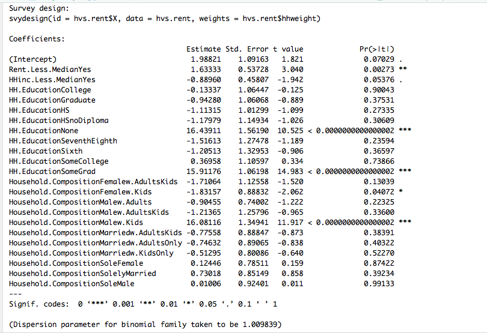

```{r setup, include=FALSE}
knitr::opts_chunk$set(echo = TRUE)
root_dir <- rprojroot::find_rstudio_root_file()
knitr::opts_knit$set(root.dir = root_dir)
```

# Understanding Evictions in NYC: A Causal Interpretation 

## Project Trajectory 

* My project has changed in scope considerably since the beginning of the semester. At first I wanted to study obesity + gentrification, but that had its own complications. Therefore, I switched to studying evictions, in particular coerced evictions, but again that came with its own complications

1. Limited data  - hard to scrape the NYS ecourts, they remove landlord tenant cases 14 days after the last court experience

2. NYC open data releases scheduled Marshal Evictions, but you will not be able to get information about the individuals involved

* I then moved to the 2017 NYC Housing Vacancy Survey (NYCHVS) because individuals self-disclose if they have recently moved due to being evcted/displaced. The NYCHVS survey has its own strengths and weaknesses that I discuss throughout my analyses.

* From the NYCHVS and after reading the first seven chapters of Judea Pearl's *The Book of Why*, I transitioned my project and created my causal model for eviction via a causal diagram. 

## Final Presentation 

* In **FinalAnalysis** folder: FinanciallyBurdenedNeighborhoods.Rmd (Final EDA) + FinalModels.Rmd (Causal)

## Repo Structure 

### data

* ACS_Data - data pulled from 2017 American Community Survey 5 year estimates via the *tidycensus* R package 

* data_created - any data I created along the way, all these datasets are supplementary/not used, but could be used in the future 

* data_final - all datasets I used in the final analysis! **Important** 

* extra - any extra data I pulled 

* NYC_HVS - data from the 2017 NYC HVS before it was cleaned 

* SBA_Profiles - profiles for each Sub Borough Area from the Furman Center

* stabilization_data - did not use in my analysis (yet), but includes data on the locations of rent stabilized apartments

* Also please note to run the analysis, you will have to download a sub-borough area shapefile. You can also use a shapefile for PUMAs. Unfortunately, the shapefiles are too large to upload to git and using git LFS distorts the shapefile. 

### code

* Evictions_Harassments_HVS.R - analysis for midterm presentation 

* ReplicateWeights.R - functions to calculate survey estimates, variance, and standard deviation using replicate weights **Important** 

* NYC_HVS_Analysis.R - analysis for mideterm presentation 

* ACS - all code in this folder relates to pulling statistics from the American Community Survey via *tidycensus* 

* Cleaning - all code in this folder is how I cleaned the household and individual datasets from the NYCHVS 

* Old - old code 

* ScrapeSBA- code I used to scrape the SBA profiles from the Furman Center 

### FinalAnalysis

* Code (rmds) + presentations (mds) for the final presentation 

### Highlights

* Five highlighted results

### Literature

* Any related literature I saved/read along the way

### Presentations:ThoughtProcess

* Includes midterm presentation and my thought process as it has changed since day one! 

## Summary 

### Research Question

* What currently drives evictions in New York City ? In other words, what is the principal cause of most evictions? 

### Causal Diagram 


### Results of Causal Model



### Future Analysis either before the semester ends or beyond 

* Neighborhood / Gentrification component  - maybe before semester end, but will most likely finish it later...

* Longitudinal - probably summer...if at all 


